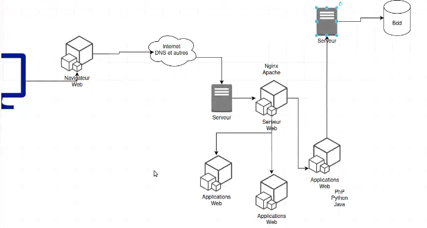
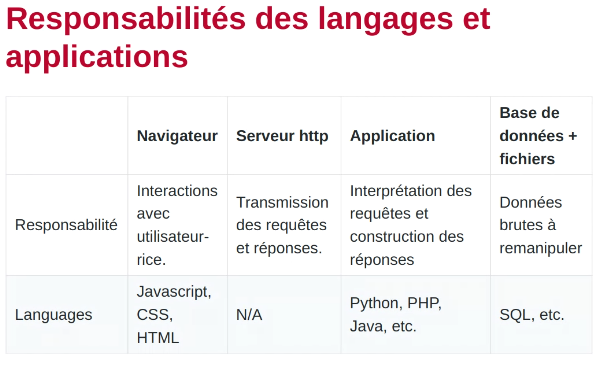

# LE WEB ET LES API
---
**Fonctionnement d'un serveur web**
- `utilisateur` envoie une requête
- `navigateur web` récupère la requête -- `javascript, css, html`
- il la transmet au serveur via `internet`
- le `serveur http` récupère la requête et les transfère à l'application
- l'`application web` reçoit les requêtes, les interprète et construit des réponses -- `python, php, java, nodeJS`
- il transmet communique avec `la base de données` qui contient les données brutes pour récupérer les données, les manipuler et les transférer  à l'utilisateur -- `SQL et al`

---
**API - application programming interface**
- une interface de communication avec un logiciel, pour un autre logiciel 
- **permet** d'interagir avec les données d'une application sans avoir à modifier le code de cette application
- **fonctionnement** : utilisation du protocole HTTP pour communiquer entre 2 applications en échangeant des services et données, notamment avec `json`
- **avantages** : pas besoin de reprendre le code source et de le convertir dans un autre langage ; pas besoin de fournir des dumps pour explorer les données
- le web aujourd'hui fonctionne sur **des protocoles asynchrones** (requêtes crées sans input de l'utilisateurice, comme par exemple rafraîchissement automatique) pour lesquels les API sont centrales, vu qu'elles permettent un échange de données
- API non web existent (utilisation de l'appareil photo d'un téléphone portable par une application tierce = API pour communiquer entre appli et téléphone portable)
- **principe d'une bonne API de données** : permet à une machine de naviguer de page à page, automatiquement : l'API donne toutes ses informations et pas besoin d'aller lire la doc
- **en très bref** : une API = une version d'un site web lisible par une machine, pas par un humain

---
**API du web en recherche**
- les API peuvent **s'aligner sur des standards** : 
	- **standards architecturaux** - manière d'écrire une API, de régler les connexions entre les pages de l'API... sert à définir la manière dont les données sont mises à disposition, et non la structure des données : `openapi` (swagger.io), `jsonapi`, `hydra`
	- **standards d'architecture** - définissent à minima un type d'objet et la structure prise par les données dans cet objet
		- **très utile pour la recherche** : pour les institutions, permet interopérabilité, dvp de projets communs, mise à disposition commune de données... ; pour les chercheureuses, permet récupération de données
		- `ÌIIF` - api pour le partage d'images d'institutions patrimoniales ; utilisé par Gallica, Getty...
		- `DTS` - architecture pour les données test en TEI

---
**SOAP, REST et protocoles d'API**
- **`SOAP`** : protocole du W3C pour les API très utilisé pdt les 90s'
- **`REST`** : protocole W3C le plus utilisé depuis 2000s' ; le protocole `REST`  est rarement suivi => standards dérivés sont appelés "restlike"
- **autres standards** : 
	- **`OAI PMH`** (pour institutions patrimoniales)
	- **`IIIF`** : une des premières API du monde patrimonial en format JSON (en fait, basé sur `JSON-LD` pour la qualification des données, mais le côté sémantique est masqué pour rendre les données manipulables par des développeurs qui ne sont pas formés au web sémantique (aka, tout le monde))

---
**Pourquoi faire une API**
- **besoins internes d'une application** : créer des interactions avec son propre site pour permettre de charger seulement les données pertinentes, via requêtes asynchrones (autocomplete, carte réactive...)
- **communication entre applications**