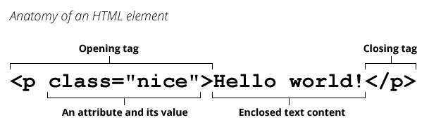
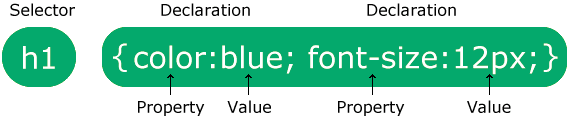
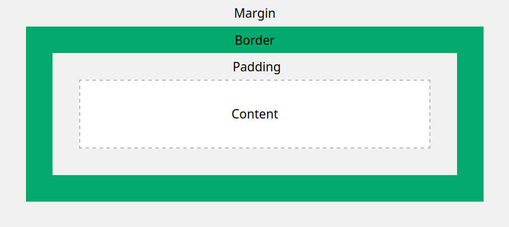
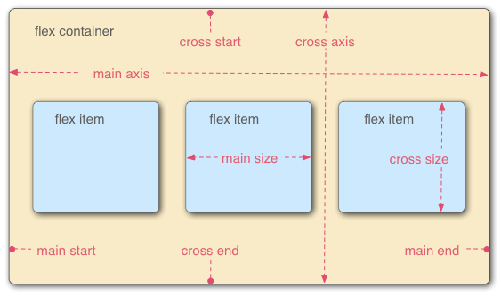

# DEVELOPPEMENT APPLICATIF: HTML + CSS

* * *

**contact**: julien.pilla@chartes.psl.eu

**supports de cours et documentation**:

- le cours: https://goo.gl/NvNnX7
- valider une page web et vérifier les erreurs: https://validator.w3.org/nu/
- documentation sur les éléments HTML : https://www.alsacreations.com, https://w3schools.com, https://developer.mozilla.org/fr/docs/Web/HTML/Element
- liste complète de balises HTML: https://jaetheme.com/balises-html5/


* * *

# INTRODUCTION

**Objectifs du cours**

- découvrir **comment fonctionne un site web**
- savoir **écrire une page** de site web en HTML + CSS
- savoir **intégrer du contenu interactif** avec JavaScript
- savoir **construire une page simple**
- savoir **communiquer** avec des vrais développeurs


* * *

**Les sites web**
site web = **un ensemble de documents liés entre eux**

**Page statique et page dynamique**

- une **page statique**: = une page qui s'affiche exactement comme elle est entregistrée sur serveur: son contenu ne varie pas en fonction de la requête du client au serveur.
    - Lors de la consultation d'une page web statique, un serveur HTTP envoie le contenu du fichier dans lequel le contenu de la page est enregistré.
    - Elles deviennent de plus en plus rares.
- une **page dynamique** est générée à l'aide d'une application en fonction de la requête du client

**L'architecture client/serveur**:

- le **client** est celui qui créé la requête
- le **serveur** stocke les données à communiquer au client. C'est un lieu physique, disposant d'une adresse IP
- le **protocole HTTP** est le protocole de communication qui sert à la communication client-serveur:
    - transmettre la requête du client au serveur
    - transmettre en retour la réponse du serveur au client
- le **navigateur web** utilise HTTP pour interpréter la demande du client, la communiquer au serveur et interpréter la réponse du serveur (en affichant une page statique ou en générant une page dynamique)

**Deux rôles sur internet**:

- **fournisseur de données**: le serveur et n'importe quel autre utilisateurice, lorsqu'il produit des données
- **consommateur de données**: celui qui reçoit les données

**Le cheminement de la donnée**:

- le client **fournit l'adresse** d'un site web
- le navigateur **demande au fournisseur** d'accès internet à quel serveur correspond cette adresse
- le fournisseur **donne l'adresse IP** du serveur
- le navigateur **transmet la requête** du client au serveur en HTTP
- le serveur **répond à cette requête** en HTTP
- le navigateur **interprète la réponse** et l'affichesous la forme d'un document HTML


---
**Histoire du web et de ses standards**
- **début 1970s'**: le réseau **ARPANET** est créé par la DARPA pour relier les différentes universités américaines. Chaque machine est localisée par son adresse physique.
- **début 1980s'**: création des **DNS** (noms de domaines) : les machines sont représentées par un identifiant unique qui les localise, et qui remplace leur adresse physique.
- **1989**: création de la première **toile internet** mondiale d'accès public (avant, l'accès était reservé). Protocole de communication utilisé: **HTTP**, créé par Tim Berners-Lee.
- **1994: W3C** est créé par Tim Berners-Lee
- **1996: HTML/1.0** est publié: protocole de communication client-serveur qui sert à la transmission d'hypertexte certifié par le W3C


---
**World Wide Web Consortium (W3C)**
- **administré par 3 institutions**: MIT (USA), Keio University (Japon), ERCIM (institut de recherche européen basé en France), il **réunit 400 organisations**
- **objectifs**: certifier les technologies du Web et promouvoir l'usage de technologies standardisées et ouvertes: **HTML SVG PNG RDF**
- **le protocole de validation des standards** est très long et très rigoureux:
	- **5 étapes**: Working Draft, Last Call Working Draft, Candidate Recommendation, Proposed Recommendation, W3C Recommendation définitive
	- le processus de validation est **très long**: 1997: validation de HTML4 - 2017: validation de HTML5.
	- les standards ne sont **pas unianimement respectés**: chaque navigateur utilise des implémentations différentes et des variantes des technologies; HTML5 est très répandu avant sa certification


* * *
# HTML - *HYPERTEXT MARKUP LANGUAGE*

**HTML, c'est quoi?**
- **un langage à balises** contenant des données textuelles
- **un langage de programmation déclaratif**: il ne décrit que le contenu du document, pas la manière dont les informations sont récupérées ou traitées
- le langage **décrivant la structure hiérarchique d'une page web** sous la forme de relations contenu/contenant (contenu d'une page / position de ce contenu sur la page)
- il ne **décrit pas le style** d'une page (couleurs, animation...: CSS s'en occupe) et **ne décrit pas l'interactivité** (ça c'est Javascript)
- **HTML5**: standard actuel du W3C. 
	- **Avant d'être standardisé**, HTML5 était déjà utilisé; certaines fonctions qu'il propose étaient remplies avec d'autres moyens (en utilisant d'autres langages)
	- Nombreuses **nouvelles fonctionnalités** : support de la géolocalisation, lecture de vidéos sans installer d’extension, gestion d’applications web hors-ligne, stockage de données en local, glisser-déposer, 2D et la 3D “performante”, meilleure accessibilité du contenu

- **basé sur le SGML** (*Standard Generalized Markup Langage*), base de notre bien aimé XML


---
**Structure du HTML**
```html
<!DOCTYPE html>
<html lang="fr">
	<head>
		<title>Titre affiché dans l'onglet du navigateur</title>
	</head>
	<body>Corps du document</body>
</html>
```

**La structure de base**
- **`DOCTYPE`** est une déclaration qui indique au navigateur le langage utilisé: html, html4, html5, xml...
- **`<html></html>`** est la balise html qui contient l'intégralité de la page.
	- la balise d'ouverture `<html>` sert à préciser des informations supplémentaires: encodage, langue...
- **`<head>`** est la balise d'en-tête: elle contient le titre de l'onglet du navigateur
- **`<body>`** est la balise de corps: elle contient le contenu, ce qui s'affiche dans la page web.

**Élément, balise et la syntaxe des éléments**
- **Élément** = balise ouvrante + contenu + balise fermante, ou balise et son contenu dans le cas d'une balise autofermante
- **Balise**: ce qui est dans `<>` et qui sert à contenir un élément


**Balises classiques et balises autofermantes**
- Une **balise classique** (`<p> <div> <title>`...) contient du texte entre une balise d'ouverture et une de fermeture:
 ```html
<p>contenu entre une balise d'ouverture et une balise de fermeture</p>
```
- Une **balise autofermante** (`<meta> `) ne peut pas contenir de texte: toutes les informations figurent à l'intérieur de la balise et il n'y a pas besoin de la fermer.

**Balises et attributs**: 
- Chaque balise peut contenir des informations sur **la manière d'interpréter son contenu**: c'est le rôle des attributs. 
- Les attributs sont spécifiés **dans la balise ouvrante**.
- **2 types d'attributs**:
	- **les attributs globaux**: fonctionnent avec toutes les balises
	- **les attributs spécifiques** - propres à un type de balise (certains attributs ne fonctionnent qu'avec `<p>`)

**Conteneurs `bloc` et conteneurs `inline`**
- une **balise `bloc`** occupe toute la longueur de la page, peu importe la taille de con contenu; les éléments `bloc` se suivent verticalement et ne se trouvent jamais sur la même ligne. Exemple:  `<div>` et `<p>`,
- une **balise `inline`** n'occupe que la place nécessaire à son contenu; plusieurs éléments `inline` peuvent se suivre sur une même ligne. Exemple: `span`
- Il est **impossible** de mettre un `bloc` dans un `inline`

**Les Event Attributes**: 
- Spécifiés dans une balise, ils **indiquent un évènement** qui modifiera la page
- Ils servent à intégrer des **scripts Javascripts dans un document HTML**
- **Liste complète d'Event Attributes**: https://www.w3schools.com/tags/ref_eventattributes.asp


---
**Les attributs globaux en HTML**
- `accesskey` - specifies a shortcut key to activate/focus an element
- `class`  - specifies one or more classnames for an element (refers to a class in a style sheet)
- `contenteditable` 	- specifies whether the content of an element is editable or not
- `data-*`  - used to store custom data private to the page or application
- `dir` - specifies the text direction for the content in an element
- `draggable` -	specifies whether an element is draggable or not
- `hidden` - specifies that an element is not yet, or is no longer, relevant
- `id` - specifies a unique id for an element
- `lang` - specifies the language of the element's content
- `spellcheck` - specifies whether the element is to have its spelling and grammar checked or not
- `style` - specifies an inline CSS style for an element
- `tabindex` - specifies the tabbing order of an element
- `title` - specifies extra information about an element
- `translate` - specifies whether the content of an element should be translated or not


---
**Les balises les plus courantes**
- **`<html><body><head><meta><link>` - les balises de base** 
	- elles contiennent des informations sur le document, mais pas du contenu qui s'affichera sur la page; `<body>` peut contenir d'autres balises dans lesquelles entrer le contenu qui s'affichera
	- racine du document, corps du document, en-tête du document, métadonnées du document, lien vers un autre document
- **`<div><p><ul><li><h1><h2>` - les balises génériques de contenu**
	- ces balises sont génériques: elles n'ont pas de valeur particulière et peuvent aller n'importe où sur la page.
	- bloc générique, paragraphe, liste à puces, élément de liste à puces, titre de niveau 1, titre de niveau 2
- **`<section><article><aside><header><footer>` - les balises plus sémantisées**, qui correspondent à un endroit de la page et à une structuration du texte: section d’une page, article, contenu secondaire ou en aparté, pied de page
- **`<a>` - les balises pour afficher du contenu externe**: hyperlien, image.
- **`<abbr><em><q><blockquote><br> ` - les balises de formatage du texte**: abbréviation, emphase, citation, citation en bloc, nouvelle ligne


---
**Le contenu externe: ` et <a>`**

 **La balise image ``**
 - **Les attributs requis**:
	 - `src`: chemin vers l'image
	 - `alt`: texte alternatif pour l'image, si l'image ne s'affiche pas
- **Autres attributs**:
	 - `height` et `width`: spécifier la longueur et la largeur de l'image, en pixels, au format `height="nb-de-pixels"`
- La balise d'image sert pour **les images apportant une valeur** au document (logo, illustration d’article, icônes cliquables). Les images d’embellissement de la page seront plutôt exprimées en CSS.
 ```html
 
```

**La balise hyperlien `<a>`**
- **`href`** - l'attribut requis, qui indique la cible URL de la balise
- **Autres attributs**:
	- `target`: où ouvrir le document lié (_blank, _parent, _self, _top)
	- `type`: le type de média de l'hyperlien
- **Le titre donné à l'hyperlien** s'écrit entre `<a>` et `</a>`

```html
 <a href="https://www.youtube.com/watch?v=6Z3N79ktprw/">What's in my ears rn</a> 
```


---
**Les balises sémantisées pour le corps de texte: `<section>` et `<article>`**
- **`<section>`**: 
	- Élément fondamental de la nouvelle approche de découpe sémantique des documents apportée par la version 5 de HTML, `<section>` regroupe un contenu relatif à une **même thématique ou une même fonctionnalité**.
	- Une `section` n'est **pas autosuffisante**: elle doit contenir d'autres balises.
	- Il doit être **introduit par un titre** `<h1>` à `<h6>`.
- **`<article>`**: une spécialisation de section
	- Un article est **une portion de document autosuffisante**: elle possède une plus forte valeur sémantique que `section`, et ne doit pas contenir de titre ou d'autres sous-balises
	- Un `<article>` dans un `<article>` est interprété comme **un commentaire de l'article**.
- **Fun fact**: une `section` peut contenir plusieurs articles, un `article` peut contenir plusieurs sections.

```html
<article>
	<h1>Pilla</h1>
	<p>Notre dieu notre sauveur...</p>
	<section>
    <h2>Julien</h2>
	Tel est son prénom...
	</section>
	<section>
    <h2>Ceci est une ode</h2>
	JavaScript me fait peur
	</section>
</article>
```


---
**En-tête et pied de page: `<header>` et `<footer>`**
- Ces deux balises ont une **valeur sémantique propre**.
- Elles servent à contenir les **informations d'en-tête et de pied de page**, assez logiquement.
- Les deux balises peuvent servir **à différents endroits**: 
	- Pour être l'en-tête/pied-de-page de  **l'ensemble de la page**, `header` et `footer` doivent être placées juste après `<body>` (balise de début) pour `header` / juste avant `</body>` (balise de fin) pour `footer`.
	- Pour s'appliquer à **une partie de la page**, `header`/`footer` doit figurer juste après l'ouverture / avant la fermeture de cette section

**Exemple 1**: Footer pour toute la page
```html
<body>
	<!-- contenu du document-->
	<footer>
        <p>Tous droits réservés</p>
	</footer>
</body>
```
**Exemple 2**: header et footer d'un article
```html
<article>
	<header>En-tête de l’article</header
	<p>Contenu de l’article</p>
  <footer>
		<p>Sujets abordés: HTML5, structure, footer</p>
		<p>Catégorie : HTML</p>
	</footer>
</article>
```


---
**Les listes: `<ul>`,  `<ol>` et `<li>`**
- **`<ul>`** - liste non-ordonnée d’éléments `<li>`. Il n'y a **pas de garantie que l'ordre soit conservé** avec une liste non ordonnée
- **`<ol>`**: liste ordonnée; **l'ordre de la liste sera conservé**. Le **numéro** de chaque élément est généré automatiquement.
- **`<li>`**: élément de liste

```html
<p>Ingrédients :</p>
<ul>
	<li>Tofu</li>
	<li>Courgette</li>
	<li>Huile de sésame</li>
</ul>
<p>Étapes de la recette :</p>
<ol>
	<li>Hacher</li>
	<li>Mélanger</li>
	<li>Cuire</li>
</ol>
```


---
**Les tables HTML : `table` `<tr>` `th` `td`**
- Les tables HTML sont crées en **imbriquant 4 types de balises** : 
	- **`<table>`** - balise contenant la table
	- **`<tr>` - table row** : balise de ligne
	- **`<th>` - table header** : balise de cellule d'en-tête; par défaut, le contenu de ces cellules est en gras et centré, sauf si on rentre une autre info
	- **`<td>` - table data** : balise de cellule générique
- **Exemple**: 
	```HTML
	<table>
		<tr>
			<th>header1</th>
			<th>header2</th>
		</tr>
		<tr>
			<td>cell1</td>
			<td>cell2</td>
		</tr>
		<tr>
			<td>cell3</td>
			<td>cell4</td>
		</tr>
	</table>	
	```

---
---
---
# CSS - *CASCADING STYLE SHEET*

**CSS en bref**

CSS sert à décrire le **style d'une page web** à travers des **règles de style** qui s'appliquent à un/des éléments HTML.
- Aujourd'hui, **CSS 3** est utilisé
- Règles de styles **définissent** : 
	- Position&taille des blocs
	- Rendu visuel des textes (police, taille, effets)
	- Couleurs des elts de la page
	- Marges internes au bloc
	- Alignement du texte
	- Ajout de barres de défilement
- **CSS définit des styles en cascade**:
	- Il associe **à une balise HTML un ensemble de propriétés**
	- Par défaut, ces prorpiétés s'appliquent **à la balise et à toutes les balises qu'elle contient**, en *cascadant* à dans la hiérarchie de balises HTML
	- Le style appliqué à une balise s’appliquera également à toutes les balises contenues dans cette balise **jusqu’à indication du contraire**
- **Règles de priorité**
	- Les règles s'appliquent **dans l'ordre dans lequel elles sont écrites**: c'est la dernière règle qui l'emporte
	- Une nouvelle règle qui cible un élément déjà ciblé par une règle précédente **met à jour** cette règle
- **Syntaxe globale du CSS**
	```CSS
	balise1, balise2, baliseN { règle1; règle2 }
	```
		
- 2 manières de **conserver sa feuille de style**
	-  Déclarées **dans la page HTML** elle-même, dans la balise `<head>`
	- Réunies dans des **fichiers externes** auxquels on fait référence via une balise **`<link>`** dans le `<head>` du document HTML
	```html
	<head>
  	  <title>Titre de ma page</title>
  	  <link type="text/css" rel="stylesheet" href="css/mon_fichier.css">
	</head>
	```


---
**Cibler une balise**
- Cibler **toutes les balises du même type** avec un sélecteur de type: dans l'exemple en dessous, toutes les balises `<strong>, <em>, <div>, <p>` sont bleues:
	```CSS
	strong, em, div, p {color : blue}```
- Cibler une **balise contenue dans une autre balise** avec les **combinateurs `[espace]` et `>`**. Voir la partie combinateurs


---
**Les sélecteurs simples** pour cibler plusieurs balises
- **Le sélecteur de type**
	- Servent à cibler toutes les **éléments portant le même nom**
	- **Syntaxe**: `nom_de_balise { règles }`
	- **Exemple**: `div` cible toutes les balises `<div>`
- **Le sélecteur universel `*`**
	- Le sélecteur universel cible **tous les éléments d'un document**
	- **Syntaxe**: `* { règles }`
- **Le sélecteur d'identifiant `id`**
	- Permet de cibler **un élément unique** en fonction de son attribut **`id`**
	- **Syntaxe et utilisation**: donner à l'élément un identifiant unique `id` dans la balise HTML ouvrante, puis indiquer le nom de l'identifiant au début de la règle CSS 
		- Dans le HTML: `<nomdebalise id="nom_identifiant">`
		- Dans le CSS: `#nom_identifiant { règles }`
	- **Exemple**: `#hector` ciblera la balise avec l'identifiant `id="hector"`
- **Le sélecteur de classe `class`**
	- Permet de cibler **un ensemble d'éléments** qui ont le même attribut **`class`**
	- **Syntaxe et utilisation**:  donner à l'élément un attribut `class` dans la balise HTML ouvrante, puis indiquer le nom de la classe au début de la règle CSS
		- Dans le HTML: `<nomdebalise class="nomdeclasse"`
		- Dans le CSS: `.nomdeclasse { règles }`
	- **Exemple**: `.hector` ciblera toutes les balises de la classe `class="hector"`


---
**Les combinateurs** pour cibler des balises en fonction de leurs liens avec d'autres balises
- **`+`, sélecteur de voisin direct**
	- Permet de sélectionner les **éléments qui suivent immédiatement un élément donné**
	- **Syntaxe**: `balise1 + balise 2 { règles }`
	- **Exemple**: `div + p` cible n'importe quel élément `p` qui suit directement un `div`
- **`~`, sélecteur de voisins**
	- Permet de sélectionner **les éléments qui en suivent un autre**, directement ou non.
	- **Syntaxe**: `balise1 ~ balise 2 { règles }`
	- **Exemple**: `p ~ span { color: red }` affichera en rouge toute les balises `span` qui se trouvent après une balise `p`
- **`>`, sélecteur d'éléments enfants**
	- Permet de sélectionner les éléments qui sont des **enfants directs d'un élément donné** et donc d'indiquer **le chemin exact vers une balise**
	- **Syntaxe**: `balise1 > balise 2 { règles }`
	- **Exemple**: `article > header > p` cible une balise `p` descendant directement d'une balise `header` qui descend directement d'une balise `article`
- **`[espace]`, sélecteur d'éléments descendants**
	- Permet d'indiquer tous les **éléments contenus dans d'autres éléments** et donc d'indiquer **le chemin vers une balise**
	- **Syntaxe**: `balise1 balise 2 { règles }`
	- **Exemple**:  `article header p` cible toutes les balises `p` contenues dans une balise `header` contenue dans une balise `article`
-  **`||`, combinateur de colonnes**
	-  Sélectionne **les nœuds qui appartiennent à une colonne**
	-  **Syntaxe** : `balise1 || balise2`
	-  **Exemple**: `col || td` cible n'importe quel élément `<td>` appartenant à une colonne `<col>`.

---
**Box model**



En CSS, **chaque élément HTML est représenté par une boîte**: c'est le box model.
- **À l'intérieur de la box**, le `content` (contenu de la balise HTML: texte et images) et le `padding` (espace vide autour du contenu)
- **La limites d'une box**, c'est sa `border`
- **À l'extérieur de la box**, le `margin` (marge, espace vide entourant la boîte, qui permet de définir un espace entre des éléments)

Les **dimensions totales** d'une boîte:
- **En largeur**: `margin` + `border` + `padding` + `width` (largeur du content, qui peut être spécifiée avec l'argument `width`)
- **En hauteur**: `margin` + `border` + `padding` + `height` (hauteur du content, qui peut être spécifiée avec l'argument `height`)


---
**`height`, `width` et `border-box`**

**`height` et `width`**: la hauteur et largeur du contenu d'une box, indépendamment des dimensions du `margin`, `padding` et `border`. **Valeurs possibles**:
- `auto`: valeur par défaut, qui sera calculée par le navigateur en fonction du contenu qui doit être affiché
- `length`: dimensions en pixels, cm...: `300px`
- `%`: dimensions de l'élément en fonction du bloc parent (dans lequel il est contenu)
- `initial`: réinitialiser les dimensions
- `inherit`: hériter les propriétés du bloc parent

**`max-width` / `max-height` / `min-width` / `min-height`**: dimensions maximales/minimales de l'élément. Mêmes valeurs que pour `height` et `width`

**`box-sizing`**: définir la manière dont les dimensions d'un élément sont calculées, et la manière dont `height` et `width` fonctionnent. **Valeurs possibles**:
- **`content-box`**: valeur par défaut. `height` et `width` = dimensions du `content`
	- Avec `box-sizing: content-box`, `height` et `width` définiront la taille du `content` sans inclure `padding` et `border`
- **`border-box`**: `height` et `width` = dimensions de `content` + `padding` + `border`
	- Avec `box-sizing: border-box`, `height` et `width` définiront la taille de tout l'élément en incluant `padding` et `border`
	- C'est une bonne pratique d'utiliser `border-box` pour définir la taille des éléments sans se prendre la tête
- `initial`: propriété réinitialisée à sa valeur par défaut
- `inherit`: propriété héritée du bloc parent
- **voir les exemples**: https://www.w3schools.com/CSSref/css3_pr_box-sizing.asp


---
**`margin` et `padding`**

Grosso modo, les deux prennent **les mêmes valeurs**:
- **valeurs possibles de `margin`**: `auto` `length` `%` `inherit`
- **valeurs possibles de `padding`**: `length` `%` `inherit`
- **defining individual sides**:
	- `margin-top` `margin-right` `margin-bottom` `margin-left`
	- `padding-top` `padding-right` `padding-bottom` `padding-left`
- **shorthand syntax**: pareil pour `padding` et `margin`
	- `padding: 25px 50px 75px 100px`: top = 25px / right = 50px / bottom = 75px / left = 100px
	- `padding: 25px 50px 75px`: top = 25px / right and left = 50px / bottom = 75px
	- `padding: 25px 50px`: top and bottom = 25px / right and left = 50px
	- `padding: 25px`: all sides = 25px
- **`margin: auto`**: centre l'élément dans son bloc parent


---
**`border-width` `border-style` et `border-color`**

**`border-style`**: le style d'une bordure. 
- Cette propriété doit être **énoncée en premier**, avant `border-width` et `border-color`
- `border-style` peut avoir **une à quatre valeurs** pour la bordure du haut / droite / bas / gauche
- **valeurs possibles**:
	- `dotted` -  dotted border
	- `dashed` - a dashed border
	- `solid` - a solid border
	- `double` - a double border
	- `groove` - a 3D grooved border. The effect depends on the border-color value
	- `ridge` - a 3D ridged border. The effect depends on the border-color value
	- `inset` - a 3D inset border. The effect depends on the border-color value
	- `outset` - a 3D outset border. The effect depends on the border-color value
	- `none` - no border
	- `hidden` - a hidden border

**`border-width`**: la largueur d'une bordure
- `border-width` peut avoir **une à quatre valeurs** pour la bordure du haut / droite / bas / gauche
- **valeurs possibles**: 
	- `medium` - valeur par défaut: bordure moyenne
	- `thin` - bordure fine
	- `thick` - bordure épaille 	
	- `length` - dimensions en pixels, cm...: `300px`
	- `initial` - réinitialise à la valeur par défaut
	- `inherit` - hérite la valeur du bloc parent

**`border-color`**: la couleur d'une bordure
- `border-color` peut avoir **une à quatre valeurs** pour la bordure du haut / droite / bas / gauche
- **valeurs possibles**:
	- `color`: couleur de la bordure; cf CSS color values
	- `transparent`: bordure transparente
	- `initial`: réinitialise à sa valeur par défaut
	- `inherit`: hérite la valeur du bloc parent


**`border`** shorthand property for: 
- `border-width`: `medium` par défaut
- `border-style` doit obligatoirement être spécifiée
- `border-color`: la couleur de bordure par défaut
- en bref, si on ne donne qu'une valeur à `border`, ça doit être `border-style` puisqu'il n'y a pas de valeur par défaut.


---
**Positionner les éléments: `position`**

Posiiton permet de **le positionnement d'un élément sur la page et son comportement** (la manière dont il réagit au défilement de la page).
**Valeurs possibles**: pour toutes les valeurs sauf `static`, on doit **définir au moins une propriété** `top` `right` `bottom` `left`
- **`static`** - valeur par défaut. On ne peut pas définir `top` `right` `bottom` `left` et la position de l'élément dépend de la page.
- **`relative`** - la position d'un élément sur la page est définie en fonction de sa position normale et de la valeur donnée à `top` `right` `bottom` et `left`
	- par défaut, `top=right=left=bottom=0`; dans ce cas, `relative`=`fixed`
	- par exemple: `position: relative; left: 30px` induit un décalage de 30px entre le bord gauche de l'élément et l'élément parent (un peut comme une marge à gauche de 30px)
- **`fixed`** - l'affichage de la page sur l'écran de l'utilisateurice définit la position de l'élément: il reste fixé au même endroit de l'écran tout au long du déroulement. Utile pour les menu d'en-tête...
- **`absolute`** - l'élément parent définit la position de l'élément: il reste toujours fixé au même endroit de la page par rapport à l'élément parent
- **`sticky`** - c'est complexe mais utile pour les pages défilantes...
	- l'élément se comporte en `relative` jusqu'à atteindre un certain point sur l'écran, puis il se comporte en `fixed` et reste au même endroit
	- en anglais: a `sticky` element toggles between `relative` and `fixed`, depending on the scroll position. It is positioned relative until a given offset position is met in the viewport - then it "sticks" in place (like position:fixed)
	- par exemple: `position: sticky; top: 30px` => l'élément sera au même endroit de la page jusqu'à être à 30px du haut de l'écran


---
**Aligner les éléments:  `float` et `clear`**

**`float`** définit l'alignement d'un élément au sein de l'élement parent. 
- Utile pour **définir la position de différentes parties d'un même élément** (2 blocs de texte, 1 bloc d'image et un bloc de texte...) 
- **Valeurs possibles**
	- **`none`** - valeur par défaut: l'élément est placé en dessous, sans alignement
	- **`left`** - l'élément est aligné à gauche
	- **`right`** - l'élément est aligné à droite
	- **`inherit`** - hérite l'alignement du bloc parent

**`clear`** indique si un élément peut être situé à côté d'éléments flottants qui le précèdent ou s'il doit être déplacé vers le bas pour être en dessous de ces éléments. La propriété clear s'applique aux éléments flottants comme aux éléments non-flottants.
- https://developer.mozilla.org/fr/docs/Web/CSS/clear
- **Valeurs possibles**: 
	- **`none`** - valeur par défaut: l'élément peut être situé à côté des éléments flottants (une img peut être à côté d'un texte)
	- **`left`** - l'élément ne peut pas être situé à gauche de l'élément flottant
	- **`right`** - l'élément ne peut pas être situé à droite de l'élément flottant
	- **`both`** - l'élément ne peut être situé ni à gauche, ni à droite de l'élément flottant
	- **`inline-start`** - "l'élément est déplacé vers le bas pour dégager le contenu vers le début du bloc englobant"
	- **`inline-end`** - "l'élément est déplacé vers le bas pour dégager le contenu du côté de la fin du bloc englobant"
- **`clear : both` permet de réinitialiser le flux** après des éléments positionnés avec `float`, en rétablissant le positionnement par défaut pour l'élément


---
**Le modèle flexbox**

Flexbox permet **d'organiser des éléments entre eux** et de définir leurs positions relatives de manière efficace.
https://developer.mozilla.org/en-US/docs/Learn/CSS/CSS_layout/Flexbox


**Les étapes**
- **`display: flex`** - pour définir un modèle flexbox, donner à l'élément parent la propriété `display: flex`. 
	- s'utilise au niveau de **l'élément parent**.
	- tous les éléments enfants seront intégrés au flexbox.
	- l'élément parent = **`flex container`** ; les enfants = **`flex items`**
- **`flex-direction`**: définir la manière dont les items s'organisent. S'utilise au niveau de **l'élément parent** **Valeurs possibles**
	- `row` - valeur par défaut: éléments disposés en ligne de gauche à droite; l'ordre des items est celui des éléments correspondant dans le HTML (enfant 1 est le plus à gauche...)
	- `row-reverse`  - éléments disposés en ligne de droite à gauche
	- `column` - éléments empilés en colomne, dans l'ordre du HTML
	- `column-reverse` - éléments empilés en colonne, dans l'ordre inverse au HTML
- **`flex-wrap`** - autoriser ou non que les items débordent du container. S'utilise au niveau de **l'élément parent**. **Valeurs possibles**
	- `nowrap` - items disposés en une seule ligne/colonne, ce qui peut causer des débordements
	- `wrap` - items étalés sur plusieurs lignes / colonnes et ne débordent pas du conteneur
	- `wrap-reverse` - items étalés sur plusieurs lignes / colonnes dans l'ordre inverse
- **`flex-flow`** - syntaxe rapide combinant `flex-direction` et `flex-wrap`
	- Syntaxe: `flex-flow: valeur_de_flex-direction valeur_de_flex-wrap`
- **`flex-basis`** - définir la taille minimum d'un item. S'utilise au niveau des **éléments enfants**. **Valeurs possibles**
 	- `auto` - valeur par défaut: pas de valeur minimale
 	- `%` - pourcentage de la taille du container
	- `length` - longueur, en px, cm...: `200px`
- **`flex-grow`** - définir quelle propprtion de l'espace du container non occupé par des items doit être alloué à un item.
	- s'utilise au niveau des **éléments enfants**
	- **Valeur possible**: un nombre. Défaut: 1. Exemple: `flex-grow: 2` fait 2 fois plus de l'espace non occupé sera alloué à cet item par rapport aux autres
- **`flex-shrink`** - définit de combien un item peut être réduit si il n'y a plus de place disponible dans le container
	- s'utilise au niveau **des éléments enfants**
	- **Valeur possible**: un nombre. Défaut: 1. Exemple: `flex-shrink: 2` => la taille de cet item sera réduite 2 fois plus que celle des autres items.
- **`flex`** - syntaxe rapide combinant `flex-basis` `flex-grow` et `flex-shrink`.
	- Syntaxe: `flex: valeur_flex-grow valeur_flex-shrink valeur_flex-basis`
	- Si un seul nombre est précisé, il est interprété comme la valeur de `flex-grow`. Exemple: `flex: 2 200px` => `flex-grow` = 2 et `flex-basis` = 200px
	- Si deux nombres sont spécifiés, alors `flex-basis` prend sa valeur par défaut. Exemple: `flex: 2 3`
- **`justify-content`** - aligner les items sur l'axe principal. 
	- S'applique à **l'élément parent**. 
	- **axe principal** du container: largeur si `flex-direction: row`, longueur si f`flex-direction: column`
	- **Valeurs possibles**:
		- `flex-start` - valeur par défaut: les items sont alignés au début de l'axe principal
		- `flex-end` - les items sont alignés à la fin de l'axe principal
		- `center` - les items sont centrés sur l'axe principal du container
		- `space-around` - les items sont répartis également le long de l'axe principal, avec un peu d'espace vide aux extrémités
		- `space between` - les items sont répartis également le long de l'axe principal, sans espace vide aux extrémités
- **`align-items`** - aligner les items sur l'axe secondaire
	- S'applique à **l'élément parent**. 
	- **axe secondaire** du container: longueur si `flex-direction: row`, largeur si `flex-direction: column`
	- **Valeurs possibles**:
		- `stretch` - valeur par défaut: les items sont étirés sur toute la longueur de l'axe secondaire du container
		- `center` - les items sont centrés sur l'axe secondaire du container
		- `flex-start` - les items sont alignés au début de l'axe secondaire
		- `flex-end` - les items sont alignés à la fin de l'axe secondaire
- **`order`**: réordonner les éléments sans toucher au HTML
	- S'applique **aux éléments enfants**
	- **Valeur possible**: nombre entier positif ou négatif. Défaut: 0. Plus le nombre est élevé, plus l'item est renvoyé à la fin du container 


---
**Le comportement du texte: `font-family` et `text align`**

**`font-family`** - définir la police de texte.
- https://developer.mozilla.org/fr/docs/Web/CSS/font-family
- **Valeurs possibles**: soit des noms génériques, soit des noms de famille de police ou de police en particulier:
	- **`generic-family`**: grand groupe de police, au choix parmi `serif` `sans-serif` `cursive` `fantasy` `monospace`
	- **`family-name`**: nom de police en particulier, qui peut s'écrire ou non entre `""`: `"Times New Roman"`, `Georgia`
- **Syntaxe**: 
	- `font-family = family-name1, family-name2, generic-family`
	- **mettre les noms génériques en dernier** : le premier nom est sélectionné en priorité, et la police générique peut servir de "fallback" si le family-name n'est pas disponible
	- **indiquer plusieurs polices** au cas où une police ne serait pas disponible dans le navigateur

**`text-align`**: l'alignement du texte. **Valeurs possibles**:
- **`left`** - valeur par défaut: texte aligné à gauche
- **`right`**
- **`center`**
- **`justify`** - texte justifié: alignement sur les bords gauches et droits, le conteneur de l'élément est rempli
- **`justify-all`** - la dernière ligne est aussi justifiée
- **`start`** -cette valeur a le même effet que la valeur left si la direction du texte va de gauche à droite ou le même effet que right si la direction du texte va de droite à gauche.
- **`end`** - cette valeur a le même effet que la valeur right si la direction du texte va de gauche à droite ou le même effet que left si la direction du texte va de droite à gauche.
- **`match-parent`** - équivalent de `inherit`


___
**La couleur c'est cool**
https://developer.mozilla.org/en-US/docs/Web/CSS/color

**Définir la couleur de quoi?**
- **Par défaut**, la couleur définie est celle de l'élément principal de la box: la couleur du **texte**
- **Couleur de bordure** peut être définie avec `border-color` ou `border` :`border: 15px solid green`
- **Couleur d'arrière plan** peut être définie avec `background-color`
- On ne **peut pas** définir une couleur de padding (la même que celle de la box) ou de margin (la même que celle de l'élément parent)

**Nommer une couleur**: les valeurs possibles
- **Noms de valeurs standardisés** - voir ici une bonne grosse liste: https://www.w3schools.com/colors/colors_names.asp
- **HEX**: les valeurs héxadécimales. Syntaxe: `#ff6347`
- **RGB**: 3 valeurs numériques entre 0 et 255. Syntaxe: `rgb(3, 231, 129)`
- **HSL**: 3 valeurs. Syntaxe: `hsl(9, 100%, 64%)`
- Définir la **transparence** avec des codes **RGBA** et **HSLA**:
	- une quatrième valeur comprise entre 0-1 permet de définir la transparence.
	- Syntaxe: `rgba(12, 210, 34, 0.8)`, `hsla(9, 100%, 64%, 0.5)`


---


