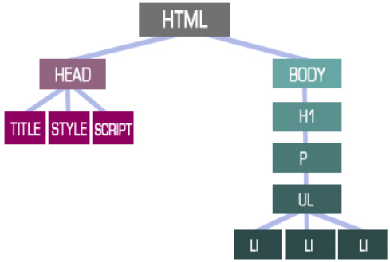

# JAVASCRIPT + DOM

---
# JAVASCRIPT


**JavaScript, c'est quoi?**
- **un langage impératif** : comme Python, une suite d’instructions qui permet d’écrire des scipts
- **un langage normé** : suit le standard ECMASCript, qui décrit les fonctionnalités de Javascript (standard qui décrit aussi d’autres langages)
- **langage principalement utilisé côté client** ; depuis 2010, gagne en popularité côté serveur


---
**Fonctionnement**
- **moteur d'exécution** :
	- programmation côté client:**chaque moteur a son navigateur** (moteur google V8 = base de plupart des navigateurs)
	- programmation **côté serveur**: NodeJS est +populaire
- **bases communes avec autres langages impératifs**
	- **structures de contrôle** (boucles conditionnelles `switch`, boucles `for`...)
	- **structures de données / data types**
	- **fonctions**
- **JavaScript et le web**: JS sert principalement à
	- **interagir avec des serveurs** par envoi de requêtes HTTP `post` et `get`
	- **intégrer de l'interactivité dans une page HTML statique**: JS permet de modifier ce qui est renvoyé par un document HTML, sans avoir besoin de modifier le HTML, en fonction d'informations transmises par le client.


---
# LES FONDAMENTAUX DE JAVASCRIPT

**Trois *super-objets* : `console`, `window` et `document`**
- **`window`** est l'objet qui correspond à la fenêtre du navigateur
- **`document`** est le document HTML en tant que tel que l'on manipule avec JavaScript
- **`console`** est la console du navigateur ; on s'en sert surtout avec `console.log()` pour faire du débuguage
	- `console.log(window);` affiche dans la console tous les objets présents dans le navigateur du client et toutes les méthodes qui peuvent leur être appliquées
	- `console.log(document)` affiche dans la console du le DOM HTML du document HTML

---
**JavaScript input & output**

**input - inclure un script JS à un document HTML avec une balise `<script>`**
- **JavaScript interne**: écrire le script dans le corps d'une balise `<script>`
`<script>document.getElementById("demo").innerHTML = "Hi";</script>` écrira `"Hi"` dans la balise `demo` ciblée par le script
- **JavaScript externe**: lier un document comportant les scripts JS au document HTML grâce à une balise `<script>`:
` <script type="text/javascript" dpsrc="myScript.js"></script> `
	- **2 méthodes pour lier un script externe**:
		- script accessible en ligne: indiquer **URL**
		- script stocker en local:  indiquer  **chemin absolu/relatif vers le fichier**
- la balise peut être **placée dans le `<head>` ou dans le `<body>`** (puisque les scripts JS ciblent une balise, donc un point du document HTML, on peut le placer n'importe où dans le HTML); les 2 méthodes peuvent être combinées

**output - où s'affiche l'issue d'un script JS**:
- **`.innerHTML`**: écrit à l'intérieur d'une balise HTML ciblée et modifie son contenu
	- **syntaxe**: `document.getElementById(id).innerHTML = Modifiable HTML content`
- **`window.alert()`**: affiche l'issue du script dans une fenêtre d'alerte
	- **syntaxe**: le `window` est optionnel, puisqu'aucune balise HTML n'est signée => ces deux syntaxes sont valides
		- `window.alert("hi")`
		- `alert("hi")`
- **`console.log()`**: affiche l'output dans la cosole du navigateur, pas sur la page à proprement parler. Peut servir à débugguer
- **`.write()`** : écrire du contenu dans un document HTML.
	- **syntaxe**: `document.write("Hello World!");`
	- attention: `.write()` **supprime le contenu d'un document HTML** => n'utiliser cette fonction que pour tester un script dans un HTML vide


---
**Syntaxe JavaScript**

Tous les éléments ci-dessous sont combinés pour créer des **des variables, des instructions et des fonctions**

- **Values / valeurs**: soit des valeurs fixes, soit des valeurs variables
	-  **Variables** auxquelles on assigne temporairement une valeur
	-  **Fixed values / Literals**: valeurs littérales, déclarées dans le script (par opposition à des variables, qui sont définies à un endroit du script pour être utilisées ailleurs); peuvent être de n'importe quel data type
- **Opérateurs**: `*+-/`...
- **Expressions**: combinaison de valeurs, variables et opérateurs qui retourne une valeur: `5 * 10` est une expression dont la valeur est évaluée à `50`.
- **Keywords**:
	- `var` - déclarer une variable
	- `let` - déclarer une variable de bloc
	- `const` - déclarer une variable de bloc constante
	- `if` - opérateur conditionnel: exécute une action seulement si une condition est remplie (comme en python)
	- `switch` - initie l'exécution de différents blocs de codes en fonction de différentes situations ou conditions
	- `for` - initie une boucle `for`
	- `forEach` - initie une boucle `forEach`
	- `function` - déclarer une fonction
	- `return` - mettre fin à une fonction et retourner son résultat
	- `try` - implements error handling to a block of statements
	- `this` - variable représentant l'élément courant appelé par une méthode : si une méthode s'applique à un élément déjà ciblé (avec querySelector, getElement...), `this` correspond à l'élément ciblé


---
**La syntaxe des instructions JS**

Comme tous les langages déclaratifs, un script JS est composé d'une **série d'instructions** qui ont une **structure semblable**. Une fonction/method est un type d'instruction particulier.
- une **instruction** est faite d'une **déclaration** (action à faire) qui a une **cible** (ce qui est ciblé par la déclaration), prend des **paramètres** et des **propriétés**
- **les fonctions** exécutent du code en fonction de paramètres particuliers.
- **les évènements** permettent l'interactivité
- **exemples**:
	- `document.getElementById("demo").innerHTML = "Hello Dolly."; `
		- *cible* - `document` : le script s'exécutera sur un document HTML)
		- *déclaration* - `.getElementbyId` : décrit un action à effectuer (içi, cibler la balise ayant l'identifiant `demo` dans le HTML)
		- *paramètre* - `demo` : ici, balise dans le document ciblé
		- *propriété* - `innerHTML`: ici, comment afficher l'issue du script)
	-  `window.addEventListener('load', auDemarrage)`
		- *cible* - `window` : le script s'exécutera sur une fenêtre d'alerte
		- *déclaration* - `.addEventListener`: s'abonnner à un évènement
		- *paramètres*:
			- *évènement* `load` (chargement de la page)
			- *fonction* `auDemarrrage` (fonction définie ailleurs dans le script JS) 


---
**Data Types**
- **`strings` / chaînes de caractères**: série de caractères: `John`
- **`numbers` / nombres**: peuvent être décimaux ou entiers: `10`, `12.34`
- **`booleans` / boléens**: `True` et `False`
- **`arrays` / listes**: liste de données 
	- s'écrit entre crochets **`[]`**
	- peut contenir **plusieurs data types**
	- **exemple**: `let myArray = ["value1", 10, "value3"]`
- **`objects` / objects**: 
	- un objet est **nommé**: c'est une variable à laquelle plusieurs **propriétés** sont assignées
	- s'écrit entre accolades **`{}`**
	- **JSON** = dérivé  des objets JS utilisable dans plusieurs langages: *JSON is a lightweight data-interchange format, derived from JavaScript, but used by many programming languages. JSON builds universal data structures*
	- **exemple**: 
		```
		const person = {
			firstName:"John",
			lastName:"Doe",
			age:50,
			eyeColor:"blue"
			};
		```
		définit un objet `person` en utilisant le keyword `const` et lui assigne 4 propriétés (`firstName` `lastName` `age` `eyeColor`)
- **`undefined`**: une variable à laquelle on assigne pas une valeur est une variable vide; son type est indéfini/undefined
- **`typeof`** opérateur permettant de connaître le type d'une variable


---
**Opérateurs**

- **Opérateurs arithmétiques**
	- `+` addition
	- `-` subtraction
	- `*`	multiplication
	- `**` exponentiation
	- `/` division
	- `%` modulus (Division Remainder)
	- `++` increment
	- `--` decrement
- **Opérateurs d'assignation** pour réassigner la valeur d'une variable
	- `=` assigner une variable
	- `+=` réassigner une variable en y ajoutant une valeur
	- `-=`
	- `*=`
	- `/=`
	- `%=`
	- `**=`
- **Opérateurs de comparaison**
	- `==` equal to
	- `===` equal value and equal type
	- `!=`	not equal
	- `!==` not equal value or not equal type
	- `>` greater than
	- `<` less than
	- `>=` greater than or equal to
	- `<=` less than or equal to
	- `?` ternary operator
- **Opérateurs de typage**
	- `typeof` retourne le type d'une variable
	- `instanceof` retourne `true` si un objet correspond au prototype/modèle défini pour un objet
- **Opérateurs bitwise**: pas mon problème


---
**Variables, en général**

- **Type par défaut : `undefined`** - si une variable est déclarée sans qu'une valeur ne lui soit attribuée, son data type est `undefined`
- **La portée d'une variable `scope`**: en JS, les variables peuvent avoir 3 portées, c-à-d être définies à 3 niveaux différents:
	- **block scope**: les variables définies dans un bloc entre accolades n'existent que dans ce bloc
	```JavaScript
	{
 	let x = 2;
	}
	// x can NOT be used here 
	```
	- **function/local scope**: les variables définies dans une fonction ne sont définies que dans cette fonction
	```JavaScript
	// code here can NOT use carName
	function myFunction() {
	  let carName = "Volvo";
  // code here CAN use carName
	}
	// code here can NOT use carName
	```
	- **global scope** : variable définie et utilisable au niveau de tout le script
- **Hoisting**: en JS, les variables sont initialisées avant l'exécution du reste du code (un script JS commence par déclarer que les variables existent, sans leur assigner de valeur, avant de commencer à exécuter du code ; l'assignation se fait au fil de l'exécution du code)
	- **bonne pratique**: déclarer la variable au début de son scope (variable locale au début du bloc/fonction, variable globale au début du script)
	- une variable peut **être déclarée sans lui attribuer de valeur** (on peut créer une variable sans dire ce à quoi elle correspond)
	- on peut donc **attribuer une valeur à une variable avant qu'elle ne soit définie**
	- dans **d'autres langages** (Python), les variables sont définies au fil de l'exécution du code


---
**Déclarer une variable - `var`, `let`, `const`**

**3 manières de définir une variable** (`var`, `let`, `const`, voir le **tableau récapitulatif**), 
- les 3 keywords **déclarent une variable** 
	- au niveau où l'on se trouve + tous les niveaux contenus
	- lui assigne optionnellement une valeur
- avec **petites nuances très chiantes** en matière de :
	- **redaclaration** : définir 2 fois de suite une même variable
		```
		var x = 2
		var x = 3
		```
	- **réassignation**: mettre à jour la valeur d'une variable
		```
		var x = 2
		var x += 3
		```
	- **scope de la redéclaration/réassignation**

**Définir une variable avec `var`**: 
- **syntaxe**: `var nameN [= valueN]`: si une valeur n'est pas déclarée, la variable est juste initialisée; plusieurs variables peuvent être définies d'un coup, en les séparant d'une virgule
- **variables peuvent être redéclarées et réassignées**
	*- duplicate variable declarations using var will not trigger an error and the variable will not lose its value, unless another assignment is performed*
- **`var` scope** = contexte d'exécution **actuel seulement**
	- au **niveau local**: variable déclarée au niveau du bloc et de tous les sous-blocs
	- au **niveau global**: la variable est déclarée pour tout le bloc. *This means its property descriptor cannot be changed and it cannot be deleted using delete. The corresponding name is also added to a list on the internal [[VarNames]] slot on the global environment record*

**Définir une variable avec `let`**:  
- **syntaxe**: `let nameN = valueN`:  si une valeur n'est pas déclarée, la variable est juste initialisée; plusieurs variables peuvent être définies d'un coup, en les séparant d'une virgule
- **exemple**: `let x = 1`
- **variables peuvent être redéclarées et réassignées**
- **`let` scope** = contexte d'exécution **actuel + tous les sous-blocs contenus**
	- la variable est définie pour les niveaux contenus (niveaux inférieurs) mais pas contenants (niveaux supérieurs)
	- *at the top level of programs and functions, let, unlike var, does not create a property on the global object*

**Définir une variable avec `const`**:
- `const` créé une **variable constante, ni redéclarable, ni réassignable** (ses propriétés peuvent être éditées, voir en dessous)
- **syntaxe**: `const nameN = valueN`
- **`const` scope** = contexte d'exécution **actuel + tous les sous-blocs contenus**
- **`const` does not define a constant value**. It defines a constant reference to a value.
	- you can NOT:
		- Reassign a constant value
		- Reassign a constant array
 		- Reassign a constant object
 	- you CAN:
    	- Change the elements of constant array
   	 	- Change the properties of constant object


|   |**var**|**let**|**const**|
|---|---|---|---|---|
|**hoisting**|yes|yes|yes|
|**scope**|global|block + containted sub-block|block + containted sub-block|
|**redeclare & reassign**|redéclarer au niveau local impacte le niveau global|niveau local : redéclaration possible seulement à un niveau inférieur de celui où la variable est déclarée + n'impacte pas le niveau global, que les niveaux inférieurs|no|


---
**Fonctions**

- **Syntaxe - définir une fonction** avec le keyword `function`
	- `function` sert à définir la fonction
	-entre parenthèses `()`: paramètres, valeurs spécifiques avec lesquelles s'exécute la fonction quand on l'appelle
	- entre accolades `{}`: code à exécuter, série d'instructions qui définissent la fonction
	- `return` met fin à l'exécution de la fonction et retourne une valeur (comme dans Python)
	- Les variables définies dans une fonction sont **locales à la fonction** (comme dans Python)
	```
	function name(parameter1, parameter2, parameterN) 	{
		// code to be executed
		}
	```
- **En JS, une fonction peut être appelée**
	- quand un évènement a lieu
	- en étant invoquée dans le script
	- une fonction peut aussi s'invoquer toute seule (récursivité)
- **`myfunction` vs `myfunction()`** (point de détail qui pourrait être important)
	- `myfunction` sans parenthèses: nommer une fonction sans parenthèses fait référence à la **fonction comme objet**: elle correspond juste à une série d'instructions mais ne s'exécute pas
	- `myfunction()` avec parenthèses: nommer une fonction avec des parenthèses **appelle la fonction**, l'exécute et retourne un résultat


---
**Events**
https://developer.mozilla.org/en-US/docs/Learn/JavaScript/Building_blocks/Events 

**Évènement** : signal du client (clic, appui de touche, utilisation de la molette…) qui déclenche une réponse qd on y est abonné : un script JS s'exécute lorsque l'évènement a lieu
- **utilité**: rendre une page web interactive sans modifier le document HTML
- **les évènements sont liés à des éléments dans un navigateur**: intégralité d'un onglet, balise HTML sur une page web, boutons sur la page...
 **il est possible d'associer une action ('event handler') à un évènement**: quand un évènement a lieu, un bloc de code (fonction) s'exécute
 
**Définir et retirer des event listeners**
- **définir un event handler: `.addEventListener()`**
	- **syntaxe**: `cible.addEventListener(eventName, callbackFunction)`
		- `cible`: lieu où l'évènement a lieu: `window` (fenêtre du navigateur), `document` (document HTML)... La cible peut aussi être une variable, une balise HTML (un boutun du document...)
		- `eventName`: il y en a plein
		- `callbackFunction`: le code exécuté lorsque l'évènement se produit. Peut être une fonction prédéfinie ou non
- **retirer un event handler: `.removeEventListener()`**
	- **syntaxe**: `cible.removeEventListener(eventName, callbackFunction)` - pareil que la syntaxe d'`.addEventListener`

**Quelques éléments** 
- **au niveau du navigateur : l'évènement `load`**
	- la fenêtre du navigateur **signale** qu’une ressource et ses ressources dépendantes sont complètement chargées (aka, que la page est chargée comme il faut)
	- **exemple**: écrire dans la console "La page est correctement chargée" au moment du démarrage de la page: 
		```
		<script type="text/javascript">
			function auDemarrage() {
  	  			console.log("La page est correctement chargée !");
			}
			window.addEventListener('load', auDemarrage);
		</script>
		```
- **Autres évènements**
	- `change` - an HTML element has been changed
	- `click` - the user clicks an HTML element
	- `mouseover` - the user moves the mouse over an HTML element
	- `mouseout` - the user moves the mouse away from an HTML element
	- `keydown` - the user pushes a keyboard key
	- `load` - the browser has finished loading the page
	- `submit` - un formulaire est soumis

**Liste complète d'évènements JS** : https://developer.mozilla.org/en-US/docs/Web/Events


---
**`.forEach` - itérer dans un array**

- `.forEach` permet d'exécuter une instruction **pour chaque élément** d'un array/liste
- **syntaxe**: 
	```
	array.forEach(instruction)
	```
	- `array`: la liste sur laquelle itérer
	- `instruction`: le code à exécuter sur chaque élément de la liste. 
- **Instructions peuvent prendre plusieurs formes**, dont:
	- ```JavaScript
		array.forEach((element) => {...})
	  ```
		- `array`: la liste sur laquelle boucler
		- `element`: l'élément de la liste sur lequel itérer
		- `{...}`: le code qui doit être exécuté sur chaque élément.
		- **exemple**: 
			```JavaScript
			let numbers = [1, 2, 3, 4, 5]
			numbers.forEach(number => {
			  console.log(number * 2)
			})
			```
	- ```JavaScript
		array.forEach(function)
	  ```	
	  - `array`: la liste sur laquelle boucler
	  - `function`: la fonction qui s'exécute pour chaque élément de la liste
	  - **exemple**:
	  	 ```JavaScript
		 	let numbers = [1, 2, 3, 4, 5]
			 function myfunc(number) {
  				console.log(number * 2)
			}
			numbers.forEach(myfunc)
		  ```
- **Un dernier exemple pour la route** :
	```JavaScript
	let listeDeLivresComplexe = [
		{title: 'Chroniques Martiennes', date: 1951},
		{title: 'Fahrenheit 451', date: 1953},
		{title: 'L\'Homme illustré', date: 1950, 'date-de-publication': 1950}
	];
	listeDeLivresComplexe.forEach(livre => {
		console.log(livre.title + ' rédigé en ' +
					livre.date);
		if (livre["date-de-publication"]) {
			console.log(livre.title + ' publié en ' + livre["date-de-publication"]);
    }
  });
	```


___
**Objets et la programmation orientée objet (bonus)**
https://developer.mozilla.org/en-US/docs/Learn/JavaScript/Objects/Basics
https://developer.mozilla.org/en-US/docs/Learn/JavaScript/Objects/Object-oriented_JS 

- **JS est un langage de programmation orienté objet (Object Oriented Programming, OOP)**: 
	- The basic idea of OOP is that we use objects to **model real world things** that we want to represent inside our programs, and/or provide a simple way to access functionality that would otherwise be hard or impossible to make use of.
	- Objects can contain related data and code, which represent information about the thing you are trying to model, and functionality or behavior that you want it to have.
	- Object data (and often, functions too) can be stored neatly (the official word is encapsulated) inside an **object package** (which can be given a specific name to refer to, which is sometimes called a namespace), making it easy to structure and access; objects are also commonly used as data stores that can be easily sent across the network.
	- **Abstraction**: 
		- créer un objet = créer un modèle simple pour représenter une chose réelle complexe. 
		- objectifs: représenter les propriétés principales de la chose et pouvoir travailler avec dans un programme informatique.
- **object templates / object sub-classes / object instances**: ce système permet de réutiliser des modèles pour créer des modèles dérivés, plutôt que de devoir créer des nouveaux modèles
	- **object template** = structure d'un objet, modèle composé d'un E de propriétés ordonnées.
		- *Exemple: une Personne peut être modélisée par un template qui liste un ensemble de propriétés (nom, âge, genre...)
	- **object sub-classes**: sous-groupe dérivé du modèle général
		- sous-classes ont des **inherited proprieties** (propriétés héritées de leur modèle, partagées avec d'autres sous-classes)  + des **specific proprieties** (propriétés qui sont propres à cette sous-classes)
		- *Exemple; Actrices et Réalisatrices sont des sous-classes du modèle Person
	- **object instances**: objets à proprement parler
		- créer un objet à partir d'un modèle = **instanciation**
		- *Exemple: Camilla Rhodes est une instance de la template Person
- **créer un modèle** en créant une fonction **constructor/constructeur**: 
	```
	function Person(first, last, age, gender, interests) {
		this.name = {
    	 first : first,
    	 last : last
  		};
  		this.age = age;
  		this.gender = gender;
  		this.interests = interests;
		}
	```
- **créer une instance** du modèle :
```
let person1 = new Person('Camilla', 'Rhodes', 32, 'female', ['bipolar identity disorder', 'movie references']);
```

---
---
---
# LE DOCUMENT OBJECT MODEL (DOM)

https://www.w3.org/TR/WD-DOM/introduction.html
https://developer.mozilla.org/fr/docs/Web/API/Document_Object_Model/Introduction
https://developer.mozilla.org/fr/docs/Web/API/Document_Object_Model
https://www.w3schools.com/js/js_htmldom.asp


---
**Le DOM, c'est quoi?**
- **un standard du W3C**; le HTML DOM est une spécification particulière du DOM Core, qui fonctionne avec tous les documents SGML
- **une représentation objet**: tous les éléments du document (toutes les balises du HTML) sont des objets , ayant
	- **des propriétés** (contenu de la balise, attributs, règles CSS)
	- **des méthodes** pour y accéder
	- **des évènements** qui leur sont liés
- une représentation de la **structure logique d'un document** HTML, XML et SVG sous la forme d'un **ensemble d'objets (aussi dits nœuds/nodes)** liés entre eux, possédant des propriétés et des méthodes:
	- le **document** est l'objet principal, dit objet racine
	- les **éléments** HTML sont des nœuds découlant de l'objet racine
	- les **attributs** de chaque élément HTML sont eux-aussi des nodes liés à l'élément


---
**Le DOM permet de** 
- **manipuler le document avec des scripts et des gestionnaires d'évènements**: les scripts modifient le contenu ou le style d'un objet lorsqu'un évènement se produit
- le DOM permet donc de **modifier le contenu d'un document HTML pour le rendre interactif** et pour qu'il s'adapte à la requête du client, sans devoir modifier le HTML

**Le DOM et JavaScript**
JS permet d'écrire des scripts qui rendent le document HTML **interactif** grâce au DOM:
- anything found in an HTML or XML document can be accessed, changed, deleted, or added using the Document Object Model
- JavaScript can *change all the HTML elements* in the page
- JavaScript can *change all the HTML attributes* in the page
- JavaScript can *change all the CSS styles* in the page
- JavaScript can *remove existing HTML* elements and attributes
- JavaScript can *add new HTML* elements and attributes
- JavaScript can *react to all existing HTML events* in the page
- JavaScript can *create new HTML events* in the page




---
**Les interfaces essentielles du DOM**

Méthodes les plus utilisées pour accéder à / modifier certains éléments du DOM:
- **`document.getElementById(id)`** - accéder à l'élément HTML selon son identifiant (`id` (identifiant individuel `id='abc'` donné en attribut de l'élément dans la balise ouvrante)
- **`document.getElementsByTagName("name")`** - accéder à la liste des éléments HTML portant le nom de balisé donné entre `()`
- **`document.createElement('name')`** - créer un élément HTML; le nom de balise est spécifié entre `()`
-  **`document.querySelector('selectors')`** - retourne le premier Element dans le document correspondant au sélecteur - ou groupe de sélecteurs - spécifié(s), ou null si aucune correspondance n'est trouvée
-  **`document.querySelectorAll('selectors')`** - retourne tous les éléments appartenant aux sélecteurs spécifiés en paramètre
	-  avec `querySelector` et `querySelectorAll`, on peut **cibler plusieurs éléments** en les séparant d'une virgule et cibler des éléments en utilisant les **combinateurs, classes et identifiants** des balises HTML
- **`parentNode.appendChild(node)`** - ajouter un nœud à la fin de la liste des enfants de `parentNode`
- **`element.innerHTML`** - accéder à/modifier le contenu de la balise HTML `element`
- **`element.style()`** - renvoie un objet représentant l'attribut style de l'élément et permet donc de connaître les règles CSS d'un élément
- **`element.setAttribute('name', 'value')`** - ajouter ou changer la valeur de l'attribut `name` de l'élément spécifié
- **`element.getAttribute()`** - renvoyer la valeur de l'attribut d'un élément. Le nom de l'attribut est spécifié entre `()`; si aucun nom n'est précisé, tous les éléments de l'attribut sont renvoyés
- **`element.addEventListener()`** - s'abonner à un évènement
- **`console.log()`** - écrire dans la console du navigateur
- **`window.content`** - renvoie un objet `window` pour la fenêtre de contenu principale
- **`window.scrollTo()`** - fait défiler le document jusqu'à un jeu de coordonnées particulier.

---
---
**Les bases de la manipulation du DOM - tutoriel youtube**
Ici, on manipule pas mal de méthodes et on peut alternativement en utiliser d'autres (utiliser `getElementByTitle` au lieu de `querySelector` dans les méthodes plus complexes, par exemple)


---
**Sélectionner des éléments dans l'objet document**
- **sélectionner une balise par son `id`** : `document.getElementById('id')`
	- *exemple: `document.getElementById('fancy')` sélectionne la balise HTML ayant un attribut `id='fancy'`*
- **sélectionnet des balises par leur `class`** : `document.getElementsByClassName('class')`
	- cette méthode renvoie un **tableau qui contient tous les éléments** ayant la class spécifiée
	- pour **sélectionner un seul élément**, on peut utiliser des index: `document.getElementsByClassName('citation')[1];` renvoie le 2e élément appartenant à la classe `citation`
	- *exemple: `document.getElementsByClassName('citation')` sélectionne les balises HTML ayant la classe `class='citation'`*
- **sélectionner une balise par son nom de balise** : `document.getElementsByTagName('tagname')`
	- cette méthode renvoie un **tableau qui contient tous les éléments** ayant le nom de balise spécifié
	- pour **sélectionner un seul élément**, on peut utiliser des index: `document.getElementsByTagName('p')[1];` renvoie le 2e élément `<p>`
	- *exemple : `document.getElementsByTagName('div')` sélectionne les balises `<div>` du HTML*
- **sélectionner des éléments avec les sélecteurs CSS** : `document.querySelector('cssSelector')` et `document.querySelectorAll('cssSelector)'`
	- permet de cibler une balise par classe et par attribut, de la même manière qu'on cible une balise HTML dans une règle CSS
	- `.querySelector()` ne sélectionne que la première balise portant le sélecteur CSS, `.querySelectorAll()` sélectionne toutes les balises portant le sélecteur CSS
	- *exemples*: 
		- *`document.querySelector('#title')` sélectionne la balise ayant l'identifiant HTML `id='title'`*
		- *`document.querySelectorAll('.citation')` sélectionne toutes les balises ayant la classe `class='citation'`*


---
**Récupérer et modifier des éléments**
- **récupérer un attribut** : `.getAttribute('attributename')`
	- *exemple : `document.querySelector('.citation').getAttribute('src');` permet de récupérer l'attribut `src` de la première balise de la classe `.citation`*
- **définir un attribut** : `.setAttribute('attributename', 'attributevalue')`
	- *exemple : `document.querySelector('a').setAttribute('href', 'https://www.wikipedia.fr');`*
- **récupérer/modifier du HTML** : `.innerHTML`
	- s'applique à un élément ciblé (cf exemples)
	- permet de récupérer **l'intégralité d'un élément HTML** (texte + balises)
	- *exemple pour récupérer du contenu : `document.getElementById('title').innerHTML` récupère le HTML de l'élément ayant pour identifiant `title`*
	- *exemple pour modifier du contenu : `document.getElementById('title').innerHTML = '<em>Hi</em>'` écrit dans l'élément 'title' `<em>Hi</em>`, càd Hi en italique*
- **récupérer/modifier du texte** : `.innerText`
	- s'applique à un élément ciblé (cf exemples)
	- permet de ne récupérer que **le contenu textuel d'un élément HTML** (texte contenu entre deux balises)
	- *exemple pour récupérer du contenu : `document.getElementById('title').innerText` récupère le texte contenu dans un élément HTML ayant pour identifiant `title`*
	- *exemple pour modifier du contenu : `document.getElementById('title').innerText = 'Hi'` écrit dans l'élément' 'title' `Hi`*


---
**Récupérer/modifier le style CSS d'un élément - `.style`**
- **récupérer le style** : `document.querySelector('cssSelector').style;` - retourne toutes les règles CSS qui peuvent être attribuées à l'élément (pas seulement les règles qu'on a défini) ; faire un `console.log()` de `.style` renverra toutes les règles CSS pouvant être définies
- **modifier le style** : `document/querySelector('cssSelector').style.cssRule = 'value'`
	- attention : **la règle CSS s'écrit en camelcase** vu qu'on est dans du Javascript (=/= méthode d'écriture css)
	- *exemple - `document.querySelector('p').style.backgroundColor = '#aaa'` attribue un fond gris au premier élément `<p>` d'un document HTML*

---
**Agir sur l'affectation de `class`**
- **ajouter un élément à une classe HTML** : `.classList.add('class')`
	-*exemple : `document.querySelector('p').classList.add('fondVert');`*
- **retirer un élément d'une classe HTML** : `classList.remove('class')`
	- *exemple: `document.querySelector('p').classList.remove('fondVert');`*
- **modifier la classe HTML d'un élément** : `classList.toggle('class')`
	- **ajoute la classe** si l'élément ne l'a pas déjà
	- **retire la classe** si l'élément l'a déjà
	- *exemple : `document.querySelector('p').classList.toggle('fondVert');`* ajoute la class `fondVert` au premier élément `<p>` si l'élément n'a pas déjà cette classe; sinon, il la retire
- **vérifier si un élément appartient à une classe HTML** : `classList.contains('class')`
	- *exemple: `document.querySelector('p').classList.contains('fondVert');`*


---
**Déplacer une balise HTML en utilisant `.appendChild`**
- **syntaxe** : `document.querySelector('cssSelector de l'élément de destination).appendChild('document.querySelector('cssSelector de l'élément à déplacer)`
- **explication** : on cible la balise de destination et on lui ajoute en balise enfant la balise que l'on veut déplacer
- *exemple : `document.querySelector('p').appendChild(document.querySelector('#title'))` déplace l'élément ayant l'identifiant title à la suite du premier élément `<p>`
	- `document.querySelector('p')` définit la cible
	- `appendChild` est la méthode qui permet de déplacer l'élément et prend pour paramètre une cible précisant l'élément à déplacer


---
---
**Les bases de la manipulation du DOM - cours de Pilla** 

**Ajouter et supprimer un nœud**
- ajouter un nœud = moyen **d'ajouter du contenu dynamique à un HTML classique** grâce à un script JS
- **ajouter un nœud balise** - le nœud est créé à la fin de la balise `<body>`
	- `.createElement()` crée l’elt à ajouter au HTML
	- `.querySelector()` sélectionne le lieu de destination: `<body>`
	- `.appendChild()` sélectionne l'endroit ou placer la nouvelle balise: en nœud enfant de `<body>`
		```Javascript
		let nouveauParagraphe = document.createElement('p');
		let body = document.querySelector('body');
		body.appendChild(nouveauParagraphe);
		```
- **ajouter un nœud en tant que premier enfant d'un nœud parent** grâce à `insertBefore` et `firstChild` :
	- `.createElement()` crée la balise ‘p’ à ajouter au HTML
	- `.querySelector()` : sélectionne la balise parente de la nv balise (et permet donc de définir la destination de la nouvelle balise)
	- `.insertBefore()` spécifie le lien avec la balise parente. 
		- Il prend 2 arguments: l'élément à insérer (`monNouvelElement`), le premier enfant de la balise parent (`firstChild`)
		- dans ce cas, `insertBefore` sert donc à insérer une balise avant le premier enfant de sa balise parent
		```JavaScript
		let monNouvelElement = document.createElement('p');
		let monElement = document.querySelector('#destination');
		monElement.insertBefore(monNouvelElement, monElement.firstChild);
		```
- **ajouter un nœud de texte** avec `.createTextNode()`
	- `createTextNode()` prend pour paramètre le texte à insérer
	- `appendChild()` sélectionne la balise parent de la balise que l'on veut créer
	```JavaScript
		let contenuDuParagraphe = document.createTextNode('Ceci est un noeud de type texte');
		nouveauParagraphe.appendChild(contenuDuParagraphe);
	```
- **supprimer un nœud** avec `remove()`
	```JavaScript
		nouveauParagraphe.remove();
	```

**Modifier les attributs d'un nœud**
- **définir un attribut** avec `.setAttribute(name, value)`; la méthode prend 2 paramères :
	- **le nom** du nouvel attribut : `src` dans le 1er exemple, `alt` dans le 2e
	- **la valeur** du nouvel attribut : le truc en jaune qui suit
	```JavaScript
		let nouvelleImage = document.createElement('img');
		nouvelleImage.setAttribute('src', 'https://monsite.fr/image.jpeg');
		nouvelleImage.setAttribute('alt', 'Contenu alternatif décrivant l\'image');
	```
- **supprimer un attribut** avec `remove(name)`: 
	```JavaScript
		nouvelleImage.removeAttribute('alt');
	```
