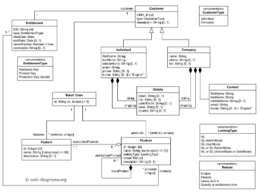

# DONNÉES

---
# DÉFINITIONS ET MODÉLISATIONS

**COURS 1**

---
**Évaluation**
- travaux par groupes de deux ou trois
- identifier/proposer un jeu de données à travailler
- enrichir ces données à partir de sources tierces (lier et agréger)
- extraire les données du jeu primaire ou secondaire via SPARQL (?)
- traiter, normaliser, restructurer, qualifier les données
- produire des datavisualisations à partir des données (3 et plus)
Rendu au début du mois de mars

---
**Signe, donnée, information, document**
- **Signe** - combinaison du signifiant (code visuel: lettres) et du signifié (concept)
- **Donnée** - élément connu, servant de point de départ à un raisonnement ou à une refléxion
	- **Donnée brute** - donnée dépourvue de raisonnement, supposition, constatation, probabilité
	- **Exemples** - observation ou description élémentaire d'une réalité, comparaison entre deux evts de même ordre, mesure...
- **Information** - ensemble de données organisées par une grammaire / système de signification pour exprimer qqch
	- **Exemple** - `David Bowie` est un `musicien` né à `Londres` en `1947` = 1 information combinant 4 données
- **Document** - à la fois contenu et contenant d'informations: objet complexe, **combinant**
	- **données** - le document est un ensemble logique et fini d'informations liées entre elles
	- **métadonnées** - le document est un objet dont la structure, forme, provenance peuvent être décrites & analysées
	- **Suzanne Briet** (bibliothécaire, pionnière de l'infocom en France) “[un document est] tout *indice* concret ou symbolique, conservé ou enregistré, aux fins de *représenter, de reconstituer ou de prouver* un phénomène ou physique ou intellectuel”
- **La pyramide DIKW - de la donnée à la sagesse** (rien que ça)

---
**Numérisation, accès à la donnée et fin du document**
- **Bibliothèque et document papier** - la bibliothèque est un lieu de recherche de données, mais **accès à la donnée via plusieurs intermédiaires** 
	- **Bibliothèque** - lieu physique d'accès à l'information et de recherche de données dans les documents
	- **Système de classification Dewey** - structuration des bibliothèques autour des disciplines scientifiques, moyen d'organiser la donnée et de permettre d'y accéder
	- **Bibliothécaire** - pour Briet, passeurs de savoir, professionnels de la recherche + fourniture d'informations
	- **Document** - lieu de stockage de la donnée
- **Numérisation** - accès direct à la donnée rendu possible
	- on ne recherche plus un document qui contient des informations, mais l’information elle-même, voire la donnée brute
	- on **accède directement au contenu** du document / la notion de “document” disparaît
	- **web sémantique** (via projets comme Wikidata) => accès au document est remplacée par accès aux données, liées entre elles
	- remplacement du document par la donnée => **nouvelle structuration des données et modélisation nécéssaires**

---
**Modélisation des données**

Modéliser, c'est **créer la représentation d'un système complexe** pour l'étudier/manipuler/comprendre: 
- **circonscrire un domaine de connaissances** - l'analyser, comprendre son fonctionnement, établir sa logique
- **faire ressortir les élts de ce domaine** - les décrire et les analyser entre eux
- **penser aux usages qu'on va faire du domaine** - les usages déterminent les modèles !
- **exemple - la modélisation en informatique** 
	- *objectif* - établir une logique formelle d’un domaine pour permettre à la machine de le manipuler ou de le calculer
	- *ce qui est fait* - on circonscrit le domaine, extrait les données, les articule, tout ça pour un utilisateur final: la machine

**3 états du modèle de données** - modèle conceptuel / modèle logique / modèle physique
- **modèle conceptuel** - les données comme elles sont organisées dans le monde réel
- **modèle logique** - les données structurées et exprimées pour être manipulables par traitement informatique
- **modèle physique** - les données telles qu'elles sont stockées dans une BDD

---
**Modèle conceptuel**
- **établir un modèle conceptuel**
	- **identifier les `entités` / `classes`** - objets du domaine à décrire *(personnages de film)*
	- **identifier les `attributs`** - caractéristiques des objets *(nom du personnage, titre du film)*
	- **décrire les `relations`** entre entités - la manière dont les entités interagissent *(X personnage vient de Y film)*
	- **identifier la `cardinalité`** des relations - la logique numéraire des relations, le nombre minimum/maximum de relations entre 2 classes *(Y film est réalisé par N réalisateurices, X réalisateurice fait N films)

- **formaliser un modèle conceptuel** - établir, de façon définitive, un modèle conceptuel liant toutes les entités, avec tous leurs attributs, décrivant toutes les relations entretenues entre entités et précisant leur cardinalité. **2 méthodes universelles**
	- **diagramme de classe en UML** (Unified Modeling Language)
		- langage de modélisation graphique basé sur des **pictogrammes**
		- **objectif**: fournir une méthode normalisée pour visualiser la conception d'un système
		- UML = un langage, **pas une méthode** - UML fournit un ensemble de diagrammes, mais chacun.e peut les implémenter à sa manière
		- UML est **un standard**, pas une norme - il est très répandu, mais rien n'oblige à passer par lui
		- https://fr.wikipedia.org/wiki/UML_(informatique)
	- **les patates** - équivalent low-tech: soit une entité une patate, on fait un schéma avec toutes les patates et les liens entre elles

---
**Modèle logique**
- **3 grandes familles**
	- modèle en tables
	- modèle en arbre
	- modèle en graphe
- **table de données** - ensemble de données organisées sous forme d'un tableau où 
	- **les colonnes** correspondent à des catégories d'information (une colonne peut stocker des numéros de téléphone, une autre des noms...)
	- **les lignes** à des enregistrements, également appelés entrées
	- **relations entre tables** permettent de lier différentes tables représentant différents types d'informations *(une table film, une table personne pour les réalisateurices et acteurices)*

- **arbre** - modélisation des données sous forme de **graphe acyclique orienté** (càd, graphe où les entités sont organisées en relations descendantes, où tous les nœuds sauf la racine ont un seul parent).
	- composé de **nœuds liés entre eux**. Plusieurs **types de nœuds**:
		- **`élément racine`** / root node - seul nœud n'ayant pas de parent, à la base de l'arbre
		- **`nœuds internes`** / internal node / inode - éléments possédant un parent et des enfants
		- **`nœuds externes`** / external node / feuille / leaf - éléments ne possédant pas d'enfants
	- **terminologie bonus** 
		- `arêtes` / edges / links lient les nœuds entre eux
		- `parent` - nœud de degré supérieur
		- `child` - nœud descendant directement d'un autre nœud, son parent
		- `voisin` / neighbour - parent ou enfant direct d'un nœud
		- `sibling` - nœuds partageant le même parent
		- `profondeur` d'un nœud : nombre d'arêtes entre la racine et le nœud
		- `taille` de l'arbre : nombre total de nodes

- **graphe orienté** - ensemble fini de nœuds non hiérarchisés pouvant entretenir plusieurs relations les uns avec les autres
	- **`nœuds`** sont non hiérarchisés et non ordonnés: il n'y a pas de relation parent/enfant, tous les nœuds sont au même niveau
	- **`arcs` / `liens`** représentent les relations. 
		- dans un graphe orienté, les **arcs sont fléchés** (relation entre 2 nœuds n'est pas unilatérale: a=>b , pas a<=>b)
		- arcs peuvent porter des **références**: des valeurs qui servent à préciser le type de relation *(A réalisateur de B)*

---
**Modèle physique**

**Langage de description des données** : modèles conceptuels et logiques **appliqués à la machine**
- dépendants du **type de modèle** et du **type de logiciel**
- **tables** - `SQL` dominant, dans ses =/= implémentations
- **arbres** - `Relax NG` est un langage très utilisé
- **graphes** - `RDF` sert à représenter les données en graphes compatibles avec le web sémantique

---
**Modèles conceptuels de références dans le monde patrimonial**

**`LRM-FRBR` - modèle conceptuel des bibliothèques** sous forme de graphe orienté
- **combine**
	- `LRM` - Library Reference Model
	- `FRBR` - Functional Requirements for Bibliographic Records
- **structure `œuvre - expression - manifestation - item`** - base du modèle, où
	- `œuvre` - idée originale, abstraite *(idée de To the Lighthouse de Virginia Woolf)*
	- `expression` - forme que prend l'idée *(To the Lighthouse tel qu'il est écrit : ensemble fini de mots)*
	- `manifestation` - version particulière de la forme *(édition X de To the Lighthouse)*
	- `item` - l'exemplaire physique *(copie de l'édition X de To the Lighthouse dans la bibliothèque)*
	=> *exemple - édition originale de To The Lighthouse conservée à la BNF*
- **ça devient vite incompréhensible** - 

**`CIDOC-CRM` - modèle conceptuel des musées**
- **nom complet** - CIDOC Conceptual Reference Model, le CIDOC étant le comité Documentation de l'ICOM
- **principes de base**
	- **modèle orienté objet**, avec insistance sur la matérialité (=/= LRM-FRBR)
	- **5 notions clés**
		-  `concept` - idée originale, abstraite, donnant lieu à l'évènement *(Rachel Whiteread veut mouler l'intérieur d'une armoire)*
		-  `actor` - agent de l'évènement *(Rachel Whiteread, l'artiste)*
		-  `place` - lieu de l'évènement *(Slade School of Art, lieu où est réalisée l'œuvre)*
		-  `time` / `event` - évènement . **Notion centrale** qui permet de décrire le contexte historique et les étapes de la vie du modèle *(1988, date de réalisation)*
		-  `thing` - objet, matériel et immatériel *(Closet, l'œuvre)*
		=> *exemple: Rachel Whiteread réalisé Closet en 1988 à la Slade School of Art*
	- **inclut éléments propres aux musées** pour gérer l'ensemble des informations: droit, documentation, gestion de l'objet...
	- **2 types d'éléments** 
		- `classes` - ensemble de 90 notions et concepts, exprimés par des noms
		- `propriétés` - ensemble de 149 actions ou interactions possibles entre classes, exprimés par verbes
	- **hiérarchies** entre les classes et les propriétés

**Tripotée d'autres modèles** `RIC`, `IFLA-LRM`..., avec **objectifs communs**
- modéliser les objets décrits, en restant au plus proche de leur réalité
- faciliter les échanges de données entre institutions
- s'adapter aux principes du web de données et rendre E informations machine-readable

---
**Gouvernance des données / Data governance**
- **principe résultat d'une stratégie qui vise à gérer les données** - flux, accès, stockage, mise à jour, consommation, pérennisation => stratégie de la donnée, de son traitement, de son utilisation
- **objectif** - optimiser valeur+efficience du traitement de la donnée
- **différentes échelles** - institution, pays, communauté de pays...
- **en un joli schéma tout choupi**

---
# BIG DATA, OPEN DATA, INTELLIGENCE ARTIFICIELLE, DATA MINING

**COURS 2**

---
**Big Data - quelques enjeux techniques**

**Historiquement**, les données sont gérées par des **silos applicatifs de données**: 
- **à la base** 1 application = 1 besoin = 1 E de données dédiées à cet usage = 1 silo
- **depuis**, dvp d'applications pouvant interroger plusieurs silos de données
- **modèle contraignant**: 
	- difficile d'interroger les données pour **répondre à d'autres questions** que celles auxquelles l'appli est censée répondre
	- **répétition des données** dans plusieurs systèmes isolés
	- risque de **désynchronisation** entre silos: des données synchronisées sur 2 systèmes peuvent être mises à jour seult sur un système
	- **multiplication des systèmes** de stockage&traitement => **multiplication des technologies utilisées** => **pb de maintenabilité**
	- **modélisation doit être recommencée** avec chaque nv usage

**Rupture**:
- **les raisons de la rupture**
	- **nouvelle approche des données** : donnée comme ressource à exploiter => **besoin d'adaptabilité** ; mouvement lancé par Google, qui commence à exploiter ses données pour publicité ciblée
	- **fin de contraintes techniques** => diminution du coût d'exploitation des données
- **nouvelle structuration**: on a plus 1 silo / 1 type de données / 1 appli, mais
	- **un module de stockage commun** à toutes les données
	- **un module de traitement des données** qui les adapte aux différents usages possibles
	- **des usages différents** pour les données
	- *cf schéma du diapo*
- **passage d'une scalabilité verticale à scalabilité horizontale**
	- **scalabilité verticale** - 1 serveur hyperpuissant pour 1 jeu de données spécifique; donnée stockée sur un seul serveur => coût d'installation très élevé, l'augmentation de la puissance de son système dépend de la puissance des machines (on doit acheter des serveurs de +en+ puissants & +en+ coûteux)
	- **scalabilité horizontale** - serveur unique remplacé par plusieurs serveurs -puissants +standardisés ; données réparties sur plusieurs petits serveurs => diminution des coûts d'augmentation de la puissance
- **répartition du stockage des données** à travers différents serveurs standardisés => -coût d'installation et stockage, +sécurité (si on se fait hacker un serveur, un +petit nombre de données sont compromises)
- **parrallélisation** - dvp de logiciels pouvant traiter les données réparties sur les différents serveurs. 2 aspects:
	- **data mapping** - logiciel de traitement des données unifie les données pour permettre la correspondance des =/= modèles de données de =/= serveurs
	- **data transformation** - transformation des données stockées sur serveur pour les adapter aux différents usages
- **microservices** se développent
	- remplacent logiciels applicatifs uniques et hyperspécialisés, coûteux
	- permet diminution des coûts dans le traitement des données

**Conséquence - nouveaux modèles de données adaptés**
- **déclin des modèles relationnels** type SGBD :
	- ils sont **spécifiques à un modèle** de données
	- **risque de désynchronisation** : infos ne sont pas systématiquement mises à jour
	- données sont **réparties sur plusieurs serveurs** *(un serveur personne, un serveur film)* => risque de corruption des données, incohérence...
- **dvp de BDD document** en format JSON. 
	- **facilite la répartition des données** sur plusieurs serveur: **le document contient toutes les données sur un objet** => contient E données nécessaires à 1 requête

---
**Open Data**

**Notions connexes**
- **notion théoriques/éthiques** - transparence, acc_s aux données des collectivités, réutilisation pour de nvx usages
- **notions informatiques** - utiliser les moyens du web, structurer les données publiées, utiliser API
- **notions juridiques** - cadre juridique de réexploitation

**Typologie des données** - en 2010, T; Berners-Lee propose une **échelle de qualité des données ouvertes**
- `*` - données disponibles sur le web avec licence ouvertes, non filtrées et éventuellement dégradées
- `**` - données disponibles en format lisible par une machine
- `***` - données disponibles en formats ouverts
- `****` - données disponibles dans des standards du W3C (RDF, SPARQL)
- `*****` - données ouvertes liées : jeux de données mises en lien + enrichies avec autres jeux de données

---
**Intelligence artificielle, traitemet automatique, data mining**

**Intelligence artificielle** - cf diapo

**Traitement automatique de la donnée** - domaine composé de nb domaines et sous-domaines qui s'entrecroisent (cf schéma du diapo)
- **fouille de texte** - ensemble de traitements informatiques consistant à extraire des connaissances selon un critère de nouveauté ou de similarité dans des textes produits par des humains pour des humains. Dans la pratique, cela revient à mettre en algorithme un modèle simplifié des théories linguistiques dans des systèmes informatiques d'apprentissage et de statistiques, et des technologies de compréhension du langage naturel
- **intelligence artificielle** - l'ensemble des théories et des techniques mises en œuvre en vue de réaliser des machines capables de simuler l'intelligence humaine
- **traitement automatique des langues** (TAL/NLP)
- **statiqtique** - aspect mathématique
- **machine learning** - champ d'étude de l'intelligence artificielle qui se fonde sur des approches mathématiques et statistiques pour donner aux ordinateurs la capacité d'« apprendre » à partir de données, c'est-à-dire d'améliorer leurs performances à résoudre des tâches sans être explicitement programmés pour chacune
	- **deep learning** - sous-catégorie qui vise à imiter le fonctionnement du réseau neuronal

**Les principes de l'apprentissage automatique**
- **programmation tradi** - un logiciel réalise un calcul sur des données à l'aide d'un programme contenant un ensemble fixe de règles
	- **input** - données et programme
	- **traitement** - calcul
	- **résultat** issu du traitement
	- **limitations** - demande d'être constamment màj pour s'adapter aux nouveaux besoins
- **programmation par apprentissage** - cf diapo pour compléments
	- **input** - ensemble de données et de résultats de traitement *(texte manuscrit et transcription par HTR)*
	- **apprentissage** - la machine traite les données et leur résultat pour mettre au point un algorithme qui, à partir des données, peut arriver au résultat. Apprentissage se fait toujours **à partir d'un set de données, en élaborant des classes** (sous-ensembles de données classés selon des elts discriminants)
	- **programme** - étape finale de l'apprentissage automatique : mise au point d'un programme utilisable sur les données
- **apprentissage automatique supervisé** 
	- on fournit au système un **set + classes de données** déjà établies et revues par humain
	- à partir de l'ensemble+classes, il **établit les critères disciminants** et dvp son modèle de classification
- **apprentissage automatique non supervisé**
	- on fournit au système un **set de données non classées**, sans spécifier de classes ou de nombre de classes à établir
	- à partir des données, il **établit ses propres classes et son système discriminant** : le système reconnaît et établit une structure de données pour un jeu de données
	- on appelle ça **le data clustering**

---
**Reconnaissance automatique pour l'audiovisuel**

**Image fixe et animée**
- **Reconnaissance de caractères**
	- **OCR** - reconnaissance optique de caractères imprimés
	- **HTR** - reconnaissance optique de caractères manuscrits
- **OLR** - reconnaissance optique de distribution; permet d'identifier parties cohérentes d'une image (zones de texte sur un page imprimée...)
- **Reconnaissance d'images / entités visuelles précises** - 
	- **Reconnaissance d'entités visuelles** - identifie une partie d'une image comme faisant partie d'une classe (identifier un tableau dans une vue d'expo)
	- **Reconnaissance d'images** - identifie une image précise dans une image (identifier le nom du tableau dans la vue d'expo)
	- **fonctionnement** 
		- entrainement du modèle : classification d'images à partir d'un très grand jeu de données
		- test du modèle : on lui fournit des images et étudie ses prédictions
		- aggrégation des résultats : on peut décomposer les images en plusieurs entités, ou sous-parties de l'image
- **Tagging d'images** - description automatique du contenu d'une image fixe/annimée
	- dvp d'un **système de classification multi-labels d'une image** (le système décrit une image à l'aide de plusieurs classes)
- **Détection des formes** - reconnaître + localiser dans une image plusieurs formes ou objets
	- **Analyse des visages** - sous-champ de la détection des formes. *Amazon rekognition* est très performant et vendu à plusieurs institutions gouvernementales US, y compris polices, malgré des énormes pbs de biais raciaux

**Sons** - moins performant en général
- **Analyse de la parole** - analyser la parole pour la rendre exploitable
	- **diarisation** - reconnaissance du changement de locuteurs
	- **speech to text** - retranscription automatique de discours
- **Reconnaissance des sons ou de musique** - retrouver dans un enregistrement un son pré-existant, conservé dans une base de données : sample de musique...
- **Classification du son** - classer des sons d'après caractéristiques typologiques (musique, voix d'hô, voix de fê...)
- **Identification de la voix** - identifier la voix d'un locuteur en la comparant à un dictionnaire / BDD d'extraits sonores de voix. Peut permettre de reconnaître la voix d'une personne précise

**Texte** - sert à traiter le texte dans l'audiovisuel + les textes produits par autres outils d'apprentissage automatique de l'audiovisuel
- **Identification d'entités nommées** - extraction automatique d'entités d'un texte
- **Classification automatique de texte** - associer des mots clés issus d'un référentiel à des blocs de texte
- **Topic modelling** - créer automatiquement des clusters/regroupements de documents par l'analyse dde leur vocabulaire
- **Mise en relation automatique par calcul de similarité de contenus** - mise en relation de documents par similarité de contenu (suggestions automatique YouTube)
- **Mise en relation des documents en fonction du comportement des utilisateurices** (Netflix...) ; ne s'attache pas aux métadonnées des documents, mais à son contenu et à un historique de l'utilisateurice
- **Réponse à des questions en langage naturel** à partir de phrases de documents analysés

---
# BASES DE DONNÉES
**Les différents types de BDD**
- **BDDR** : bases de données relationnelles, organisées en tables
	- langage: SQL ou spécifique (cad, autre langage propriétaire)
- **BDD orientée colonnes** : BDD qui stocke les données en colonnes, et non en lignes (=/= SGBDR) 
	- **différence avec BDD orientées lignes**:
		- Une table de données orientée lignes sérialise toutes les valeurs d'une ligne ensemble, puis les valeurs de la ligne suivante, etc.
		- Une base de données orientée colonne sérialise les valeurs d'une colonne ensemble, puis les valeurs de la colonne suivante, etc.
	- **utilité** 
		- grands jeux de données avec peu de variété entre données
		- permet d'ajouter des colonnes +facilt aux tables, puisque les lignes n'ont pas besoin d'être redimensionnées avec l'ajout de nv données
	- **langage** : SQL ou spécifique
- **BDD document** :
	- **avantages** : 
		- unité d'information
		- comme tout est compris dans la structure cela évite de faire des jointures pour reconstituer l'information car elle n'est plus dispersée dans plusieurs tables. Il n'y a plus besoin de transaction car l'écriture est suffisante pour créer des données sur un document pour modifier un objet. Une seule lecture est suffisante pour reconstituer un document. D'autre part, les documents étant autonomes, on peut les déplacer facilement, ils sont indépendants les uns des autres. 
	- **correspond à un modèle en arbre** : un élément racine est relié à un ensemble de nœuds descendants
	- **langage** : JSON et XML
- **BDD graphes** : BDD en graphes orientés, svt aux standards du web sémantique
	- **relations entre entités** rpr en graphes, avec noeuds et arcs
	- une base de données orientée graphe correspond à un système de stockage capable de fournir une adjacence entre éléments voisins : chaque voisin d'une entité est **accessible grâce à un pointeur physique**.
	- **modèle RDF** : triplet sujet-prédicat-objet, basé sur les technologies du web sémantique
	- **property graph** : 2e modèle dominant, organisé entre 2 sommets reliés par des arcs; sommets et arcs ont des propriétés
	- **langage** : SPARQL

---
**Le fonctionnement des BDD en tables**
**les propriétés ACID** (théoriquement, ces propriétés fonctionnent avec toutes les tables, mais sont surtout bien adaptées aux BDDR)
- **atomicité** : si une transaction (opération comprenant requête+réponse avec retour de résultats), la base retourne à son état initial : soit tout est exécuté, soit rien n'est exécuté
- **cohérence** : les données restent tjs cohérentes, même en cas de platnage du disque
- **isolation** : une transaction est exécutée de manière isolée => autres transaction doivent attendre la fin de la précédente pour voir le nouvel état de la table
- **durabilité** : dès que la transaction est terminée, les modifications sont oersistées de manière durable : logs, écriture disque...

---
**Bases de données orientées document**
- chaque objet = un **modèle en arbre** : un objet est représenté par un arbre
- la BDD = **ensemble d'arbres/objets combinés dans la BDD**
- la BDD document est **organisée en collections** : les collections rassemblent des objets semblables décrits par une même structure, qui peuvent être requêtés ensemble
- **langage de requête pour interroger un graphe** : `Xpath` si les objets sont décrits en XML, `jsonPath` si les objets sont décrits en json
- **quelques SGBDDD** (cf diapo)

---
**Évaluer et choisir une BDD** 
- **Théorème de CAP** 
	- **Consistency / Cohérence** : tous les nœuds du système voient exactement les mêmes données au même moment ; la donnée n'a qu'un seul état visible
    - **Availability / Disponibilité** : garantie que toutes les requêtes reçoivent une réponse; il est toujours possible de réaliser une opération
    - **Partition Tolerance / Tolérence à la distribution des données** : toutes les opératuons se terminent, quelque soit la disponibilité des documents
    - **seulement 2 pôles peuvent être garantis à la fois** :
		- **BDDR** : C+A grâce aux propriétés ACID, mais partition difficile 
		- **BDDDoc** : AP ou CP
- **Quel type de BDD choisir ?**
	- **BDDD** :
		- **pourquoi l'utiliser**
			- pour stocker **documents structurés hiérarchiquement** et ne pouvant être exprimés en BDDR
			- besoin de **très forte montée en charge** : puissance de calcul très forte pour faire du data clustering, du cloud et très gros jeux de données
			- **peu ou pas de màj des documents** : la BDDD est très difficile à mettre à jour =/= BDDR
			- **fort besoin de consultation et d'interrogation de la base** : en bref, une BDDD est surtout utile à la consultation
			- **possibilité de faire évoluer sa structure** de données facilement (alors que les données en tant que telles sont dures à éditer)
		- **pourquoi ne pas l'utiliser**
			- interrogation de **données peu représentables en document** (obviously) : données fortement reliées avec grande hétérogénéité (dans ce cas, préférer BDDR)
			- pour faire de **l'interrogation de données complexes** et recherche de résultats très précis (là, BDDR est mieux)

---
**Les moteurs de recherche**
- La **recherche d'informations** / information retrieval / IR consiste à trouver des documents peu ou faiblement structurés, dans une grande collection, en fonction d'un **besoin d'informations**
- **2 types de moteurs de recherche**
	- **recherche plein texte** : recherche dans la valeur des données (recherche dans le contenu des balises, par ex) : examiner tous les mots de chaque document enregistré pour les faire correspondre à la recherche de l'utilisateur. Permet recherche peu structurée et produit un réponse avec un plus grand risque de bruit
	- **recherche type BDD** : requête structurée sur un jeu de données structuré, avec une réponse "exacte"
- **vocabulaire**
	- bruit / silence
	- faux positif : document non pertinent inclus dans le résultat d'une requête (forme de bruit)
	- faux négatif : document pertinents qui ne sont pas inclus dans le résultat (forme de silence)
- **enjeu** dans la conception d'un moteur de recherche : trouver le **juste milieu entre bruit/silence**
	- est-ce qu'on privilégie les faux positifs ou les faux négatifs
	- jouer sur **précision** (mesure de la fraction de vrais positifs dans un résultat; précision de 1 = absence totale de faux positifs; précision de 0 : absence de vrais positifs)
	- jouer sur **[terme manquant]** (mesure de la fraction de faux positifs dans le résultat)
- **Principes de base du moteur de recherche**
	- **crawl** (surtout pour les moteur web) : utilisation d'un robot d'indexation qui garantit l'accès du moteur de recherche à toutes les données à indéxer
	- **indexation** : dans le corpus à explorer, des mots significatifs sont extraits et enregistrés dans une **BDD: index terminologique** du corpus à explorer. **Améliorer l'indexation** : 
		- **tokenisation** - permettre le repérage des mots dans la requête et dans les documents
		- **normalisation** de l'orthographe
		- **lemmatisation**
		- **repérage des mots vides**
		- **création de synonymes**
	- **recherche + tri et classement des réponses** : un algorithme est utilisé pour retourner des résultat et les organiser selon le critère déterminé par l'utilisateur
		- **pertinence** : type de tri qui vise à proposer un ordre de classement qui semble le plus pertinent au regard de la requête et de l'ensemble des résultats. Calculée à partir de nombreux critères: fréquence d'un terme, degré de similarité (proximité de synonymie), provenance des mots dans requêté dans le document, page rank
	- **recherche à filtres et recherche à facettes** 
- **Comment choisir son moteur de recherche**
	- performances attendues
	- périmètre de données

---
**Forces et faiblesses de chaque type de BDD**
- **BDDR** :
	- permet beaucoup de **lecture/écriture**
	- données **très strcturées**
	- garantie de la **transaction**
- **BDDD** 
	- quand il n'y a **peu ou pas de mise à jour**
	- pour **données semi structurées** => pas de granularité très fine
	- **montée en charge** : immense puissance de calcul
- **BDDGraphe**
	- données **très très très structurées**
	- permet **inférence** sur les données
	- respecte **logique des données**
- **Moteur de recherche**
	- facilite requête en **plein texte**
	- **réponses rapide**
	- **montée en charge** pour gérer un +gd nombre d'utilisateurs (=/= BDDD, qui permet une montée en charge sur complexité des requêtes)

**Dans la pratique**, combinaison de systèmes de BDD, avec
- **système de stockage primaire** type BDDR  : entrepôt de référence des données qui assure conservation des données, écriture de données, requêtes basiques...
- **système de stockage secondaire** type JSON ou moteur de recherche: permet requêtes, construction de moteurs de recherches, exposition des données... Usage majoritairement en lecture. Demande synchronisation avec le système de stockage primaire

---
**Cloud**
- Cloud permet **plein de trucs cools** : supervision, disponibilité, maintenabilité, montées de version, gestion de montée en charge... => pour beaucoup d'argent **facilite énormément** la gestion des données (on confie à un grand opérateur la gestion de ses données, on a plus à choisir une BDD, à s'inquiéter de la puissance de ses serveurs...)
- **problèmes** : coût, sécurité des données, souveraineté sur les données...
- **questions à prendre en compte**
	- criticité des données (sensibles ou non)
	- volumétrie des données (détermine le coût)
	- capacité du réseau de l'institution (pour accéder au cloud)
	- perte de compétence dans la gestion de ses propres de données (on risque d'être pris en otage par son cloud)
- **tldr** : ne pas prendre un tank pour tuer une souris

---
# VISUALISATION
**extraire des données**
rattrapper

---
**de la donnée à la visualisation**
- **préparer les données**
	- identifier les limites et erreurs dans les données, pour trouver les biais à la visualisation
	- déterminer des indicateurs; critères mesurables à partir desquels extraire une visualisation
	- croiser les données entre elles, éventuellement
	- tester la pertinence des résultats pour vérifier les biais possible
- **visualiser**
	- trouver des représentations pertinentes par rapport à la nature des données
	- jauger la quantité d'informations visualisables
	- déterminer des interactions utilisateur avec les représentations (pour pas faire de visualisations statiques)
	- déterminer si l'analyse est explicite ou non

---
# MASHUP DE DONNÉES

---
**principes de base**
- le mashup, c'est **le mélange de différentes sources de données** pour permettre son exploitation
- **à partir de là**, on peut créer des API, permettre une exposition au public...

---
**première étape : analyser ses données**

**évaluer** les données et **imaginer** les usages : base du L de visualisation
- **qu'est-ce qu'on va faire des données** (question principale)
- quelles sont les données
- quelles forces et faiblesses ?
- est-ce que les données sont complète
- est-ce qu'on peut les compléter en faisant un mashup avec d'autres datasets ?

---
**étapes du travail**
- récupérer les données
- préparer les données
- exploiter les données 

---
**récupérer les données**
- **comment ?**
	- **`data dump`** : dépôt ou déversement de données figé à un instant T (en gros, un export de BDD) ; 
		- c'est pratique, mais le problème c'est qu'un dump est figé dans le temps et dans sa forme (impossible de trier les données) ; 
		- énormément de dumps d'etp et services publics sur internet (ratp, ministères, ina...)
		- il y a aussi des dumps communautaires (wikidata)
	- **`API`** : dépôt de données en temps réel
		- nombreuses manières de requêter : REST (ce qu'on fait avec module `request` je crois), Restfull, SPARQL Endpoint...
		- API sont plus rarement open data, donc plus rarement réutilisable => **consulter les licences**
		- **API web ouvertes** : 
			- SPARQL Endpoint : wikidata, data.bnf, dbpedia, biblissima
			- IIIF : Biblissima
			- Langages propriétaires : Wikimedia commons, 
	- **`scraping`** : automatiser la récupération des données structurées en HTML sur une page web (en gros, copier le HTML d'une page) ; attention, **peut être illégal** ; librairie python : `scrapy`

---
**préparer ses données**
- **phase indispensable** : permet de standardiser les données et de les rendre ensuite réutilisables
	- les données récupérées sont souvent sales
	- permettre l'interopérabilité des formats (faire communiquer des données RDF avec du SQL...)
- **quel type de traitement**
	- **traitement unique** : on le fait une fois ; à privilégier si on travaille sur un dump, un jeu de données qui n'évolue pas (films réalisés avant 2000...)
	- **traitement régulier** : traitement en flux quand on travaille avec des flux de données
- **méthode**
	- **`analyse`** de données (comprendre la structure, sémantique, nature et cohérence des données)
	- **`filtrage`** : sélectionner les données utiles
	- **`normalisation`** : typer les données, cohérence des valeurs, forme des données
	- **`structuration`** : mapping des données (diriger ses données d'une étape à l'autre, déterminer où elles vont)
	- **`enrichissement`** : jointure avec d'autres jeux de données
- **outils de nettoyage** : OpenRefine, Datailku, Talend...
	- fonctionnent comme un **data pipeline** avec une interface graphique (flux de traitement de données où on fait plusieurs séries de modifications)

---
**exploitation et enrichissement de données**

---
## lancer dataiku 
- `programmes/dataiku/bin/dss start`
- `http://localhost:11000/`, login admin pw admin).