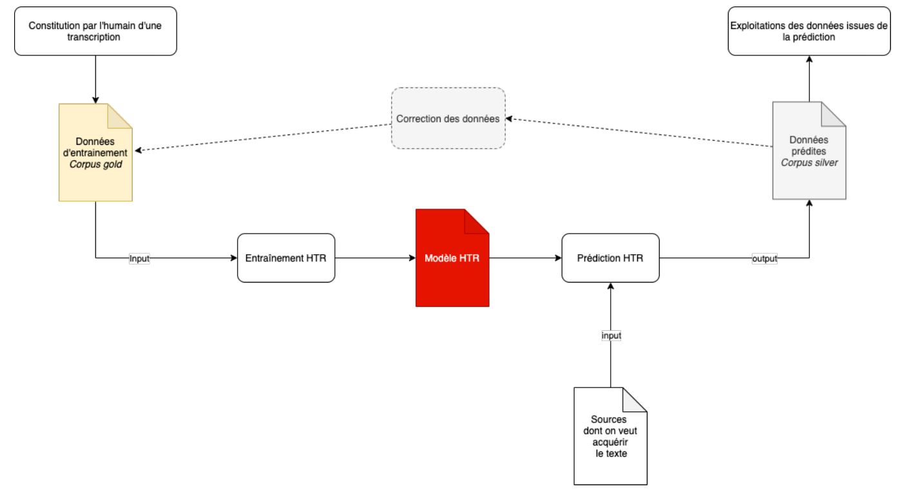

# HTR ET eSCRIPTIORIUM

---

**Logiciels d'HTR dispo, une histoire**:
- Transkribus, le 1er financé par UE qui en fait finit par voler les entrainements faits par des quipes de recherche avant de venir priver
- Ocropy & Kraken: alternatives livbres, aujourd'hui très importantes

**HTR = évolution de l'OCR**, qui **permet**:
- prédiction de contenu texte depuis une image de la source
- à partir d'une **intelligence artificielle entraînée** par un humain

---
**mise au point d'un modèle: processus incrémental**
Alternance de phases d'intervention humaines (contribution de transcriptions pour entraîner le modèle) + phases de calcul (test du modèle par l'ordinateur sur d'autres corpus), selon **ce modèle**:
- **transcription par l'humain**: au moins 30 documents, voire 100 pour bien entraîner son modèle
- **corpus Gold** / vérités de terrain / ground truth : corpus de documents transcrits et vérifié par l'humain, qui sert à l'entraînement et qui peut être utilisé pour établir de nouveaux modèles en faisant un *fork* d'un modèle pré-existant
- **entraînement**: test du corpus gold sur d'autres documents, pour établir le modèle HTR
- **modèle HTR** en version +- bêta disponible à la fin de cette étape, utilisable sur d'autres corpus => prédiction
- **prédiction d'HTR**: test sur un nouveau corpus, avec nv sources, pour établir *corpus Silver*.
	- **Prédictions**: documents lus par HTR mais non-corrigés
- **corpus Silver**: E de prédictions: corpus de données non corrigées par un humain
	- à la fin de cette étape, **modèle fonctionnel à 90%** (90/100 caractères reconnus sans faute)
	- **enrichissement du corpus Gold** aprèse correction du corpus Silver par un humain => **màj du modèle HTR**

---
**Pourquoi utiliser ou créer un modèle d'HTR**
- on créé rarement des modèles ex-nihilo: **réutilisation de modèles performants créés pour des corpus semblables**, qu'on peut trouver sur: https ://github.com/HTR-United/htr-united
- réutilisation de **modèles pré-existants permet**:
	- accélérer phase d'**acquisition du texte**
	- accélerer l'**élaboration de son propre modèle** en ne partant pas de zéro
	- **enrichissement des modèles pré-existants**
- **utilisations possibles** en fonction de la qualité des données:
	- **accuracy > 95%** - édition de textes et publication
	- **accuracy 90-95%** - mise à disposibition de texte brut, pour la recherche ou pour diffusion restreinte
	- **accuracy 80-90%** - utiliser le modèle pour des analyses quantitatives
- **déterminer le niveau d'accuracy à atteindre** à partir de ses besoins: il n'y a pas besoin d'une précision +95% si on veut juste avoir un texte brut disponible

---
**Bonnes pratiques collaboratives**
- **harmonisation des données entre projets** très importante pour améliorer modèles existant pour corpus semblables
- **établir des référentiels et des pratiques communes**: définir comment représenter un caractère rare, une abbréviation...
- **utiliser des vocabulaires contrôlés** pour le zonage du texte (en gros, diviser son texte en balises XML selon un vocabulaire de balises contrôlées)
- **équilibrer besoins scientifiques et pragmatiques** de façon commune dans la transcription, en adaptant ses pratiques à la communauté scientifique visée
- dans la **gestion de projet**, établi des **pipeline**: diviser le L en plusieurs sous-étapes pour réadapter le modèle (par exemple, faire un pipeline lemmatisation, un pipeline zonage du texte...) 
- **documenter ses choix avec rigueur** si on veut produire une vérité de terrain partageable et donc permettre l'enrichissement de nvx modèles à partir de notre corpus Gold
- **attention aux formats d'HTR**:
	- ils ne sont **pas pérennes** et dépendent des logiciels et de leurs évolutions technologiques (l'HTR, ça date d'il y a pas 10 ans)
	- ils ne sont **pas interopérables** surtout pour Transkribus; pareil pour algorithmes des différents logiciels
- **créer des sets de données partageables**: un des objectifs majeurs de l'HTR aujourd'hui, ce que doivent permettre les bonnes pratiques

---
**Comment évaluer un modèle?**
- **Tester le modèle** avec de nouvelles prédictions
- **Évaluer l'élasticité du modèle**: voir comment il se débrouille avec d'autres types de corpus

---
**eSCRIPTORIUM**
- outil collaboratif => **créer un outil par transcripteur** pour éviter les conflits (qqun segmente un texte segmenté par qqun d'autre...)
