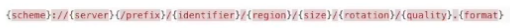
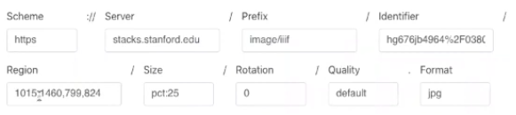
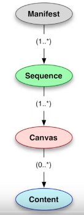
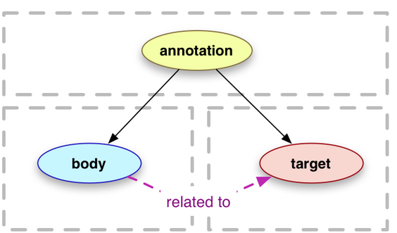
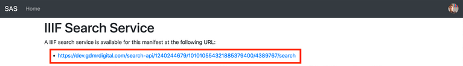

# IIIF

---
https://training.iiif.io/iiif-online-workshop/

---
## Image API
---

**Basic definitions**
- An `image API` works like a URL which points to the image to manipulate and describes the way in which to manipulate it : 
	- it is the agreed standard and specification which forms the contract between Client and Server
	- a IIIF URL looks like : `http://host:port/identifier/region/size/rotation/quality.format` and it is possible to generate images that fit this URL structure and conform to the IIIF Image API using a tile generator.
	- 
	- 
- `Image API Server` - the running software that provides access to images using the Image API. Sometimes shortened in this context to Image Servers. 

**But what does it provide ?**
- A standard URL structure for accessing images (easy to support)
- Enough information to drive a zoom viewer (software that allows users to zoom on an image)
- Human hackable URLs
- Cacheable and Scalable URLs


---
**Contents of the URL and of the Image API**
- **`Identifier`** : a link/URL to the resource (image) used for IIIF.
	- `info.json` : a file linked to the image URL (the identifier) that gives informarion to the viewer software about the image : full width and height...
	- **everything to the right of the Id** is controlled by IIIF : region, size, rotation, quality, format.
- **`Region`** : a portion of an image to be displayed by the viewer.
	- **URL format** : `/x,y,width,height/` 
		- *ex* : : `/125,15,120,140/`
			- 125 pixels from the left
			- 15 pixels from the top
			- the region's width is 120px
			- the region's height is 140px
	- **shortcuts** : 
		- `full` : the full image
		- `square` : a square region, positionned by the server
- **`Size`** : the size of the output image
	- **some formats** : 
		- `full` / `max` : the full image (this is renamed `max` in 3.0)
		- `w,` - only the width is specified and the server works out the correct height to keep the aspect ratio. Example `500,`
		- `,h` : the alternative only specifying the height. Example `,250`
		- `w,h` - explicit width and height. Note this will distort the image. Example: `250,250`
		- `!w,h` - fit in a box width by height but don't distort the image. Example `!250,250`
	- **full list of options** : https://iiif.io/api/image/2.1/#size 
- **`Rotation`** : totating the image in degrees up to 360. You can also use the `!n` to mirror and rotate the image. Note **not all image servers support rotation** and there are the following levels of support known as compliance levels:
		- *No rotation supported* - Level 0
		- *Only 90 degree rotation supported* - Optional in Level 1 mandatory in level 2
		- *Arbitrary rotation* - Optional at all levels
		- *Mirroring* - Optional at all levels
	- *example of mirroring* : `!0` mirrors the image vertically
- **`Quality`** : defines the color of the output : 
	- `Default` : the source color
	- `Gray` : greyscale color
	- `Bitonal` : each pixel is black or white
	- `Color` : pretty much the same as default i guess 
	- This can be useful for some image processing tools like OCR generation
- **`Format`** : The format of the image for example `jpg` or `png`. The list of images supported by the image server is again listed in the `info.json`.


---
**File formats**

The IIIF specification makes no mention of the source format of an image and the type of image you can use is driven by the IIIF Image Server you choose. Most support the common file formats like jpeg, png, tiff or gif. To get the fastest experience it is advised to use a special kind of image format that supports tilling (`jpeg2000`, `pyramid tiffs`)
	- tiling : formats of images that are composed of small "squares" which can be picked out by the viewer to produce a zoomed in or zoomed-out image quicker, rather than calculating everything pixel by pixel
	
	
---
**Using the image API**

There are **many ways to make a IIIF Image** available which is both a big advantage but also can add complexity. The decision on which option to go for depends on your institution or personal use case. IIIF is able to be used by single researchers up to National institutions and so there are setups to handle each individual case.
- **vendor / digital assets management systems** : the best solution for institutions is implementing IIIF into existing software that they aldready have : reduces the duplication of images
- **hosted** : uploading your images to a service that provides IIIF image API. Hosting providers run the IIIF image servers and provide interfaces for uploading and managing images. They are a good solution for individual researchers and mid-sized institutions.
	- free hosting services : Internet Archive
	- commercial hosting : klokan iiifhosting, digirati dcls platform.
- **iiif image servers** : they can be FOSS, but require to be set up and maintained. This is overkill for a single institution.
	- `IIP Image` is written in C
	- `Loris` in python
	- `Cantaloupe` in Java 
- **static tiles** : a cheaper and easier option, but with a lot of steps, is to not use an image server. Instead, you can extract the derivative images created with the image API and host them online somewhere. Then, the images can be reused on demand, but has limited numbers of sizes and regions defined.
	- basically you create your images out of your source (zoomed images, rotated...) and upload them to a hosting service 


---
**Internet Archive and the image API**
- Upload your image
	- Ensure you only upload a single image
	- Ensure you select the 'Community Image' collection
- On the details page get the identifier for the image. For example if the details page link is: `https://archive.org/details/img-8664_202009`
	- the identifier would be `img-8664_202009`
- Use the Internet Archive image service with this identifier: `https://iiif.archivelab.org/iiif/img-8664_202009/info.json`
- You should then be able to use this image:
	- Create an image link:
		- `https://iiif.archivelab.org/iiif/img-8664_202009/full/512,/0/default.jpg`
	- Check it works with a zooming viewer like OpenSeaDragon:
		- `https://iiif.gdmrdigital.com/openseadragon/index.html?image=https://iiif.archivelab.org/iiif/img-8664_202009/info.json`
	- Pull out regions using the UCD selector tool:
		- `https://jbhoward-dublin.github.io/IIIF-imageManipulation/index.html?imageID=https://iiif.archivelab.org/iiif/img-8664_202009`
		- Note: the UCD selector tool requires the Image link without the info.json at the end of the URL.
	- Small images workaround : Some images are appearing small, to get round this issue you will need to add the filename to the URL.
		- go from this: `https://archive.org/details/img-8664_202009`
		- to this: `https://iiif.archivelab.org/iiif/img-8664_202009$IMG_8664.jpg/info.json`


---
### Presentation API

---
**IIIF manifest**



a `"Manifest"` is a bundle of information that IIIF relies on to enable sharing of books and manuscripts across viewers and institutions. It works by encapsulating a digital object : a single image, a sequences of images, a video...
- a single `JSONLD` file which contains 
	- **metadata** (all information needed to present an image to a viewer
		- **descriptive metadata** : title, dates, description, license
	- **one or more sequences** of canvases that applies to content (images) 
		- a sequence **defines** the viewing order for canvases and their contents
	- **canvas** : the holder for image content and annotations. It is refenred by canvases ; one image can be described by several canvases
		- they define a layer of abstract coordinates to which contents are linked
		- sever images can be laid over a single canvas
		- **the `json` canvas structure**
			- an `@id` (URI identifier)
			- an `@type` (which explicitates the fact that the json file is a canvas)
			- a `label` : the display label (data to be displayed)
			- a `height` and `width`, in pixels
			- `images`, which link images and annotations
		- **the `json` annotation structure** : 
			- `@id` : an identifier
			- `@type` specifies that the json file is an annotation
			- `on` links the annotation to the canvas 
			- `resource` links the annotation to the image

---
**Creating a manifest**

Generally the data required to create a manifest generator are as follows:
- **Accessible IIIF Images**
- **Data on how the images relate to each other**. For example the order of the pages in a manuscript
- **Descriptive metadata** for example:
	- `Title` - Name of the item this is called a label in IIIF
	- `Descriptions` (optional)
	- `Rights or licensing` (optional)
	- `Metadata` useful for discovery (optional) - this will be explained later

Once the manifests are generated, they can be stored on any web server and don't need a specific server like the image API.


---
### IIIF Anotations
---
**Intro**
- follows the **`W3C annotation model`** : all annotations are composed of a body (the content of the annotation) which points to a target (the thing which is annotated).
	- 
- an **annotation list** groups annotations at canvas or page level. Annotation lists are usually **resolvable** which means if you take the `@id` and put it into a Web Browser you should get the annotation list back. 

---
**JSON annotation structure in Open Annotations**

An annotation is a `json` file which contains:
- `@id` : identifier of the annotation
- `@type` which specifices the JSON file is an annotation
- `motivation` : the reason for which we're annotating / the type of annotation
- `resource` which contains the body of the annotation
- `on` : pointer to the target (the image you're annotatng)

Another format (`web annotations`) has the same JSON structure but with slightly different labels.


---
**Annotation stores** 

They are applications on which to annotate IIIF materials permanently. Here are some :
- **annotot**
- **elucidate**
- **simpleannotationserver**, which we'll use.
	- textual annotations are written in **RDF/A HTML**
	- https://github.com/glenrobson/SimpleAnnotationServer 
	- utiliser en ligne : https://dev.gdmrdigital.com/

---
**Annotating with SimpleAnnotationServer**
- **connect** online and link it to your manifest : 
	- https://github.com/glenrobson/SimpleAnnotationServer 
	- Connect the manifest to SAS : you need to go to IIIF Workbench, Manifests tab, click on the IIF logo of your manifest, open it and copy its URL. This will copy the Manifest URL to your clipboard. Then, paste it on SAS
- **annotate away** ...
- **link the annotations to your manifest the annotations to the workbench** : 
	- on the SAS, click on `browse annotations` > `download annotations`
	- upload the annotations on the Workbench
	- modify the `manifest.json` file : after the `"images"` array, add an `otherContent` element : 
		```json
		"otherContent": [
			{
				"@id": "url of the annotations (retrieved in the same way as the JSON manifest's link was retrieved from the workbench)",
				"@type": "sc:AnnotationList",
				"label": "Name of the annotations"
			}
		]
		```


---
**Searching through annotations : the IIIF search API**
- **on the SAS**, go to `browse annotations` > `configure IIIF search`
- **paste the URL** :
	- 
- **update the `json` manifest** : after `label`, add a `service` element : 
	```json
	"service": {
		"profile": "http://iiif.io/api/search/0/search",
		"@id": "URL copied in the previous step",
		"@context": "http://iiif.io/api/search/0/context.json"
},
	```

---
**Publishing a manifest**
- **update the manifest** on the workbench with the final manifest
- **that's it !** - the annotations and search services can be browsed on the following apps : 
	- `mirador 3` : https://projectmirador.org/ 
	- `universal viewer` : http://universalviewer.io/
	- `annona` : http://iiif.gdmrdigital.com/annona/index.html?iiif-content=[annotations_url] (for that one you need to update the `[annotations_url]` by your actual annotations url)