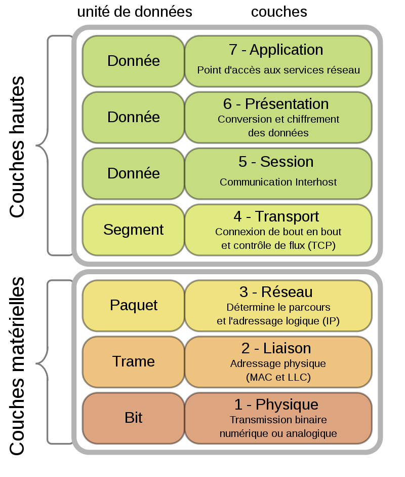

## # SERVEURS SOUS LINUX
---
## Machines virtuelles

- idée de base : les machines peuvent aujourd'hui **utiliser plusieurs systèmes d'exploitation** => VMs permettent de faire tourner **plusieurs OS**
- **virtualisation** : 
	- plus simplement : substituer à un élément de matériel informatique (hardware) – tel un ordinateur ou une console de jeux – un logiciel
	- processus qui fait croire à un OS qu'il tourne sur du vrai hardware alors qu'il tourne sur du software qui fait le lien avec du hardware (une VM debian fait croire à debian qu'on utilise debian comme OS principal alors qu'on utilise debian sur du ubuntu et que ubuntu fait la communication debian-hardware)
- **emulation** : variante de la virtualisation qui permet d'accélerer le processus
- **hyperviseur** : logiciel de virtualisation qui permet de lancer plusieurs OS invités
	- **hyperviseur de type 1** : un noyau système très léger et optimisé pour gérer les accès des noyaux d'OS invités à l'architecture matérielle sous-jacente (il y a aussi des hyperviseurs de type 2, +lourds)

**lancer virtual machine manager** : `virt-machine` dans le terminal

---
**socket, coeur, thread**
- `socket` : processeur physique (combien de processeurs sont connectés au software)
- `core / cœur` : processeur logique
- `thread` : virtualisation des processeurs (pas compris)

---
## installation de paquets
- `dpkg --list` : afficher la liste des paquets installés sur le système ; les lignes comportant les logiciels installés commencent par `ii`
- `apt` : 
    - `apt install <package>` installe le paquet "package" ;
    - `apt search <package>` recherche le paquet "package" dans les dépôts ;
    - `apt purge <package>`` désinstalle le paquet "package" ;
    - `apt update` met à jour le cache local contenant la liste des paquets disponibles ;
    - `apt upgrade` met à jour les paquets installés.
- **les dépôts logiciels sous Debian** sont configurés à plusieurs endroits : dans le fichier `/etc/apt/sources.list`, ou dans un fichier dont l'extension se termine par `.list` et se trouvant dans le répertoire `/etc/apt/sources.list.d`.
- **installer un nv dépôt** : ajouter l'url du dépôt dans ces dossiers, dans un fichier `backports.list` : `/etc/apt/sources.list.d/backports.list`
	- *par exemple* : `echo "deb http://deb.debian.org/debian bullseye-backports main" > /etc/apt/sources.list.d/backports.list`
- **installer un paquer depuis un dépôt** : `apt install -t nomPaquet`

---
## réseau et HTTP

Une machine a une **adresse IP par défaut** (indentifiant individuel) et une **passerelle par défaut** (serveur par défaut pour se connecter à internet)
- **adresse IP de ma machine** : `192.168.122.148`
- **passerelle par défaut** : `192.168.122.0`

**Le protocole d'adressage** : 
- **couche haute** : 
- **couche matérielle** : 
- **adresses IP** : `ipv4` et `ipv6`
	- **`ipv4`** : protocole IP majoritaire, existe depuis 30-40 ans. Adresse IP composée de 4 octets. https://fr.wikipedia.org/wiki/IPv4 
		- **une adresse IP**, c'est une série de 4 octets (1 octet = un nombre entre 0 et 255) => 4 séries de nombres séparés par un point : `192.168.122.148`.
		- **adresses décomposées** entre bits réservés au réseau et bits reservés à l'hôte : 
			- c'est le **masque de sous-réseau** à la suite de l'IP, qui définit combien d'adresses IP personnelles différentes peuvent se connecter au réseau
			- formellement : le `/N` dans l'adresse suivante) `192.168.122.148/16`
		- **adresse réseau / adresse broadcast** : 
		- **adresse de sous-réseau** : un routeur (une source d'internet, quoi) peut connecter plusieurs adresses IP personnes à internet : l'IP réseau du routeur est divisée en plusieurs adresses de sous-réseau qui sont utilisées par les ordinateurs personnels
		- une adresse IP personnelle est une adresse privée : elle ne peut pas accéder à internet en tant que telle => le **`NAT`** (Network Adress Translation) permet de traduire une IP personnelle en IP réseau ; c'est le **routeur web** qui fait le NAT.
		- **`LAN` / `localhost`** :
			- **localhost** : adresse IP `127.0.0.X` : c'est une adresse réseau locale (qui tourne seulement sur l'ordi), qui n'est jamais connectée au réseau
			- **LAN** : local area network : réseau informatique de plusieurs machines qui communiquent sans utiliser d'accès à internet. Un LAN peut être connecté à internet si une machine du LAN a une passerelle vers internet
		- **passerelle par défaut** : l'adresse IP par défaut par laquelle une machine ou un LAN permet de transférer des informations à internet
		- **`DNS`** : Domain Name System : le protocole qui permet de traduire des adresses IP en adresses web "normales" (google.com)
	- **`ipv6`** : protocole IP arrivé il y a 20aine d'années. Il y a bcp plus de 4 octets

**Réseau HTTP sous Debian**
- Sous Debian, la configuration de l'interface réseau se trouve dans le fichier `/etc/network/interfaces`. Comme pour la configuration des dépôts, un répertoire `/etc/network/interfaces.d` peut contenir des fichiers de configuration supplémentaires.
- `ip addr show` : montre les adresses IP
- `ip route show` affiche la table de routage de la machine
- `man interfaces` : donne la syntaxe de configuration de l'interface

---
## Gestion des utilisateurices
- *mdp utilisateur de student1 : password*
- `exit` / `logout` : se déconnecter de sa session actuelle
- `login <usrname>` : se connecter à un compte

---
## Architectures 3/3 (trois tiers)

**Essentielle au dvp du web dynamique** : développement en 3 couches

**Les bases**
- **présentation** : la couche qui communique des données à l'utilisateurice / sur son poste personnel
	- **langage propre** à la couche présentation: `html`, `xhtml`, `css`
	- **langage de communication** présentation/bdd principal : `CGI` (common gateway interface)
- **application**, qui gère et affiche les données
	- **langage propre** à la couche applicative: `php`, `perl`, `python`, `java`, `javascript`, `ruby`
	- **langage de communication** principal application/bdd : `sql`
- **base de données** qui contiennent les données à afficher 
	- **langage propre** : `MySQL`, `Postgresql`, `Oracle`, `MariaDB`...

**Nouveaux ajouts**
- **couche animations** s'est rajoutée sur la couche applicative (avec `javascript`)
- **couche distribution** indépendante, avant la couche de présentation: permet la répartition de charge (fonctionnement plus complexe d'une application web pour gérer un plus grand nombre de requêtes: 
	- répartiteurs de charge:  diviser le fonctionnement d'un site web sur différents serveurs web (X serveur gère X requête...)
	- gérer la sécurité
	- mettre en cache des données qui sont souvent requêtées (les stockées dans la mémoire en accès rapide pour une durée limitée pour diminuer la durée de lancement)
	- **les reverse proxy** permettent de faire tourner ça : une couche proxy qui est devant les serveurs web qui font tourner l'application et qui répartissent les requêtes à travers différents serveurs.
- **couche de données volatiles**, au niveau de l'application : le serveur web applicatif garde en mémoire vive certaines données dans des bases clés/valeurs qui n'utilisent pas de SQL (principe `nosql`)

