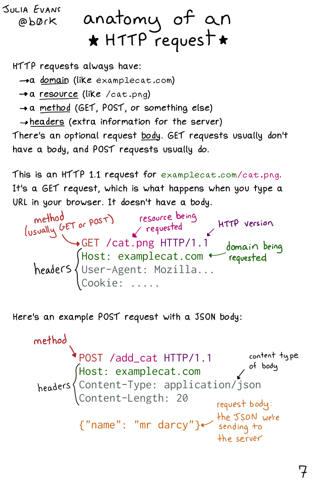
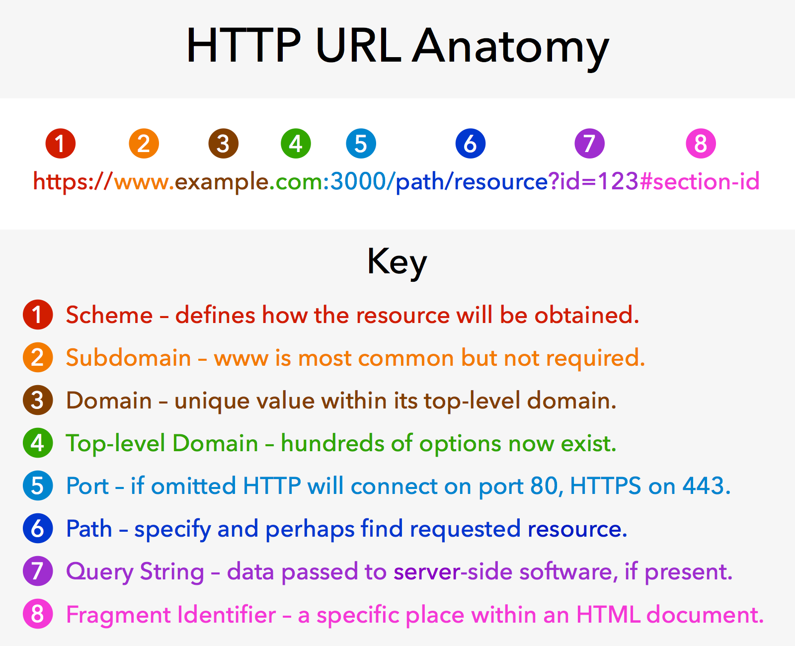
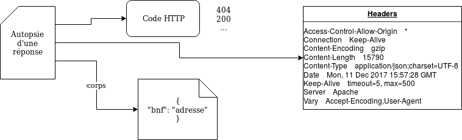

# PYTHON _ LES LIBRAIRIES

* * *

# EN GÉNÉRAL

- un **package/librairie/module** est une librairie contenant des modules : des outils (fonctions, méthodes…) rassemblés pour un besoin spécifique (travailler avec des images, des csv...)
    - **utilité** : réaliser certaines tâches spécifiques, traiter certains types de documents (csv…)
    - **`import pkgname`** : importer un package pour pouvoir l’utiliser
    - **`from___import___`** : spécifier le lieu d’origine du module à importer / n’importer qu’une sous-fonction ou un sous-module dans un module plus large. *Exemple: `from csv import csv.writer`*
    - **`dir(pkgname)`** : accéder à la liste des outils du package
- **lire la documentation** : https://docs.python.org/3.5/
- **dans jupyter** réimporter ses pkg à la correction pour éviter des bugs

* * *

# `CSV`

- **`csv.reader(file, dialect, **fmtparams)`** : lire le contenu d’un csv
    - `file` : fichier ouvert en mode lecture
    - `dialect` : ensemble de fmtparams pré-programmés pour se conformer aux pratiques de logiciels spé (Excel : default dialect)
    - `**fmtparams` : paramètres supplémentaires spécifiés dans la documentation, dont
        - `delimeter` (définir un délimiteur de colonne)
        - `quotechar` (encapsulateur, pour échapper un caractère)
    - `csv.reader()` est un **générateur**.
- **`csv.writer(file, dialect, **fmtparams)`** permet d’écrire dans un csv :
    - fonctionne avec un fichier **ouvert en mode écriture**
    - sinon, **même syntaxe** que `csv.reader()` : dialect, delimeter, quotechar, quoting…
- **`.writerow()`\*\* : ajouter une ligne à un csv.
    - **prend en argument** une liste d'items à rajouter au csv

* * *

# JSON LE FORMAT, `JSON` LE MODULE

**Le format JSON**

- JSON, avec JS **sert à alléger la communication de données** « simples » sur le web
    - **remplace** la communication client-serveur basée sur XML (beaucoup +lourde)
    - **JS gère les requêtes via JSON** : il communique des objets JSON entre client et serveur et met à jour des pages statiques HTML
- JSON est en fait très proche de la manière de décrire des dictionnaires ou des listes en python. Et de fait, **l'objet racine de JSON**  = `list` ou `dict` ; peut **contenir n'importe quel data type** :
    - des dictionnaires
    - des listes
    - des booléens,
    - des chaines de caractères
    - des entiers et des décimaux
    - des objets "vides" (null, l'équivalent de None en Python)

**Le module `JSON`**

- **lire des fichiers json** :
    - **`json.load()`** : lire une instance de fichier en cours (aka, fichier ouvert avec ‘open’)
    - **`json.loads()`** : lire un fichier json sous forme de chaîne de caractère
- **écrire des fichiers json**
    - **`json.dumps()`** : output : chaîne de caractères (‘dumps’ écrit une chaîne de caractères)
    - **`json.dump()`** : output : format json


---
# LES REQUÊTES HTTP ET LE MODULE `REQUESTS`

**structure du web et requêtes**

- **navigation web = communication** client/serveur en **HTTP**
    - **requête** HTTP du client au serveur
    - **réponse** HTTP du serveur au client-serveur
    - E passe par des **standards et protocoles** ultra stricts
- **`headers` / `body` dans les communications HTTP** (la strcture header/body existe pour les requêtes et les réponses)
	- **`header` / en-tête** : informations sur la communications passée du client au serveur ou du serveur au client (selon la communication)
		- **obligatoire**
		- **type d'infos du header** : contexte de requêtage (IP du client, IP du serveur...), informations à transmettre sur la requête (identifiants de connexion, date de péremption de la requête ou de la réponse...) 
	- **`body` / corps** : contenu de la requête
		- **optionnel** : très rare dans les requêtes GET, plus souvent dans POST (ou le serveur retourne une réponse, un contenu)
		- **nombreux formats possibles**, dont JSON


* * *

**anatomie d'une requête HTTP**



**URL** \- *`https://en.wikipedia.org/wiki/Panopticon#Social_media`*



- **scheme/protocole**; comment la ressource sera obtenue (*`https` \- en https, dérivé d'http*)
- **subdomain** : domaine fasant partie du main domain (`en`, `www`...)
- **domain** : nom de domaine principal (*`wikipedia`*)
- **top-level domain** : élément en haut de la hiérarchie du Domain Name System (DNS) : (*`.org`*)
- **port** : porte technique à utiliser pour accéder aux ressources du serveur; généralement absent : les protocoles utilisent des ports par défaut (80 pour http, 443 pour https) (*ici absent*)
- **path / chemin** : chemin vvers la donnée requêtée (`/wiki/Panopticon`)
- **query string / chaîne de paramètres** : une requête complète peut être passée au serveur via http dans une query string
- **fragment identifier / ancre** : endroit ou sous-section spécifique d'un document HTML : le fragment identifier a pris un sens très différent avec l'usage de JS. (`#Social_media`)
- **explications bonus** - https://developer.mozilla.org/fr/docs/Learn/Common_questions/What_is_a_URL

**méthode HTTP** : mot clé indiquant l'action à réaliser vis à vis d'une ressource:

- **`get`** - demander d'accéder à des données
- **`post`** - demander à transmettre des données
- **`head`** - comme `get`, mais ne retourne que le header (sans corps de la réponse)
- **`put`** - replaces all current representations of the target resource with the request payload
- **`delete`** - supprimer la ressource ciblée
- **`connect`** - établir un tunnel vers le serveur identifié par une cible
- **`options`** - options de communication avec la ressource ciblée
- **`trace`** - performs a message loop-back test along the path to the target resource
- **`patch`** - faire des modifications partielles sur la ressource ciblée


* * *

**anatomie d'une réponse HTTP**



**information sur la réponse** : encodage, format de données…

- **code HTTP** : nombre à 3 chiffres qui informe sur le contenu de la réponse, y compris les erreurs (`200` : succès de la requête ; `404` : page non trouvée)
- **corps** : contenu de réponse

* * *

**Le module `requests`**

dépendance à installer via `pip install`
**documentation accessible en ligne** : https://docs.python-requests.org/en/master/

- **`requests.get()`** \- permet d'analyser les requêtes http get
    - **syntaxe** :
        `r = requests.get('url')`
    - **paramètre**: en str, url auquel on veut accéder
    - **utilisation** : on définit une variable qui viendra contenir la réponse obtenue par requests.get(); permet de **créer des objets `response`**
    - **méthodes**
        - **syntaxe** : `r.method`, avec `r` l'objet response (cf syntaxe de requests.get())
        - **`.status_code`** : default method ; code HTTP sous la forme d'un entier qui informe du succès de la requête
        - **`headers`** : retourne un dictionnaire contenant les headers
        - **`encoding`** : encodage
        - **`.text`** : corps de la réponse
        - **`.json()`** : parser du contenu de la réponse en json
        	- le header de la réponse obtenue avec requests.get peut préciser une manière de parser le contenu, qui peut être json par défaut
        	- tldr : si `.headers['content-type']` = `headers['application.json']`, le contenu est déjà parsé en json et utiliser la method `.json()` est superflu
        - **`.raise_for_status()`** : génère une erreur python si la requête retourne un code d’erreur (=> utile si on veut interrompre l’exécution d’une fonction si arrive pas à récupérer l’url)
    - **faire passer des informations dans une requête : les *custom headers***
        - dans une requête, on peut vouloir *communiquer des informations particulières* au serveur (métadonnées personnelles: identifiant, localisation...)
        - `requests` permet d'automatiser cette étape avec les **`custom headers`**
        - **syntaxe**: `r = requests.get(url, headers = {"data = "value"}`
        - **data type** des headers : `dict`
- **`requests.post()`** - analyser les requêtes http post
    - **syntaxe** : `‘r = requests.post('url', data = {'key':'value'})`, avec:
        - `url` : le lien auquel passer la requête, en str
        - `data` : paramètre spécifiant, sous la forme d’un dictionnaire, les infos envoyés par la requête HTTP POST (infos de connexion, formulaire…)
    - **méthodes**
        - `.update()`
        - `.delete()`
        - `.put()`
        - `.post()`


---
# LES CLI ET `CLICK`

**Les CLI**
- **outil à utiliser en terminal**, sans interface graphique (=/= GUI)
- **utilité**:
	- +**léger** qu'un GUI
	- nécessaire pour L sur **serveur distant**
	- permet d'**automatiser des tâches** en rendant des scripts python +adaptables, +paramétrables et accessibles directement depuis le terminal
- **paramètres** doivent en général être précisés pour exécuter un CLI. **3 types de paramètres** :
	- **arguments** : a required parameter that’s passed to the script. If you don’t provide it, the CLI will run into an error. For instance, `django` is the argument in this command: `pip install django`.
	- **options** : As the name implies, its is an optional parameter which usually comes in a name and a value pair such as `pip install django --cache-dir ./my-cache-dir`. The `--cache-dir` is an option param and the value `./my-cache-dir` should be uses as the cache directory.
	- **flags**: special option parameter that tells the script to enable or disable a certain behaviour. The most common one is probably `--help`.
- **article sur les librairies python pour écrire des CLI** https://codeburst.io/building-beautiful-command-line-interfaces-with-python-26c7e1bb54df


---
**Le module `click`**

**documentation officielle** https://click.palletsprojects.com/en/8.0.x/ (elle est belle et il faut y jeter un œil, tu critiques mais tu `click`)

***Exemple*** :
```Python
	@click.group() #définir un groupe de commandes
	
	def mon_groupe() #le groupe de commandes correspond à la fonction group et contient les 4 décorateurs ci dessous
		
	@mon_groupe.command("search") #définit une commande nommée "search", qui correspond à la fonction 'run'
	@click.argument("query", type=str) #définit l'argument obligatoire pour 'run'
	@click.option("-f", "--full",  is_flag=True, default=False) #définit la 1e option pour 'run'
	@click.option("-o", "--output", "output_file", type=click.File(mode="w"), default=None) #définit la 2e option pour 'run' : un fichier où écrire les résultats
		
	def run(query, full, output_file):
		#code de la fonction
		
	#on pourrait ajouter d'autres commandes au groupe de commandes ici

	if __name__ == "__main__":
  	group() #rendre le script exécutable depuis le terminal
```

**Les décorateurs** : 
- **définition**
	- **décorateur, définition générale** : un décorateur est une fonction qui modifie le fonctionnement de la fonction sur laquelle il est appelé (avec click, transformer une fonction en commande dans un script)
	- **dans `click`** : la librairie crée des CLI à l'aide de décorateurs qui encadrent des fonctions (ces fonctions constituant le script exécuté par le CLI). MAIS les décorateurs ne sont pas propres à click.
- **liste complète de décorateurs** - https://click.palletsprojects.com/en/8.0.x/api/#decorators/ 
- **bonne pratique** : classer les décorateurs par ordre de l'obligatoire à l'optionnel (command puis argument puis option)
- **voir l'exemple après la présentation des décorateurs**
- **`@click.group()`** - décorateur qui permet de grouper des commandes et de créer un script contenant plusieurs commandes
- **`@click.command()`** - décorateur qui transforme la fonction définie après celle-ci en commande utilisable depuis le terminal)
- **`@click.argument()`** - définit un argument (paramètre obligatoire) pour la fonction
- **`@click.option()`** - définit un paramètre optionnel pour la fonction. On nomme l'option avec un nom court, un nom long ou un nom de variable (cf partie 'Paramétrer')

**Paramétrer**
- **les types de paramètres: arguments et options**
	- un **argument** est un paramètre obligatoire, introduit grâce au décorateur `@click.argument`
	- une **option** est un paramètre optionnel, introduit grâce au décorateur `@click.option`
	- **différences** : 
		- les arguments ont moins de possibilités que les options. The following features are only available for options:
			- automatic prompting for missing input
			- act as flags (boolean or otherwise)
			- option values can be pulled from environment variables, arguments can not
			- options are fully documented in the help page, arguments are not (this is intentional as arguments might be too specific to be automatically documented)
		- les arguments peuvent accepter n'importe quel nombre de valeurs, alors que les options ne peuvent accepter qu'un nombre fixe (par défaut 1)
- **nommer une option** :
	- **nom court** : 1 tiret + 1 lettre maj ou min `-f` `-o`
	- **nom long** : 2 tirets + plusieurs lettres maj ou min `--full` `--output`
	- **nom de variable** : soit celui-ci est défini dans la fonction, soit c'est le nom le plus long du nom long ou du nom court `full` `output_file`
- **forcer un type pour un paramètre : `type=`** 
	- liste de **tous les types possibles** : https://click.palletsprojects.com/en/8.0.x/parameters/#parameter-types
	- ***exemple** avec une chaîne de caractère): `@click.argument("query", type=str)`*
- **travailler avec un fichier `type=click.File()`** : declares a parameter to be a file for reading or writing. The file is automatically closed once the context tears down (after the command finished working).
	- **syntaxe complète** : ` type=click.File(mode='[r/w]', encoding=None, errors='strict', lazy=None, atomic=False)`
	- **lire un fichier** - `mode='r'`
	- **écrire dans un fichier** - `mode='w'`
- **faire un paramètre `flag` et paramétrer les flags**
	- **les flags, c'est quoi?** : un flag est un comportement particulier pour la fonction. Désactivé par défaut, il s'active lorsqu'il est appelé. 
	- **paramétrage d'un flag**: (cf exemple)
		- `is_flag=True` indique que l'option est un flag
		- `Default=False` : le comportement ne s'active pas par défaut, mais seulement si l'option est appelée

**Grouper les commandes, en étapes**
- **définir un groupe de commandes** avec `click.group()` suivi de la fonction groupant les commandes.
	```
		@click.group()
		def mon_groupe()
	```
- **définir les commandes contenues dans le groupe** avec le décorateur `[group].command()` (remplacer `[group]` par nom de fonction défini après `click.group()`)
	```
		@mon_groupe.command()
		def run():
			#code
	```
	- **ajouter une commande à un groupe plus tard** : plutôt que d'utiliser `[group].command()`, on peut définir une commande par `click.command()` et l'ajouter ensuite à un groupe avec `[group].add_command()` (remplacer `[group]` par nom de fonction défini après `click.group()` et mettre le nom de la commande à ajouter au groupe en paramètre de `add_command()`) : 
		```
			@click.command()
			def run():
				#code
			mon_groupe.add_command("run")
		```

- **nommer les commandes du script** 
	- **nom de commande** indiqué par une chaîne de caractères en paramètre de `mon_groupe.command()` :
		```
			@mon_groupe.command("search")  #la commande s'appelle "search"
			def run():
				#code
		```
	- **n'exécuter qu'une seule commande d'un cli** qui contient un groupe de commandes en indiquant le nom de cette commande dans le terminal
		- *Exemple* - `python cli/isidore.py search "Philaenis" --full` n'exécute que la commande `search` du CLI `isidore.py` avec l'argument `Philaenis` et l'option `full` activée
- **Exécuter le groupe de commandes** - à la fin du script, on exécute la commande définie avec le décorateur `click.group()`:
	```
		if __name__ == "__main__":
    	group()
	```
- ***Exemple de la documentation officielle de click***
	```
		@click.group()
		def cli():
  	 	pass
		
		@cli.command()
		def initdb():
			click.echo('Initialized the database')
			
		@cli.command()
		def dropdb():
			click.echo('Dropped the database')
	```


---
**Autres décorateurs et librairies utiles pour les `click`**

**`click.echo()`**
- **retourne un message** dans stdout (le terminal) ou dans un fichier. À utiliser plutôt que `print()`, ça marche beaucoup mieux: it provides better support for different data, files, and environments.
- **Ne fonctionne que avec des `str` ou `byte`** - sinon, on doit retyper son message: `click.echo(click.style(str(r), fg='cyan')`
- **syntaxe complète** : `click.echo(message=None, file=None, nl=True, err=False, color=None)`
- **paramètres**
	- `message` (optionnal; data type : str ou byte) : le message à retourner. Retyper
	- `file` (optionnal) : le fichier où écrire (si on ne spécifie rien, `file=None` et l'output est stdout)
	- `err` (optionnal; bool) - write to stderr instead of stdout
	- `nl` (optionnal; bool) - print a newline after the message. Enabled by default.
	- `color` (optional; bool) - afficher ou masquer les couleurs et autres styles. Par défaut, click n'utilise la couleur que si l'output est un terminal

**`click.style()`**
- donner à un texte un **style ANSI**
- **syntaxe complète** : `click.style(text, fg=None, bg=None, bold=None, dim=None, underline=None, overline=None, italic=None, blink=None, reverse=None, strikethrough=None, reset=True)`
- **paramètres utiles**
	- `text` (str) - la chaîne de caractères à styliser
	- `fg` - couleur d'avant plan
	- `bold` (bool) - texte en gras
	- `underline` (bool) - souligner
	- `italic` (bool) - texte en italique
- **couleurs supportées** - attention, je crois qu'il faut avoir installé la librairie `colour` (https://pypi.org/project/colour/) !
	- *noms de couleurs* - black, red, green, yellow, blue, magenta, cyan, white, bright_black, bright_red, bright_green, bright_yellow, bright_blue, bright_magenta, bright_cyan, bright_white
	- *tuple rgb* - 3 integrers compris entre 0 et 255
- **Documentation officielle** de `click` - https://click.palletsprojects.com/en/8.0.x/utils/#ansi-colors 
- **Exemples**: 
	```
		click.echo(click.style('Hello World!', fg='green'))
		click.echo(click.style('ATTENTION!', blink=True))
		click.echo(click.style('Some things', reverse=True, fg='cyan'))
		click.echo(click.style('More colors', fg=(255, 12, 128), bg=117))
	```

**Les couleurs - `colour`**
- On peut facilement ajouter des couleurs ! Les librairies telles que colour sont particulièrement adaptées.


**Les tableaux - `terminaltables`**
- On peut facilement formater des tableaux avec des librairies comme terminaltables