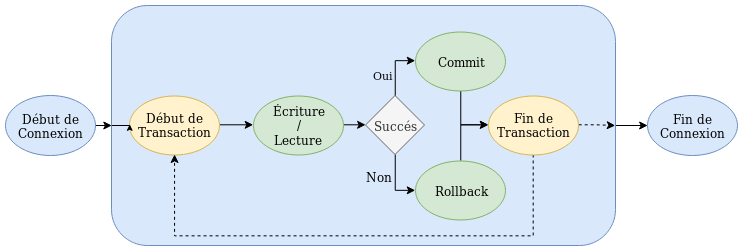
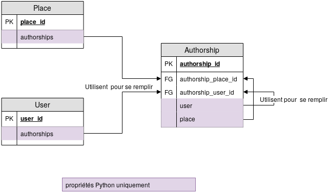

# PYTHON _ LES LIBRAIRIES

* * *

# EN GÉNÉRAL

- un **package/librairie/module** est une librairie contenant des modules : des outils (fonctions, méthodes…) rassemblés pour un besoin spécifique (travailler avec des images, des csv...)
    - **utilité** : réaliser certaines tâches spécifiques, traiter certains types de documents (csv…)
    - **`import pkgname`** : importer un package pour pouvoir l’utiliser
    - **`from___import___`** : spécifier le lieu d’origine du module à importer / n’importer qu’une sous-fonction ou un sous-module dans un module plus large. *Exemple: `from csv import csv.writer`*
    - **`dir(pkgname)`** : accéder à la liste des outils du package
- **lire la documentation** : https://docs.python.org/3.5/
- **dans jupyter** réimporter ses pkg à la correction pour éviter des bugs

* * *

# `CSV`, TON TABLEUR EN MOINS BEAU

- **`csv.reader(file, dialect, **fmtparams)`** : lire le contenu d’un csv
    - `file` : fichier ouvert en mode lecture
    - `dialect` : ensemble de fmtparams pré-programmés pour se conformer aux pratiques de logiciels spé (Excel : default dialect)
    - `**fmtparams` : paramètres supplémentaires spécifiés dans la documentation, dont
        - `delimeter` (définir un délimiteur de colonne)
        - `quotechar` (encapsulateur, pour échapper un caractère)
    - `csv.reader()` est un **générateur**.
- **`csv.writer(file, dialect, **fmtparams)`** permet d’écrire dans un csv :
    - fonctionne avec un fichier **ouvert en mode écriture**
    - sinon, **même syntaxe** que `csv.reader()` : dialect, delimeter, quotechar, quoting…
- **`.writerow()`\*\* : ajouter une ligne à un csv.
    - **prend en argument** une liste d'items à rajouter au csv

* * *

# JSON LE FORMAT, `JSON` LE MODULE

**Le format JSON**

- JSON, avec JS **sert à alléger la communication de données** « simples » sur le web
    - **remplace** la communication client-serveur basée sur XML (beaucoup +lourde)
    - **JS gère les requêtes via JSON** : il communique des objets JSON entre client et serveur et met à jour des pages statiques HTML
- JSON est en fait très proche de la manière de décrire des dictionnaires ou des listes en python. Et de fait, **l'objet racine de JSON**  = `list` ou `dict` ; peut **contenir n'importe quel data type** :
    - des dictionnaires
    - des listes
    - des booléens,
    - des chaines de caractères
    - des entiers et des décimaux
    - des objets "vides" (null, l'équivalent de None en Python)

**Le module `JSON`**

- **lire des fichiers json** :
    - **`json.load()`** : lire une instance de fichier en cours (aka, fichier ouvert avec ‘open’)
    - **`json.loads()`** : lire un fichier json sous forme de chaîne de caractère
- **écrire des fichiers json**
    - **`json.dumps()`** : output : chaîne de caractères (‘dumps’ écrit une chaîne de caractères)
    - **`json.dump()`** : output : format json


---
# POSER DES QUESTIONS À INTERNET : `REQUESTS` ET LES REQUÊTES HTTP

**structure du web et requêtes**

- **navigation web = communication** client/serveur en **HTTP**
    - **requête** HTTP du client au serveur
    - **réponse** HTTP du serveur au client-serveur
    - E passe par des **standards et protocoles** ultra stricts
- **`headers` / `body` dans les communications HTTP** (la strcture header/body existe pour les requêtes et les réponses)
	- **`header` / en-tête** : informations sur la communications passée du client au serveur ou du serveur au client (selon la communication)
		- **obligatoire**
		- **type d'infos du header** : contexte de requêtage (IP du client, IP du serveur...), informations à transmettre sur la requête (identifiants de connexion, date de péremption de la requête ou de la réponse...) 
	- **`body` / corps** : contenu de la requête
		- **optionnel** : très rare dans les requêtes GET, plus souvent dans POST (ou le serveur retourne une réponse, un contenu)
		- **nombreux formats possibles**, dont JSON


* * *

**anatomie d'une requête HTTP**


**URL** \- *`https://en.wikipedia.org/wiki/Panopticon#Social_media`*


- **scheme/protocole**; comment la ressource sera obtenue (*`https` \- en https, dérivé d'http*)
- **subdomain** : domaine fasant partie du main domain (`en`, `www`...)
- **domain** : nom de domaine principal (*`wikipedia`*)
- **top-level domain** : élément en haut de la hiérarchie du Domain Name System (DNS) : (*`.org`*)
- **port** : porte technique à utiliser pour accéder aux ressources du serveur; généralement absent : les protocoles utilisent des ports par défaut (80 pour http, 443 pour https) (*ici absent*)
- **path / chemin** : chemin vvers la donnée requêtée (`/wiki/Panopticon`)
- **query string / chaîne de paramètres** : une requête complète peut être passée au serveur via http dans une query string
- **fragment identifier / ancre** : endroit ou sous-section spécifique d'un document HTML : le fragment identifier a pris un sens très différent avec l'usage de JS. (`#Social_media`)
- **explications bonus** - https://developer.mozilla.org/fr/docs/Learn/Common_questions/What_is_a_URL

**méthode HTTP** : mot clé indiquant l'action à réaliser vis à vis d'une ressource:

- **`get`** - demander d'accéder à des données
- **`post`** - demander à transmettre des données
- **`head`** - comme `get`, mais ne retourne que le header (sans corps de la réponse)
- **`put`** - replaces all current representations of the target resource with the request payload
- **`delete`** - supprimer la ressource ciblée
- **`connect`** - établir un tunnel vers le serveur identifié par une cible
- **`options`** - options de communication avec la ressource ciblée
- **`trace`** - performs a message loop-back test along the path to the target resource
- **`patch`** - faire des modifications partielles sur la ressource ciblée


* * *

**anatomie d'une réponse HTTP**


**information sur la réponse** : encodage, format de données…

- **code HTTP** : nombre à 3 chiffres qui informe sur le contenu de la réponse, y compris les erreurs (`200` : succès de la requête ; `404` : page non trouvée)
- **corps** : contenu de réponse

* * *

**Le module `requests`**

dépendance à installer via `pip install`
**documentation accessible en ligne** : https://docs.python-requests.org/en/master/

- **`requests.get()`** \- permet d'analyser les requêtes http get
    - **syntaxe** :
        `r = requests.get('url')`
    - **paramètre**: en str, url auquel on veut accéder
    - **utilisation** : on définit une variable qui viendra contenir la réponse obtenue par requests.get(); permet de **créer des objets `response`**
    - **méthodes**
        - **syntaxe** : `r.method`, avec `r` l'objet response (cf syntaxe de requests.get())
        - **`.status_code`** : default method ; code HTTP sous la forme d'un entier qui informe du succès de la requête
        - **`headers`** : retourne un dictionnaire contenant les headers
        - **`encoding`** : encodage
        - **`.text`** : corps de la réponse
        - **`.json()`** : parser du contenu de la réponse en json
        	- le header de la réponse obtenue avec requests.get peut préciser une manière de parser le contenu, qui peut être json par défaut
        	- tldr : si `.headers['content-type']` = `headers['application.json']`, le contenu est déjà parsé en json et utiliser la method `.json()` est superflu
        - **`.raise_for_status()`** : génère une erreur python si la requête retourne un code d’erreur (=> utile si on veut interrompre l’exécution d’une fonction si arrive pas à récupérer l’url)
    - **faire passer des informations dans une requête : les *custom headers***
        - dans une requête, on peut vouloir *communiquer des informations particulières* au serveur (métadonnées personnelles: identifiant, localisation...)
        - `requests` permet d'automatiser cette étape avec les **`custom headers`**
        - **syntaxe**: `r = requests.get(url, headers = {"data = "value"}`
        - **data type** des headers : `dict`
- **`requests.post()`** - analyser les requêtes http post
    - **syntaxe** : `‘r = requests.post('url', data = {'key':'value'})`, avec:
        - `url` : le lien auquel passer la requête, en str
        - `data` : paramètre spécifiant, sous la forme d’un dictionnaire, les infos envoyés par la requête HTTP POST (infos de connexion, formulaire…)
    - **méthodes**
        - `.update()`
        - `.delete()`
        - `.put()`
        - `.post()`


---
# TU CRITIQUES MAIS TU `CLICK`

**Les CLI**
- **outil à utiliser en terminal**, sans interface graphique (=/= GUI)
- **utilité**:
	- +**léger** qu'un GUI
	- nécessaire pour L sur **serveur distant**
	- permet d'**automatiser des tâches** en rendant des scripts python +adaptables, +paramétrables et accessibles directement depuis le terminal
- **paramètres** doivent en général être précisés pour exécuter un CLI. **3 types de paramètres** :
	- **arguments** : a required parameter that’s passed to the script. If you don’t provide it, the CLI will run into an error. For instance, `django` is the argument in this command: `pip install django`.
	- **options** : As the name implies, its is an optional parameter which usually comes in a name and a value pair such as `pip install django --cache-dir ./my-cache-dir`. The `--cache-dir` is an option param and the value `./my-cache-dir` should be uses as the cache directory.
	- **flags**: special option parameter that tells the script to enable or disable a certain behaviour. The most common one is probably `--help`.
- **article sur les librairies python pour écrire des CLI** https://codeburst.io/building-beautiful-command-line-interfaces-with-python-26c7e1bb54df


---
**Le module `click`**

**documentation officielle** https://click.palletsprojects.com/en/8.0.x/ (elle est belle et il faut y jeter un œil, tu critiques mais tu `click`)

***Exemple*** :
```python
	@click.group() #définir un groupe de commandes
	
	def mon_groupe() #le groupe de commandes correspond à la fonction group et contient les 4 décorateurs ci dessous
		
	@mon_groupe.command("search") #définit une commande nommée "search", qui correspond à la fonction 'run'
	@click.argument("query", type=str) #définit l'argument obligatoire pour 'run'
	@click.option("-f", "--full",  is_flag=True, default=False) #définit la 1e option pour 'run'
	@click.option("-o", "--output", "output_file", type=click.File(mode="w"), default=None) #définit la 2e option pour 'run' : un fichier où écrire les résultats
		
	def run(query, full, output_file):
		#code de la fonction
		
	#on pourrait ajouter d'autres commandes au groupe de commandes ici

	if __name__ == "__main__":
  	group() #rendre le script exécutable depuis le terminal
```

**Les décorateurs** : 
- **définition**
	- **décorateur, définition générale** : un décorateur est une fonction qui modifie le fonctionnement de la fonction sur laquelle il est appelé (avec click, transformer une fonction en commande dans un script)
	- **dans `click`** : la librairie crée des CLI à l'aide de décorateurs qui encadrent des fonctions (ces fonctions constituant le script exécuté par le CLI). MAIS les décorateurs ne sont pas propres à click.
- **liste complète de décorateurs** - https://click.palletsprojects.com/en/8.0.x/api/#decorators/ 
- **bonne pratique** : classer les décorateurs par ordre de l'obligatoire à l'optionnel (command puis argument puis option)
- **voir l'exemple après la présentation des décorateurs**
- **`@click.group()`** - décorateur qui permet de grouper des commandes et de créer un script contenant plusieurs commandes
- **`@click.command()`** - décorateur qui transforme la fonction définie après celle-ci en commande utilisable depuis le terminal)
- **`@click.argument()`** - définit un argument (paramètre obligatoire) pour la fonction
- **`@click.option()`** - définit un paramètre optionnel pour la fonction. On nomme l'option avec un nom court, un nom long ou un nom de variable (cf partie 'Paramétrer')

**Paramétrer**
- **les types de paramètres: arguments et options**
	- un **argument** est un paramètre obligatoire, introduit grâce au décorateur `@click.argument`
	- une **option** est un paramètre optionnel, introduit grâce au décorateur `@click.option`
	- **différences** : 
		- les arguments ont moins de possibilités que les options. The following features are only available for options:
			- automatic prompting for missing input
			- act as flags (boolean or otherwise)
			- option values can be pulled from environment variables, arguments can not
			- options are fully documented in the help page, arguments are not (this is intentional as arguments might be too specific to be automatically documented)
		- les arguments peuvent accepter n'importe quel nombre de valeurs, alors que les options ne peuvent accepter qu'un nombre fixe (par défaut 1)
- **nommer une option** :
	- **nom court** : 1 tiret + 1 lettre maj ou min `-f` `-o`
	- **nom long** : 2 tirets + plusieurs lettres maj ou min `--full` `--output`
	- **nom de variable** : soit celui-ci est défini dans la fonction, soit c'est le nom le plus long du nom long ou du nom court `full` `output_file`
- **forcer un type pour un paramètre : `type=`** 
	- liste de **tous les types possibles** : https://click.palletsprojects.com/en/8.0.x/parameters/#parameter-types
	- ***exemple** avec une chaîne de caractère): `@click.argument("query", type=str)`*
- **travailler avec un fichier `type=click.File()`** : declares a parameter to be a file for reading or writing. The file is automatically closed once the context tears down (after the command finished working).
	- **syntaxe complète** : ` type=click.File(mode='[r/w]', encoding=None, errors='strict', lazy=None, atomic=False)`
	- **lire un fichier** - `mode='r'`
	- **écrire dans un fichier** - `mode='w'`
- **faire un paramètre `flag` et paramétrer les flags**
	- **les flags, c'est quoi?** : un flag est un comportement particulier pour la fonction. Désactivé par défaut, il s'active lorsqu'il est appelé. 
	- **paramétrage d'un flag**: (cf exemple)
		- `is_flag=True` indique que l'option est un flag
		- `Default=False` : le comportement ne s'active pas par défaut, mais seulement si l'option est appelée

**Grouper les commandes, en étapes**
- **définir un groupe de commandes** avec `click.group()` suivi de la fonction groupant les commandes.
	```python
		@click.group()
		def mon_groupe()
	```
- **définir les commandes contenues dans le groupe** avec le décorateur `[group].command()` (remplacer `[group]` par nom de fonction défini après `click.group()`)
	```python
		@mon_groupe.command()
		def run():
			#code
	```
	- **ajouter une commande à un groupe plus tard** : plutôt que d'utiliser `[group].command()`, on peut définir une commande par `click.command()` et l'ajouter ensuite à un groupe avec `[group].add_command()` (remplacer `[group]` par nom de fonction défini après `click.group()` et mettre le nom de la commande à ajouter au groupe en paramètre de `add_command()`) : 
		```python
			@click.command()
			def run():
				#code
			mon_groupe.add_command("run")
		```

- **nommer les commandes du script** 
	- **nom de commande** indiqué par une chaîne de caractères en paramètre de `mon_groupe.command()` :
		```python
			@mon_groupe.command("search")  #la commande s'appelle "search"
			def run():
				#code
		```
	- **n'exécuter qu'une seule commande d'un cli** qui contient un groupe de commandes en indiquant le nom de cette commande dans le terminal
		- *Exemple* - `python cli/isidore.py search "Philaenis" --full` n'exécute que la commande `search` du CLI `isidore.py` avec l'argument `Philaenis` et l'option `full` activée
- **Exécuter le groupe de commandes** - à la fin du script, on exécute la commande définie avec le décorateur `click.group()`:
	```python
		if __name__ == "__main__":
    	group()
	```
- ***Exemple de la documentation officielle de click***
	```python
		@click.group()
		def cli():
  	 	pass
		
		@cli.command()
		def initdb():
			click.echo('Initialized the database')
			
		@cli.command()
		def dropdb():
			click.echo('Dropped the database')
	```


---
**Autres décorateurs et librairies utiles pour les `click`**

**`click.echo()`**
- **retourne un message** dans stdout (le terminal) ou dans un fichier. À utiliser plutôt que `print()`, ça marche beaucoup mieux: it provides better support for different data, files, and environments.
- **Ne fonctionne que avec des `str` ou `byte`** - sinon, on doit retyper son message: `click.echo(click.style(str(r), fg='cyan')`
- **syntaxe complète** : `click.echo(message=None, file=None, nl=True, err=False, color=None)`
- **paramètres**
	- `message` (optionnal; data type : str ou byte) : le message à retourner. Retyper
	- `file` (optionnal) : le fichier où écrire (si on ne spécifie rien, `file=None` et l'output est stdout)
	- `err` (optionnal; bool) - write to stderr instead of stdout
	- `nl` (optionnal; bool) - print a newline after the message. Enabled by default.
	- `color` (optional; bool) - afficher ou masquer les couleurs et autres styles. Par défaut, click n'utilise la couleur que si l'output est un terminal

**`click.style()`**
- donner à un texte un **style ANSI**
- **syntaxe complète** : `click.style(text, fg=None, bg=None, bold=None, dim=None, underline=None, overline=None, italic=None, blink=None, reverse=None, strikethrough=None, reset=True)`
- **paramètres utiles**
	- `text` (str) - la chaîne de caractères à styliser
	- `fg` - couleur d'avant plan
	- `bold` (bool) - texte en gras
	- `underline` (bool) - souligner
	- `italic` (bool) - texte en italique
- **couleurs supportées** - attention, je crois qu'il faut avoir installé la librairie `colour` (https://pypi.org/project/colour/) !
	- *noms de couleurs* - black, red, green, yellow, blue, magenta, cyan, white, bright_black, bright_red, bright_green, bright_yellow, bright_blue, bright_magenta, bright_cyan, bright_white
	- *tuple rgb* - 3 integrers compris entre 0 et 255
- **Documentation officielle** de `click` - https://click.palletsprojects.com/en/8.0.x/utils/#ansi-colors 
- **Exemples**: 
	```python
		click.echo(click.style('Hello World!', fg='green'))
		click.echo(click.style('ATTENTION!', blink=True))
		click.echo(click.style('Some things', reverse=True, fg='cyan'))
		click.echo(click.style('More colors', fg=(255, 12, 128), bg=117))
	```

**Les couleurs - `colour`**
- On peut facilement ajouter des couleurs ! Les librairies telles que colour sont particulièrement adaptées.


**Les tableaux - `terminaltables`**
- On peut facilement formater des tableaux avec des librairies comme terminaltables


---
# `FLASK` - UNE APPLICATION WEB EN BOUTEILLE
https://flask.palletsprojects.com/en/2.0.x/

**bases**
- **flask** : un framework et une librairie pour le développement d'application web en Python. 
	- concurrent principal : django, +utilisé mais +lourd 
	- flask est parfait pour de petits projets ou des projets simples en général.
	- **bases utilisées par flask** :
		- `jinja`, pour la création de templates html
		- `werkzeug`, un toolkit WSGI (web server gateway interface, spécifiant le protocole de communication entre serveur web et applications)
- **tutoriel** : Le Tutorial de Miguel Grinberg est une référence ( https://blog.miguelgrinberg.com/post/the-flask-mega-tutorial-part-i-hello-world )
- flask est un package python, et comme beaucoup de package Python, il est disponible au téléchargement via PyPI (Python Package Index) et s'installe via la commande `pip install flask`. 


---
**créer une application**
- une appli Flask = **un/des scripts/fonctions python qui s’activent** quand l’usager.ère se connecte à une route
- importer la **classe d’objet Flask** : 
	- `from flask import Flask`
- **créer un objet Flask** et l’attribuer à une variable ; cet objet est accessible sur le navigateur ; elle prend obligatoirement un nom d’appli en argument (permet de faire tourner plusieurs applications sur un seul serveur) 
	- `app = Flask(‘appname’)`
- **définir une route** activant l’application :
	- `@app.route(‘url’)`
- **lancer un serveur** pour faire tourner l’application : 
	- `app.run()`


---
**routes et définition de routes à paramètres**

https://flask.palletsprojects.com/en/2.0.x/quickstart/#routing
- **route = chemin vers une page** dans une application web
- **créer une application à plusieurs pages** dans une application : 
	- chaque décorateur `@app.route(‘url’)` définit un chemin auquel est associé une fonction
	- les différentes fonctions de l’application s’exécuteront quand leur url sera appelé :
     ```python
		@app.route('/')
		def index():
		    return 'Index Page'

		@app.route('/hello')
		def hello():
		    return 'Hello, World'
  ```
- **variables** : une partie de route peut être assignée à une variable qui est passée à la fonction :
	- **syntaxe** : `@app.route(‘/url/<variable_name>’)` définit une variable ‘variable_name’ à la fin de la route de l’application
	- *exemple : `@app.route('/places/<placeid>')` permet de créer une variable placeid : quand l’utilisateur entre un `placeid` dans l’url sur le navigateur, celui-ci est stocké dans la variable `placeid`*
- **typer une route** : 
	- **syntaxe** : `@app.route(‘/url/<datatype:variable_name>’)` 
	- **types autorisés** par flask : `str`, `int`, `float`, `path` (chemin de fichier), `any` (n’importe quelle valeur), `uuid` (chaîne uuid)
	- *exemple : `@app.route("/places/<int:place_id>")` définit une variable ‘place_id’ qui doit être un nombre entier*


---
**templates `jinja` - les bases**
- permettent de **lier du html à des fonctions** ; le fichier html est lu par le framework et complété par des informations que l’on fournit au framework
- Flask utilise **Jinja** pour générer des templates ; utilisation des templates : E de fichiers HTML que l’on rédige comme on veut et que l’on lie à son script Python
- la fonction **`render_template`** permet de lier un template html à une route :
	- **syntaxe** : `render_template(‘pathway-to-file’, named arguments)`, avec
		- comme *premier argument*(`pathway-to-file`), le chemin vers le fichier html depuis le dossier `templates`
		- comme *`named-arguments`*, des variables définies dans la fonction et qui sont passées à la template
	- **importer fonction** : `from flask import render_template`
	- **appeler la fonction** avec `return` : `return render_template("accueil.html", nom="Gazetteer")`


---
**templates `jinja` – les types de données**
- templates peuvent s’utiliser avec plusieurs **types de données** : listes, dictionnaires… 
- on peut **naviguer un itérable** avec le template, pour retourner seulement certaines données pertinentes
	- **syntaxe** – naviguer dans des variables : 
		- globalement, la syntaxe est la **même** que avec python : `nom_liste[0]` retournerait le 1er élément d’une liste
        - cas particulier des **dictionnaires** : on peut naviguer dans un dictionnaire avec `[]` comme dans python ou avec `.` : `ville.nom` = `ville[nom]` = la valeur de la clé ‘nom’ dans le dictionnaire ‘ville’


---
**templates `jinja` - la fonction `length`**
- **le pipe `|`** sert à appeler des fonctions de Jinja sur des variables (et les variables sont prises en paramètre des fonctions jinja)
- *exemple : `{{lieux|length}}` : la fonction length est appelée sur la variable lieux*


---
**templates `jinja` - les conditions et les boucles

**conditions**
- **syntaxe** : ``  ``  ``  `` (endif met fin à la structure conditionnelle)
	- à part les ``, les conditions s’écrivent **comme en python**
- on peut **combiner les conditions** avec `and`, comme en python
- quelques **conditions utiles** :
	- vérifier qu’une variable est **définie** (attention, une variable peut être définie et vide) ; ``
	- vérifier qu’une variable **n’est pas vide** : ``
	- vérifier qu’une variable est **true** : ``
	- on peut **combiner** les conditions, comme en python : `` vérifie qu’une variable est définie et qu’elle n’est pas vide

**boucles**
- **boucles dans des templates** : ` … `


---
**templates `jinja` - construire des url et lier des pages avec `url_for()`**

**`url_for(endpoint, **values)`** permet de générer un url vers une cible avec la méthode spécifiée
- **`endpoint`** (string) : la cible à laquelle renvoie l’URL, soit le nom de la fonction que l’on veut activer avec `url_for()`
- **`**values`** (key=value) : arguments nécessaires à la construction de l’URL, pour faire passer des arguments à la fonction à laquelle renvoie url_for()
	- **syntaxe** : `arg_name=value`, avec arg_name le nom d’un argument tel qu’il a été défini dans la fonction à laquelle renvoie url_for
	- lier vers un **fichier statique** : `url_for(‘static’, filename=’path/to/filename/from/static’)`
- *exemple simplifié : si on a une fonction `ma_fonction(a, b, c)`, alors on peut créer une route vers cette fonction et lui donner comme arguments 1, 2, 3 avec `url_for(ma_fonction, a=1, b=2, c=3)`*
- *exemple (issu de cours-flask/exemple7) : `url_for(‘lieu’, place_id=lieu_id)` 
	- tldr : permet de générer un lien vers la fonction `lieu(place_id)` et de faire passer `lieu_id` comme argument de cette fonction
	- permet de générer une route vers la fonction `lieu` (une fonction qui prend un argument `place_id` qui est une clé de dictionnaire et qui retourne la valeur associée à la clé) et de donner à `plaxe_id` la valeur de `lieu_id`, une variable définie dans une boucle
	- effet : `url_for()` permet de créer un index qui, en bouclant sur un dictionnaire, associe à chaque clé du dictionnaire un lien vers une page contenant les valeurs associées à la clé (les infos sur une ville)*

***toujours utiliser `url_for()` pour créer des liens entre les pages sinon on va se faire taper sur les doigts ouhloulou***


---
**templates `jinja` - lier des blocs, héritage, `extends` et `include`**
- **les blocs** : la composition d’une page web est faite de blocs, avec un bloc principal qui se retrouve sur toutes les pages (header, menu, footer) et des blocs secondaires et qui s’intègrent dans ce squelette
- **fonctionnement** : un bloc d’import appelle un bloc d’accueil dans lequel il viendra s’intégrer (`extends`), ou inversement (`include`) ; on utilise surtout les `extends`
- **la définition de blocs**: ` <contenu-en-html> `
- **`extends` – fonctionnement** : créer un conteneur avec de l’espace pour les blocs d’import et créer des blocs d’import qui revoient au conteneur avec `extends`
	- créer un **template pour le bloc conteneur** 
		- avec des éléments dans lesquels on intègre les blocs d’import : syntaxe : entre 2 balises, ``
	- créer un **template pour les blocs d’import** :
		- au début du template, spécifier le template dans lequel le bloc d’import s’intègre : `` ; avec extends, le bloc d’import appelle le bloc d’accueil
		- ensuite, encadrer le contenu html du bloc d’import par `` et ``
	- exemple où le bloc accueil s’intègre dans conteneur : 
		- bloc conteneur dans un fichier :
        ```html
			<html>
				<head><title></title></html>
				<body><div></div></body>
			</html>
		```
		- blocs d’import dans un autre fichier :
        ```html
			<html>
			
			 [contenu html] 
			 [contenu html] 
      </html>
	  ```

- **`include` – fonctionnement** : on peut appeler des éléments à inclure dans des templates html ; c’est l’inverse de extends (le fichier principal est le conteneur)
	- système **moins utilisé** aujourd’hui (peut poser des problèmes) ; on s’en sert surtout pour les sous-éléments incrustables sur plusieurs pages (permet d’inclure des balises de métadonnées, par ex)
	- **syntaxe** : ``
		- pas la peine de spécifier la fin de l’inclusion
        - le chemin doit renvoyer à un fichier html qui ne contient pas de syntaxe particulière

- **bonne pratique** : ranger ses fichiers dans le dossier du projet ! (on peut changer les noms de dossier hein)
	-dossier `templates` pour contenir toutes les templates
	- fichier html conteneur à la racine de `templates`
	- dossier `pages` pour les pages du navigateur
	- dossier `partials` pour les autres trucs qu’on pourrait rajouter (les médaonnées à rajouter avec `include`, par ex)
	- dossier `static` pour tous les fichiers appelés par le script et qui ne vont pas changer : images, css, javascript


---
# `FLASK_SQLALCHEMY` - SQL EN FLASQUE

https://flask-sqlalchemy.palletsprojects.com/en/2.x/*

---
**l’anatomie d’une transaction SQL**
- **une transaction, c’est** : la communication avec une BDD à l’aide de SQL, composée d’une ou plusieurs requêtes
- **déroulement d’une transaction SQL** (à l’aide d’un langage de prog comme python ou non)
	- un début de connexion à la BDD
	- un début de transaction avec la BDD : on lance une requête SQL (écriture, lecture…)
	- un retour de SQL : succès ou échec de la requête
		- succès => commit de la requête (le résultat de la requête est retenu : les données envoyées pour écriture sont enregistrées) et fin de transaction
		- échec => rollback : on revient au début de la transaction et on recommence
	- fin de la transaction


---
**utiliser `flask_sqlalchemy` - les bases**
- **adaptation de SQLalchemy** (librairie qui sert à travailler avec SQL) à la librairie flask
- SQLalchemy est un **ORM** (objet relational mapping) : permet de travailler avec des objets natifs plutôt que de faire des requêtes SQL (en gros, un ORM résout l’incompatibilité SQL/python en traduisant SQL pour un langage orienté objet)
	- **avantages** : 
		- changer de moteur facilement (compatibilité avec ≠ versions de SQL : les ORM adaptent la requête aux différents moteurs SQL)
		-  protection contre des failles de sécurité (évite de passer directement de l’input utilisateur à la BDD, évite l’injection de requêtes par des utilisateurs (injections = l’utilisateur qui écrit des requêtes comme s’il était admin ouloulou le fifou)
- **utiliser la librairie** : (après l’avoir installé avec pip install et après avoir installé sqlite, avec comme nom d’application flask `app`)
	- **importer les librairies** `flask` et `flask_sqlalchemy`
	- **créer une application flask** et la stocker dans une variable: `app = Flask(‘nom_appli’)`
	- **connecter l’appli à la bdd** : `app.config['SQLALCHEMY_DATABASE_URI'] = 'sqlite:///chemin-relatif-vers-bdd`
		- `SQLALCHEMY_DATABASE_URI` permet d’indiquer quel uri sera utilisé pour se connecter à la bdd
		- `sqlite` indique le moteur utilisé (ici, sqlite)
		- `///` : le premier `/` indique qu’on utilise un chemin relatif ; pour un chemin absolu, utiliser `//`
	- **initier la bdd** sous la forme d’un objet sqlalchemy : `db = SQLAlchemy(app)`
		- on crée un objet SQLAlchemy et on lui donne en argument l’application flask (`app`)
		- on stocke cet objet dans une variable `db`
	- **créer une base de donnée selon un modèle : `db.create.all()`** : on définit notre modèle dans un script, puis `db.create.all()` (avec `db` le nom de variable dans laquelle on stocke la bdd)
	- **supprimer toutes les tables d'une bdd: `db.drop.all()`**


---
**faire une requête en langage sql : `engine.execute()`**
- **syntaxe** : `db.engine.execute(‘requête en syntaxe sql’)` 
	- avec `db` le nom de la variable dans laquelle on stocke son objet `SQLAlchemy`
	- la requête retourne un objet `ResultProxy`, et pas les résultats en tant que tel
- **faire ressortir les résultats**
	- boucler sur l’objet `ResultProxy`
	- utiliser les **méthodes** 
		- `.fetchone()` (retourne 1 résultat de la requête), 
		- `.fetchall()` (retourne tous les résultats) et 
		- `.fetchmany(n)` (retourne `n` résultats)
	- les résultats sortis avec ces méthodes prennent comme **clé de dictionnaires les noms de colonnes de db** => cf exemple 

	```python
		query = db.engine.execute("SELECT * FROM place")
		print(query)
			for x in query.fetchmany(2):
				print(x["place_nom"])
				print(type(x))
	```
	
	---
**créer un modèle de table**

il faut créer un modèle (une classe python qui reprenne la structure d’une table de la bdd) et requêter ce modèle avec les méthodes de SQLAlchemy :
- **définir le modèle** : 
	- le modèle est défini comme une **`class`**
	- son nom prend une **majuscule** pour être lisibile,
	- le modèle doit avoir le **même nom que la table** dont il est dérivé
	- **syntaxe** pour renseigner les champs du modèle*(aka, les colonnes du tableau): `nom_colonne = colonne(data-type, params)` (cf exemples)
	- **nommer la table sql** (dans le cas où on crée une nouvelle table) : `__tablename__ = "table_name"`
	- **data types** pour les modèles:
		- `.String(n)` : chaîne de caractères de longueur maximale `n`
		- `.Text` - texte sans longueur maximale
		- `.DateTime` : heure et date, suivant un objet `datetime` en python
		- `.Integer` : entier
		- `.Float` : décimal
		- `.Boolean` ; boléen
	- *exemple - pour comprendre la syntaxe:
	```python
		class Place(db.Model):
			__tablename__ = "place"
			place_id = db.Column(db.Integer, unique=True, nullable=False, primary_key=True, autoincrement=True)
			place_nom = db.Column(db.Text)
			place_description = db.Column(db.Text)
			place_longitude = db.Column(db.Float)
			place_latitude = db.Column(db.Float)
			place_type = db.Column(db.String(45))
	```


---
**les requêtes et les filtres de base** - toutes les requêtes se font sur une table, que l'on appelle comme dans le modèle défini avec `class`
- **`.query`** : lancer une requête SELECT
- **`.filter()`** : filtrer les résultats par un critère (équivalent de WHERE)
		- en SQL, le filtrage sur des données se fait en comparant une donnée avec une valeur => avec flasksql, c'est la même chose mais on utilise les opérateurs python:
	- **syntaxe**: `Modelname.query.filter(Modelname.column=="value")` (on peut remplacer `==` par un autre opérateur etc)
- **`.get(n)`** : récupérer une entrée par numéro d'identifiant `n`
	- **`get_or_404(n)`** : récupérer une entrée par numéro d'identifiant `n` ou lancer une erreur 404 si aucune entrée ne correspond à cet identifiant (si rien n'a cette clé primaire quoi)
- **`.like()`** : faire une requête LIKE et filtrer ses résultats avec un critère approximatif
	- **syntaxe** : `Modelname.query.filter(Modelname.comun.like("%value%"))`
	- **tldr** : s'utilise dans un filtre `.filter()` et permet d'utiliser les wildcards `%`


---
**trier les résultats d'une requête**
- **`.all()`** : récupérer tous les résultats d'une requête
- **`.first()`** : ne récupérer que le premier résultat
	- **`.first_or_404()`**
- **`.limit(n)`** : n'afficher que les `n` premiers résultats ; à utiliser après le `.filter()` et avant `.all()`, qui permet d'afficher tous les `n` résultats
- **`.order_by()`** : ordonner les résultats en fonction d'un nom de colonne
	- `.order_by([...].desc())` : ordre descendant
	- `.order_by([...].asc())` : ordre ascendant (par défaut)
	- **ordonner avec plusieurs critères** : `.order_by([...], [...])`


---
**combiner les filtres:  `db.and_()`, `db.or_()`**
- **`db.and_()`** permet de faire des **requêtes AND**
- **`db.or_()`** permet de faire des **requêtes OR**
- **syntaxe** : on sépare les filtres par des `,`
	- `.filter(db.and_(filtre1, filtre2))`
	- `filter(db.or_(filtre1, filtre2))`
	- on peut **combiner les and et or**, en faisant un `or` dans un `and` ou inversement : `.filter(db.and_(db.or_(filtre1, filtre2), db.or_(filtre3, filtre4)))` (le mal de crâne vient est offert)

---
**les fonctions d'aggrégation**
- **`.count()`** : compter les résultats (aka récupérer le nombre de résultats)
- **`group_by()`** : regrouper les données en fonction d'un critère passé en argument
- **`having()`** : comme `.filter()`, mais permet de travailler sur les fonctions d'aggrégation


---
**requêter à travers plusieurs tables : `.join()`**
- **syntaxes** : 
	- **quand la relation entre les 2 tables est explicite** : `session.query(Table1).join(Table2)` (aka quand, dans le modèle de données, les 2 tables ont une colonne avec un argument `db.ForeignKey`, et que la clé étrangère d'une table renvoie à la clé principale de l'autre)
	- **avec une clause SQL `ON`** :
		- **sans `.filter()`** : `session.query(Table1).join(Table2, Table1.clé = Table2.clé` (avec `clé` la colonne des tables SQL grâce auxquelles on trie les données)
		- **avec `.filter()`** : `session.query(Table1).join(Table2).filter(Table1.clé = Table2.clé)`
- **joindre plusieurs tables en même temps** : 
	- **syntaxe** : jointure entre 1 et 2, puis entre 2 et 3:
	```python
	session.query(Table1)\
		.join(Table2).filter(Table1.clé = Table2.clé)\
		.join(Table3).filter(Table2.clé = Table3.clé)`
	```
	-   mais il faut faire attention à l'autre des jointures (*par exemple: soit A B C trois tables, avec une relation entre A et B et une relation entre B et C ; on doit joindre A et B, puis B et C*)
- **ça peut vite faire chauffer les transactions complexes** => préférer les tables de relation là où on peut
- **documentation complète** : https://docs.sqlalchemy.org/en/14/orm/query.html#sqlalchemy.orm.Query.join 


---
***une pile d'exemples pour espérer comprendre***
- *récupérer toutes les entrées de la table Place : `lieux = Place.query.all()`*
- *récupérer un élément par son `id` : `cinq = Place.query.get(5)`*
- *requête complexe et `order_by()` : `settlements = Place.query.filter(Place.place_type=="settlement").order_by(Place.place_nom.desc()).all()`*
- *double `.order_by()` : `data = Place.query.filter(Place.place_type=="settlement").order_by(Place.place_nom.desc(), Place.place_nom.desc()).all()`*
- *combiner OR et AND : requêter tous les endroits dont les coordonnées géographiques montrent qu'ils sont situées en France métropolitaine* :
	- `.between(int1, int2)` sert à faire ressortir les résultats contenus entre 2 valeurs extrêmes
	```python
		minLat2, minLong2, maxLat2, maxLong2 = -4.7625, 42.3404785156, 8.14033203125, 51.0971191406 #longitudes et latitudes encadrant la France métropolitaine

		#la requête sous vos yeux ébahis
		data = Place.query.filter(db.or_(
    	db.and_(
				Place.place_longitude.between(minLong, maxLong),
        Place.place_latitude.between(minLat, maxLat)
    	),
    	db.and_(
        Place.place_longitude.between(minLong2, maxLong2),
        Place.place_latitude.between(minLat2, maxLat2)
    	)
		)).order_by(Place.place_nom.desc(), Place.place_nom.desc()).all()

		#faire ressortir les résultats
		for lieu in data:
    	print(lieu.place_nom, lieu.place_description)
	```
- *jointure avec 2 méthodes équivalentes pour la même requête:
	- `q = session.query(User).join(Address, User.id==Address.user_id)`
	- `q = session.query(User).join(Address, User.addresses)`*

---
**faire quelque chose des résultats**
- **afficher les résultats d'une requête** : 
	- **`request_name.column_name`** : on stocke le résultat de la requête dans une variable et on utilise le nom de colonne que l'on veut afficher comme attribut de cette variable
	- utiliser des **boucles** pour traduire le résultat
	- *exemple : soit une requête `lieu` qui récupère toutes les noms de lieux dans la table `Place`*
		```python
			for lieu in lieux:
				print(lieu.place_nom, lieu.place_type)
		```
- **lire une requête `flask_sqlalchemy` avec la syntaxe SQL** : soit une variable `requete` stockant une requête, il suffit de faire: `print(requete)`
- **intégrer les résultats d'une requête dans une application utilisant une base de données**
	```python
		#importer ses librairies
		from flask import Flask, render_template
		from flask_sqlalchemy import SQLAlchemy
			
		#configurer son appli et la lier avec la bdd
		app = Flask("Application")
		app.config['SQLALCHEMY_DATABASE_URI'] = 'sqlite:///cours-flask/db.sqlite'
		db = SQLAlchemy(app)
			
		#initier ses modèles de données
		class Place(db.Model):
			place_id = db.Column(db.Integer, unique=True, nullable=False, primary_key=True, autoincrement=True)
			place_nom = db.Column(db.Text)
			place_description = db.Column(db.Text)
			place_longitude = db.Column(db.Float)
			place_latitude = db.Column(db.Float)
			place_type = db.Column(db.String(45))
		
		#récupérer les données de la bdd quand on exécute les routes:
		@app.route('/')
		def accueil():
			lieux = Place.query.all()
			return render_template("pages/accueil.html", nom="Gazetteer", lieux=lieux)
			
		@app.route("/place/<int:place_id>")
		def lieu(place_id):
			lieu_unique = Place.query.get(place_id)
			return render_template("pages/place.html", nom="Gazetteer", lieu=lieu_unique)
	```

---
**formulaire de recherche simple : html `<input type="text">` et l'objet flask  `request`**
- **construire un formulaire de recherche simple en HTML** : 
	- **tldr** : inclure un élément `<input>` dans un élément `<form>`
	- **la balise `<form>`** englobe l'ensemble des champs de recherche simple/complexe et l'ensemble des boutons de recherches
	- **les champs de saisie de texte `<input type="text">`** : 
		- c'est dans cette balise que l'on tape **les mots à rechercher**
		- **attribut `placeholder=""`** permet d'afficher une légende dans le champ de recherche (un texte qui s'affiche quand l'utilisateurice n'a pas écrit dans ce champ)
		- **attribut `name=""`** permet de nommer un champ de recherche ; c'est le nom de ce champ que l'on recupère avec `request`
		- il y a un **kilotonne de types** de balises `<input>` : https://developer.mozilla.org/en-US/docs/Web/HTML/Element/Input ; les utiliser si ça vaut le coût
		- *exemple : `<input type="text" name="keyword" placeholder="Recherche">`*
	- **le bouton de lancement de recherche `<button type="submit">`** - c'est assez translucide comme bitonnieau : c'est le bouton sur lequel on clique pour lancer la recherche
		- *exemple : `<button type="submit">envoyer</button>`*
- **traiter une requête : l'objet `request`** 
	- `request` est un objet flask qui permet de **récupérer les données transmises au serveur par une requête HTTP** faite par l'utilisateur (requête GET : recherche ; requête POST : ajout d'infos...) ; plusieurs comportements sont possibles pour cet objet, définis comme =/= attributs (voir documentation complète pour la liste)
	- **`request.args`** : l'attribut `args` **parse les paramètres d'un URL sous la forme d'un dictionnaire** et permet donc de traiter les requêtes GET
		- fonctionne avec la méthode **GET** : la requête est stockée en paramètres d'un url, après le `?`
		- => permet de **récupérer une recherche** lancée par l'utilisateur, puisque recherches sur le site = requête http get + requêtes get sont lisibles dans l'URL
	- **utiliser `request.args`** : stocker la recherche de l'utilisateurice dans une variable et créer une fonction qui associe à la recherche une requête SQL:
		- `request.args.get()` - traiter la recherche : associer la recherche de l'utilisateur à la méthode http get et donner `None` comme valeur par défaut à cette requête (si aucune requête est lancée par l'utilisateur, rien n'a lieu quoi)
		- `if motclef:` - si une recherche a été lancée par l'utilisateurice, la traduire en recherche SQL
		- recherche rapide => requête SQL `.like()` lancée (pour avoir des résultats proches de la requête)
- tant que tous les formulaires de recherche du même type (recherche rapide) renvoient à la même page, on peut **multiplier les formulaires** : il suffit de donner le même argument `name=""` à la balise `<input>` pour que la recherche soit traitée par `request.args`


---
**une recherche retournant tous les résultats sur une seule page**
```python
		@app.route("/recherche")
		def recherche():
    	motclef = request.args.get("keyword", None)
    	resultats = []
	    titre = "Recherche"
			if motclef:
        resultats = Place.query.filter(Place.place_nom.like("%{}%".format(motclef))).all()
        titre = "Résultat pour la recherche `" + motclef + "`"
    return render_template("pages/recherche.html", resultats=resultats, titre=titre)
```
- **documentation à la bien sisi** : https://flask.palletsprojects.com/en/2.0.x/quickstart/#accessing-request-data
- **documentation dodue mal de crâne** : https://flask.palletsprojects.com/en/2.0.x/api/#incoming-request-data 
	
	
---
**une recherche retournant les résultats avec pagination**
- **en bref** : créer un objet pagination avec `paginate` et le mobiliser dans le template avec `.iter_pages()`
- **les méthodes de l'objet pagination**
	- `items` : les résultats de la page actuelle
	- `iter_pages` permet de construire une pagination en html
	- `page` retourne le numéro de la page actuelle
	- `pages` retourne le nb total de pages
	- `total` retourne le nb total de résultats
	- `prev_num` retourne le numéro de la page précédente,  `next_num` retourne le numéro de la page suivante
	- `has_prev` retourne `True` si il existe une page précédente, `has_next` retourne `True` si il existe une page suivante
- **dans le script python (`route.py)`, `.paginate()`** est une méthode flask_sqlalchemy qui permet de paginer les résultats d'une requête sqlalchemy
	- **syntaxe** : `.paginate(page=..., per_page=...)`, avec `page` le numéro de la page active et `per_page` le nombre de résultats à afficher par page
	- **utilisation** : 
		- à mettre **à la place de `.all()`** dans une requête sqlalchemy
		- pour l'utiliser de manière dynamique, on donne au paramètre `page` une variable qui permet de gérer la pagination de façon dynamique : *si on clique sur la page 2 des résultats dans l'appli, alors la valeur 2 est assignée à la variable `page`, et donc des résultats pour la page 2 sont retournés*
- **dans le template (`recherche.html`), construire la pagination en itérant sur `iter.pages()`**, une méthode de l'objet pagination qui permet de générer les différentes pages de la pagination
	- **syntaxe** : `pagination.iterpages(left_edge=a, left_current=b, right_current=c, right_edge=d)`, avec
		- `a, b, c, d` des nombres entiers
		- `left_edge` le nombre de pages à afficher au début de la pagination
		- `left_current` le nombre de pages à afficher à gauche de la page courante
		- `right_current` le nombre de pages à afficher à droite de la page courante
		- `right_edge` le nombre de pages à afficher à la fin de la pagination
	- **utilisation** : `` permet de générer une pagination dans le template html, en générant une variable `page` qui est passée à la fonction `.paginate()` (dans le script python) pour générer des paginations de façon cool et dynamique
- **exemple** : c'est assez dodu, donc aller voir les scripts commentés dans **`cours-flask/exemple15`**


---
**insertions `flask_sqlalchemy`**
- **créer une fonction pour ajouter des données** : en `sqlalchemy`, une nouvelle ligne d'une base de données = un objet, instance d'une classe particulière => l'ajout de données correspond à une fonction qui permette de créer un objet en suivant la structure d'une classe
- cette fonction est une **`@staticmethod`** : une méthode qui s'applique à une classe entière
- **préparer l'insertion : `db.session.add(la_chose_à_envoyer)`** (pour plus de facilité : stocker les données à envoyer dans une vériable et faire `db.session.add(variable_name)`)
- **envoyer ses données : `db.session.commit()`** : après avoir ajouté toutes les données avec `db.session.add`,
	- les insertions ont lieu en 2 temps, comme avec Git
- **utiliser `try...except`** pour eviter l'ajout de données framgnetaires

**en bref**
```python
class Classname (db.model):
	#le modèle de la classe
	
	@staticmethod
	def add_data(var1, var2, varN):
		
		#ici, on peut ajouter du code pour renvoyer des erreurs si toutes les infos ne sont pas fournies)
		
		#dans la fonciton, on crée une variable 'objet' dans laquelle on stocke toutes les données à ajouter
		objet = Classname(
			info1=var1,
			info2=var2,
			infoN=varN)
		
		#on fait une insertion avec un try except à la bien
		try:
			db.session.add(objet)
			db.session.commit()
			return True, objet
		except Exception as erreur:
			return False, [str(erreur)]
```
	


---
**la gestion des utilisateurices, au niveau de la `class User` dans un script `utilisateurs.py`**


**créer une `class` d'utilisateurices** dans laquelle on stockera les informations sur les utilisateurs (id, nom, login, email, mdp)
- on donne à cette classe **2 attributs: `db.Model` et `UserMixin`**
	- **`db.Model`** permet de faire comprendre que cette classe est un modèle de table SQL; en d'autres termes, que `User` est une spécification de la classe `db.Model`
	- **`UserMixin`** est la classe fournissant des données de base qui permettent au plugin `flask_login` de gérer la connexion des utilisateurices; en d'autres termes, ce paramètre précise que `User` est une spécification de la classe `UserMixin`, qui a 4 proprpiétés:
		- `is_authenticated` : retourne `True` si l'utilisateurice est connecté
		- `is_active` retourne `True` si l'utilisateurice est actif
		- `is_anonymous` retourne `False` si l'utilisateurice n'est pas anonyme
		- `get_id(identifier)` retourne un utilisateur selon sa clé primaire
		- ces méthodes sont un **gloubiboulga technique** nécessaire au fonctionnement de `flask_login`, on rentre pas dans les détails
		- il fait **réecrire `get_id()`** en méthode de `User` : dans le code source, `UserMixin` a une propriété `get_id` qui retourne l'attribut `.id` d'un objet. Or, dans notre cas, `User` n'a pas d'attribut `.id`, mais un attribut `.user_id` => on doit réécrire la propriété `get_id` pour que UserMixin fonctionne avec la classe `User` :
 			- (avec `self` est la variable stockant l'utilisateurice courant.e ; la fonction ci dessous permet donc, pour un utilisateur, de retourner sa propriété `user_id`, soit son identifiant)
		```python
			def get_id(self):
				return self.user_id
		```
		
**créer une méthode pour ajouter un nouvel utilisateurice : `def creer(...)`**, en `staticmethod` de cette classe (à l'aide de la méthode d'insertion SQL via `flask_sqlalchemy` vue au dessus)
- on utilise un **système de gestion des erreurs** : 
	- créer une liste vide `erreurs` ; si une info n'est pas rajoutée au formulaire, on ne crée âs d'utilisateur et on renvoie les erreurs que l'utilisateur a fait
	- à l'aide de la variable `uniques`, gérer l'utilisation d'infos uniques: si une info non-répétable (email, login) est déjà présente dans la bdd (si un autre compte utilise le même mail ou login), renvoyer une erreur à l'utilisateurice
- si tout va bien, **faire une injection sql avec un `try...except`**

**créer une méthode pour se connecter : `def identification(...)`**, en `staticmethod` de la classe `User`
- en fait c'est assez simple : on récupère un objet `User` dans la DB en fonction du login grâce à une requête (aka, une ligne dans la db sql) et on compare le mdp fourni au moment de la connexion avec le hash généré à partir du mdp de cet objet `User`

**créer une fonction qui permette de récupérer un utilisateur en fonction de son identifiant**, pour la gestion des connexions (je comprends pas trop à quoi ça sert)


```python
	class User(UserMixin, db.Model):
		user_id = db.Column(db.Integer, unique=True, nullable=False, primary_key=True, autoincrement=True)
		user_nom = db.Column(db.Text, nullable=False)
		user_login = db.Column(db.String(45), nullable=False, unique=True)
		user_email = db.Column(db.Text, nullable=False)
		user_password = db.Column(db.String(100), nullable=False)

		def get_id(self):
		""" Retourne l'id de l'objet actuellement utilisé
		:returns: ID de l'utilisateur
		:rtype: int
		"""
				return self.user_id

		@staticmethod
		def creer(login, email, nom, motdepasse):
		""" Crée un compte utilisateur-rice. Retourne un tuple (booléen, User ou liste).
		Si il y a une erreur, la fonction renvoie False suivi d'une liste d'erreur
		Sinon, elle renvoie True suivi de la donnée enregistrée
		:param login: Login de l'utilisateur-rice
		:param email: Email de l'utilisateur-rice
		:param nom: Nom de l'utilisateur-rice
		:param motdepasse: Mot de passe de l'utilisateur-rice (Minimum 6 caractères)
		"""
			erreurs = []
	
			#gestion des infos manquantes
			if not login:
    		erreurs.append("Le login fourni est vide")
			if not email:
    		erreurs.append("L'email fourni est vide")
			if not nom:
				erreurs.append("Le nom fourni est vide")
			if not motdepasse or len(motdepasse) < 6:
				erreurs.append("Le mot de passe fourni est vide ou trop court")
			
			#gestion des infos non répétables
			uniques = User.query.filter(db.or_(User.user_email == email, User.user_login == login)).count()
			if uniques > 0:
				erreurs.append("L'email ou le login sont déjà inscrits dans notre base de données")
		
			# Si on a au moins une erreur
			if len(erreurs) > 0:
				return False, erreurs

			# Sinon, on crée un utilisateur
			utilisateur = User(
				user_nom=nom,
				user_login=login,
				user_email=email,
			user_password=generate_password_hash(motdepasse)
			)
		
			#on fait un commit
			try:
				db.session.add(utilisateur)
				db.session.commit()
			# On renvoie l'utilisateur
				return True, utilisateur
		
			except Exception as erreur:
				return False, [str(erreur)]
		
		def identification(login, motdepasse):
		""" Identifie un utilisateur. Si cela fonctionne, renvoie les données de l'utilisateur.
		:param login: Login de l'utilisateur
		:param motdepasse: Mot de passe envoyé par l'utilisateur
		:returns: Si réussite, données de l'utilisateur. Sinon None
		:rtype: User or None
		"""
			utilisateur = User.query.filter(User.user_login == login).first()
			if utilisateur and check_password_hash(utilisateur.user_password, motdepasse):
				return utilisateur
			return None
	
	@login.user_loader
	def trouver_utilisateur_via_id(identifiant):
		return User.query.get(int(identifiant))

```


---
**au niveau des routes : formulaire de création de comptes, de connexion et de déconnexion**

**formulaire et fonction pour créer un compte**
- **tldr** : je détaille ce qui se passe dans l'exemple en dessous
	- créer un **template avec un formulaire d'inscription**, avec 1 balise `<input>` par type de donnée (mail, mdp, login)
		- **modèle** : `<input type="text" name="zzz" placeholder="xxx"/>`, avec `name` le nom de variable récupéré par la fonction et `placeholder` le texte qui s'affiche par défaut sur le formulaire
	- créer **route avec une fonction** qui récupère les informations d'un formulaire et les passe à la fonction `@staticmethod` pour créer un objet instance d'une classe (autrement dit : pour créer une ligne d'une table SQL)
	- **`methods=["GET", "POST"]`** (en paramètre de la route) montre que la route accepte les méthodes get et post
	- **`request.form.get()`** permet de récupérer des données d'un formulaire d'une balise `<input>`, en prenant pour argument la valeur de l'attribut ` name=""` de cette baluse (aka, permet de cibler une balise précise dans le HTML en fonction de son attribut name)
	- **`flash(str)`** est une fonction Flask qui permet de retourner à l'utilisateurice une chaîne de caractères : *the flashing system basically makes it possible to record a message at the end of a request*
	- **`return redirect('/')`** permet de renvoyer l'utilisateurice sur la page d'accueil
	- **cf exemple en dessous**
- **cf `cours-flask/exemple16` tbqh**
- *exemple*
	```python
		from flask import flash, redirect, request
		@app.route("/register", methods=["GET", "POST"])
		def inscription():
			""" Route gérant les inscriptions
			"""
			# Si on est en POST, cela veut dire que le formulaire a été envoyé
			if request.method == "POST":
				statut, donnees = User.creer(
				login=request.form.get("login", None),
				email=request.form.get("email", None),
				nom=request.form.get("nom", None),
				motdepasse=request.form.get("motdepasse", None))
				#si tout va bien, on met un ptit message et on renvoie sur la page d'accueil
				if statut is True:
					flash("Enregistrement effectué. Identifiez-vous maintenant", "success")
					return redirect("/")
				#sinon, on se tape une erreur
				else:
					flash("Les erreurs suivantes ont été rencontrées : " + ",".join(donnees), "error")
					return render_template("pages/inscription.html")
			else:
					return render_template("pages/inscription.html")
	```
	
**formulaire et fonction de connexion**
- on **importe les modules** :
	- dans le module `flask_login`, `current_user` (qui permet d'identifier l'utilisateurice actuel) et `login_user` (qui permet à un.e utilisateurice de se connecter)
	- du module `app`, la variable `login` qui contient `LoginManager(app)` (une fonction de `flask_login` qui permet de gérer la connexion des utilisateurices) 
- créer un **template HTML avec des balises `<input>`**, comme pour les formulaires de création de compte; l'attribut `name=""` permet de le cibler comme il faut
- si l'utilisateurice est **déjà connecté.e**, le renvoyer à la page d'accueil
- si il n'est **pas connecté**, alors le formulaire envoie des données avec la méthode `POST` ; on appelle alors la méthode `User.identification()` pour vérifier que les infos fournies par l'utilisateurice correspondent à des entrées dans la db (à des vrais identifiants, quoi)
- on **crée une redirection vers la page de connexion** quand on essaye d'accéder à une page qui demande d'être connecté, avec `login.login_view`
	```python
		from flask_login import login_user, current_user
		from .app import login
		@app.route("/connexion", methods=["POST", "GET"])
		def connexion():
		""" Route gérant les connexions
		"""
			if current_user.is_authenticated is True:
				flash("Vous êtes déjà connecté-e", "info")
				return redirect("/")
			# Si on est en POST, cela veut dire que le formulaire a été envoyé
			if request.method == "POST":
				utilisateur = User.identification(
					login=request.form.get("login", None),
					motdepasse=request.form.get("motdepasse", None))
				if utilisateur:
					flash("Connexion effectuée", "success")
					login_user(utilisateur)
					return redirect("/")
				else:
					flash("Les identifiants n'ont pas été reconnus", "error")

			return render_template("pages/connexion.html")
		login.login_view = 'connexion'
	```
	
**gérer la déconnexion**
- on utilise juste la **fonction `logout_user`** du module `flask_login()` :
	```python
		from flask_login import logout_user, current_user
		@app.route("/deconnexion", methods=["POST", "GET"])
		def deconnexion():
			if current_user.is_authenticated is True:
			logout_user()
		flash("Vous êtes déconnecté-e", "info")
		return redirect([l\'url_for() doit renvoyer vers les utilisateurs])
	```


---
**relations entre les tables**
- **`db.ForeignKey`** : une option que l'on peut donner à une propriété d'une classe (une ligne dans une table SQL) qui **lie un champ d'une table à un champ d'une autre table** : récupère les infos de tableB et les rajoute à tableA
	- permet de **gérer la création automatique de clés secondaires**
	- **syntaxe** : dans la table `Table1`, pour lier avec `Table2` `table2_id = db.Column(db.Integer, db.ForeignKey('table2.id'))`
		- avec `table2_id` la clé extérieure dans Table1 qui renvoie vers Table2 et `table2.id` est la clé principale de Table2
		- on remarque pour **cibler la table externe**, on utilise la syntaxe SQL entre guillemets : `"nom_de_table_en_sql.nom_de_colonne"` (on donne le nom de table et de colonne tels qu'ils sont dans SQL, et non dans nos `Class`)
- **`db.relationship`** : expliciter la relation entre 2 tables
	- `db.relationship` ne **modifie pas la structure de la table** SQL, elle explicite juste la relation entre des tables pour notre langage de programmation OOP
	- **paramètres** :
		- **le nom de la classe liée - obligatoire** (`Authorship`...)
		- **`back_populates`** : un argument optionnel à placer dans les colonnes  `db.relationship()` de tableA et tableB pour lier les deux tables de façon à ce que la modification d'une table impacte l'autre ; permet **relations bidirectionnelles explicites** (maj de tableA impactent tableB et inversement)
			- il existe des alternatives à `back_populates`, mais ce cours est bien assez complexe comme ça (`backref`, qui ne se place que sur la tableA et renvoie à la tableB; 2 options équivalentes, mais `backref` est moins explicite)
		- **`foreign_keys`** : permet de préciser la clé externe à utiliser dans une colonne `db.relationship()`. À utiliser quand il y a **plusieurs manières de construire une relation entre des tables ; permet de désambiguïser** (2 colonnes de tableA qui renvoient à tableB => précise comment faire la jointure)
			- syntaxe: 
			```python
				class Customer(Base):
					__tablename__ = 'customer'
					id = Column(Integer, primary_key=True)
					name = Column(String)

					billing_address_id = Column(Integer, ForeignKey("address.id"))
					shipping_address_id = Column(Integer, ForeignKey("address.id"))

					billing_address = relationship("Address", foreign_keys=[billing_address_id])
					shipping_address = relationship("Address", foreign_keys=[shipping_address_id])
			```
		- **`primary_join`** : préciser la clé de jointure primaire entre 2 tables
	- **documentation complète** : https://docs.sqlalchemy.org/en/14/orm/relationship_api.html#sqlalchemy.orm.relationship
	- **syntaxe** pour créer un lien entre 2 tables
	```python
		class A(db.Model):
			propriete_de_relation1 = db.relationship(
				"B",
				back_populates="propriete_de_relation2"
			)
		class B(db.Model):
			propriete_de_relation2 = db.relationship(
				"A",
				back_populates="propriete_de_relation1"
			)
	```

---
**configurer différents types de relations : `one to many`, `many to one`, `one to one`, `many to many`**

(ici, on utilise la méthode `back_populates` pour avoir des relations bidirectionnelles : la table `parent` est la première, la table `enfant` est la deuxième : dans `one to many`, une entrée de la table parent peut avoir plusieurs relations avec la table enfant)
- comment lier tous les trucs one to many... : 
	- one to many : un élément de tableA peut avoir plusieurs éléments liés dans tableB
	- many to one : un élément de tableA a plusieurs éléments liés dans tableB
	- one to one : un élément de tableA n'a qu'un élément lié dans tableB
	- many to many : plusieurs éléments de tableA ont plusieurs éléments liés dans tableB
- **`one to many`** : (relation parent-enfant = one to many ; relation enfant-parent = many to one) placer la clé externe sur la table enfant et connecter les 2 tables en utilisant `relationship.back_populates`
	```python
		class Parent(Base):
			__tablename__ = 'parent'
			id = Column(Integer, primary_key=True)
			children = relationship("Child", back_populates="parent")

		class Child(Base):
			__tablename__ = 'child'
			id = Column(Integer, primary_key=True)
			parent_id = Column(Integer, ForeignKey('parent.id'))
			parent = relationship("Parent", back_populates="children")
	```
- **`many to one`** : placer la clé externe sur la table parent et lier les deux tables en utilisant `relationship.back_populates`:
	```python
		class Parent(Base):
			__tablename__ = 'parent'
			id = Column(Integer, primary_key=True)
			child_id = Column(Integer, ForeignKey('child.id'))
			child = relationship("Child", back_populates="parents")

		class Child(Base):
			__tablename__ = 'child'
			id = Column(Integer, primary_key=True)
			parents = relationship("Parent", back_populates="child")	
	```
- **`one to one`**  : équivalent d'une relation one to many/many to one (comme dans l'exemple 1), mais en donnant l'attribut `uselist=False` à la colonne `relationship` de la table table parent :
	```python
		class Parent(Base):
			__tablename__ = 'parent'
			id = Column(Integer, primary_key=True)
			child = relationship("Child", back_populates="parent", uselist=False)

		class Child(Base):
			__tablename__ = 'child'
			id = Column(Integer, primary_key=True)
			parent_id = Column(Integer, ForeignKey('parent.id'))
			parent = relationship("Parent", back_populates="child")
	```
- **`many to many`** : créer une table d'association entre tableA et tableB, ajouter des arguments `relationship.back_populates` entre tableA et tableB et créer une relation secondaire vers la table d'association (avec `relationship.secondary`) :
	```python
		class Parent(Base):
			__tablename__ = 'parent'
			id = Column(Integer, primary_key=True)
			children = relationship('Child', secondary=relationship, back_populates='parents')
		
		class Child(Base):
			__tablename__ = 'child'
			id = Column(Integer, primary_key=True)
			parents = relationship('Parent', secondary=relationship, back_populates='children')
		
		class Relationship(Base):
			__tablename__ = 'relationship'
			child_id = Column(Integer, ForeignKey('child.id'))
			parent_id = Column(Integer, ForeignKey('parent.id'))
	```
	(sinon l'exemple pour la table `Authorship` donné par le prof et qui suit fonctionne aussi)
	
---
**créer une table `Autorship` et les relations `many-to-many`**
- dans le cas des relations **many-to-many**, on crée une **table de relation** tableC qui fasse le lien entre tableA et tableB
- la table `Autorship` permet de dire quel utilisateurice a modifié quelle table de la BDD et à quelle date => c'est une **table de relation** entre les classes `User` et `Place` (dans l'ex du cours), 
	- avec des propriétés **clés externes** (champs contenant une propriété `db.ForeignKey`)
	- des propriétés **relations explicites** aux autres tables (`db.relationship`)
	-  une propriété pour **dater** (`db.DateTime` `datetime.datetime.utcnow`)
- *exemple du cours avec une table `Autorship` liant `User` et `Place`*
	- *bien sur, il faut que les classes `User` et `Place` aient un lien explicite avec `Autorship` : une propriété `db.relationship("Autorship")` avec un `back_populates`*
```python
	import datetime #on importe le module pour dater
	
	class Authorship(db.Model):
		__tablename__ = "authorship"
		authorship_id = db.Column(db.Integer, nullable=True, autoincrement=True, primary_key=True)
		authorship_place_id = db.Column(db.Integer, db.ForeignKey('place.place_id'))
		authorship_user_id = db.Column(db.Integer, db.ForeignKey('user.user_id'))
		authorship_date = db.Column(db.DateTime, default=datetime.datetime.utcnow)
		user = db.relationship("User", back_populates="authorships")
		place = db.relationship("Place", back_populates="authorships")
```

*pour tenter de résumer*



---
**update et mise à jour de la BDD - en 4 étapes**
- **récupérer l'entrée à corriger** et la stocker dans une variable : `var_name = table_name.query.filter(...)`
- **corriger les données de cette entrée** : `var_name.column_name= "..."`
- **ajouter l'objet modifié à une session de changement** : `db.session.add(var_name)`
- **commit** : `db.session.commit()`

- **détails** :
	- on ne peut **pas modifier les clés primaires** à cause des propriétés de celles ci, ça fouterait le bordel honnêtement
	- on peut caler un **`try...except`** à la bien, comme avec la création de nv données
```python
	# 1.
	place = Place.query.filter(Place.place_nom.like("%settlement%")).first()
	# 2.
	place.place_nom = "Lipara"
	# 3. 
	db.session.add(place)
	# 4.
	db.session.commit()
```


---
**`.delete()` et suppression de données de la BDD**
- la méthode **`.delete()`** permet de supprimer les entrées de la base de donnée ciblées
- *exemple : `Place.query.get(1).delete()`*


---
# TU PEUX PAS `UNITTEST`
(les jeux de mots empirent de librairie en librairie)
**intro** 
- les tests, c'est **du `assert` sous stéroïdes**
- les tests cherchent à vérifier un **ensemble de fonctionnements** :
	- **le fonctionnement des blocs** programmés, pris séparément, fonctionnent correctement
	- **l'interaction des blocs** les uns avec les autres
	- (pour les applications graphiques) **la partie graphique** en front-end de l'application interagit correctement avec le back-end
	- **les modifications futures** - y compris par des tiers - ne provoquent pas d'erreur
- **principales librairies de tests python** : 
	- `unittest` - incluse par défaut dans python
	- `nosetest` - rétrocompatible avec `unittest`, installable avec `pypi`
	- `py.test` - +léger, utilise bcp `assert`


---
**créer un test, à la base, c'est quoi?**


---
**les assertions de `unittest`**
- `assertEqual(a,b)` : a == b
- `assertNotEqual(a,b)` : a != b
- `assertTrue(x)` : bool(x) is True
- `assertFalse(x)` : bool(x) is False
- `assertIs(a,b)` : a is b
- `assertIsNot(a,b)` : a is not b
- `assertIsNone(x)` : x is None
- `assertIsNotNone(x)` : x is not None
- `assertIn(a,b)` : a is in b
- `assertNotIn(a,b)` : a is not in b
- `assertIsInstance(a,b)` : isinstance(a, b) (a est une instance de b)
- `assertNotIsInstance(a,b)` : not isinstance(a, b)
- `assertAlmostEqual(a,b)` : round(a-b, 7) == 0
- `assertNotAlmostEqual(a,b)` : round(a-b, 7) != 0
- `assertGreater(a,b)` : a > b
- `assertGreaterEqual(a,b)` : a >= b
- `assertLess(a,b)` : a < b
- `assertLessEqual(a,b)` : a <= b
- `assertRegex(s,r)` : .search(s) (vérifier que la regex r retrouve la chaîne s)
- `assertNotRegex(s,r)` : not r.search(s)
- `assertCountEqual(a,b)` : variables a et b sont égales : même nombre d'éléments et mêmes éléments quelque soit leur ordre