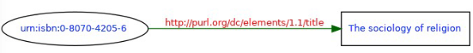
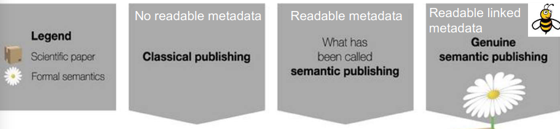
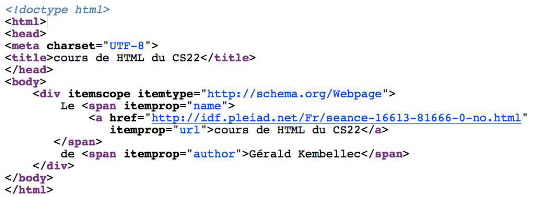
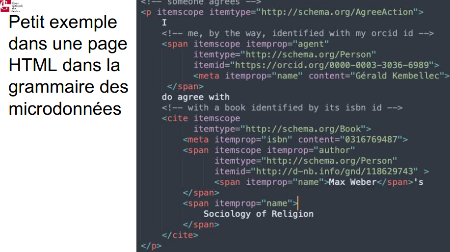

# Introduction au web sémantique

---
**Récupérer les URI des préfixes** : http://prefix.cc

---
**Principes du web sémantique**
- **lier des ressources sur le web**, avec 
	- bases d'autorités (ISNI, wikidata...)
	- vocabulaires (FOAF, DublinCore...)
	- modèle théorique (RDF)
	- implémentations techniques (XML-REF, TEI, HTML5 augmenté de RDFa, microdonnées, JSON-LD)
- **une méthode : le `semantic publishing`** : 
	- utilisation de **standards établis**
	- **publier des données brutes** sur le web, pas des contenus édités
	- fournir des **métadonnées de publication** (références biblio, catalographiques, en formats machine-readable)


---
**Le web sémantique, d'un point de vue des contenus**
- mécanisme de communication : protocole `HTTP`
- mécanisme d'identification des données : `URI` et `URN`
- mécanisme d'identification des autorités : `ISNI`, `VIAF`, `ISSN`, `ISBN`


---
**Le web sémantique, du point de vue des technologies**
- **encyclopédies** : `wikidata`, `dbpedia`
- **grammaire** : `RDF`
- **vocabulaires sémantiques** : `RDFS`, `OWL` pour la construction de thésaurus
- **règles d'écritures et formats sémantiques** : `RDF/XML` (implémentation du RDF), `N3`, `Trurtle`, `JSON-LD`
- **moyen de communication et d'interrogation des données** : `SPARQL`


---
## Structurer des données : `RDF`

*exemple - The sociology of religion a été écrit par Max Weber*
- **schéma théorique de description de ressources**, qui doit être suivi d'une application pratique
- **grammaire** : 
	- `sujet` (ressource décrite) - *The sociology of religion*
	- `prédicat` (type de propriété de la ressource, qui la lie à l'objet) - *a été écrit par*
	- `objet` (valeur de la propriété : un littéral ou une autre ressource) - *Max Weber*
- pour documenter les contenus, on s'appuie sur **des standards identifiés par leur préfixe** : dans l'exemple,
	- le sujet est un livre => identifié par son `ISBN`
	- le prédicat : `dc:creator` est utilisé pour renseigner l'auteur
	- l'objet : un identifiant pour l'auteur, `ISNI` ou `VIAF` ou autre
	=> **on a** : 
		- subject : `isbn:0-8070-4205-6`
		- predicate : `http://purl.org/dc/elements/1.1/creator`
		- object : `http://d-nb.info/gnd/118629743`


---
**L'implémentation `XML-RDF`** 

```xml
<?xml version="1.0"?>
	<rdf:RDF
		xmlns:rdf="http://www.w3.org/1999/02/22-rdf-syntax-ns#"
		xmlns:dc="http://purl.org/dc/elements/1.1/">
	<rdf:Description rdf:about="urn:isbn:0-8070-4205-6 ">
		<dc:title>The sociology of religion</dc:title>
	</rdf:Description>
</rdf:RDF>
```
- `<rdf:RDF/>` : élément racine, qui permet de définir le document comme un document RDF et qui contient les spécifications utiles
	- attr `xmlns:rdf` permet de renvoyer à la syntaxe RDF
	- attr `xmlns:dc` renvoie au standard DC
- `<rdf:Description/>` : description de la ressource
	- attribut `rdf:about` : renvoi vers l'objet (ici un ISBN de livre)
- `<dc:title/>` : le titre de l'objet, ici avec un prédicat dublin core title
- **un validateur du W3C** permet de créer un graphe à partir de la descrion : https://www.w3.org/RDF/Validator/rdfval



---
**Documenter du `RDF-XML` pour le rendre un tout petit peu plus digeste** (et lisible par un humain)
```xml
<?xml version="1.0"?>
<rdf:RDF xmlns:rdf="http://www.w3.org/1999/02/22-rdf-syntax-ns#"
xmlns:dc="http://purl.org/dc/elements/1.1/">
	<rdf:Description rdf:about="urn:isbn:0-8070-4205-6">
		<dc:creator>
			<rdf:Description rdf:about="urn:isni:000000012145101X"/>
		</dc:creator>
		<dc:title>The sociology of religion</dc:title>
		<dc:subject>
			<rdf:Bag>
				<rdf:li>Sociology</rdf:li>
				<rdf:li>Religion</rdf:li>
			</rdf:Bag>
		</dc:subject>
	</rdf:Description>
</rdf:RDF>
```
- dans **`<rdf:Bag/>`** on a une liste de thèmes `<rdf:li/>`
- dans **`<dc:title/>`** on le titre lisible par un humain*


---
## Interroger un corpus RDF : `SPARQL`**
- **`SPARQL EndPoint`** : un serveur de requête SPARQL
- **attention** : un logiciel de requêtage =/= un SPARQL Endpoint (le endpoint = l'endroit où on fait la requête')

**Syntaxe SPARQL**
```sql 
#en utilisant les préfixes : récupérer "Les misérables" de Hugo
PREFIX dbpedia: <http://dbpedia.org/resource/> #on définit les préfixes et namespaces utilisés
SELECT ?oeuvre 
	--SELECT : déclaration du type de requête
	--?oeuvre : déclaration de la ou des variables recherchées
WHERE {
	?oeuvre <http://dbpedia.org/ontology/author> dbpedia:Victor_Hugo.
	?oeuvre <http://www.w3.org/2000/01/rdf-schema#label> "Les Misérables"@en.
} 
	--where: tri des données
	--?oeuvre : déclaration d'un triplet ; utiliser des "<>" si l'URI est exprimé complètement
	--"Les Misérables" : le littéral est déclaré entre guillemets, hors chevrons
	--"@en" : le langcode du littéral est exprimé avec un "@"
```

- **types de requête possibles** : 
	- `SELECT` : comme en SQL, récupérer des données
	- `ASK` : faire du raisonnement
	- `CONSTRUCT` : construire un graphe de connaissance à partir d'un select

---
**construction d'une requête `SELECT` : les bases**
- **`PREFIX`** : définir un préfixe et namespaces** (la base sur laquelle on va requêter des données) : `PREFIX dbpedia: <http://dbpedia.org/resource/>` (/resource : version de dbpedia lisible machine, contrairement à /page, pour les humains)
- **`SELECT`** : sélectionner une variable pour requêter (en gros, la variable dans laquelle on stocke les résultats) : `SELECT ?oeuvre` (le nom de variable n'est pas signifiant pour la requête)
- **`SELECT DISTINCT`** : éliminer les doublons
- **`WHERE {}`** : définir le **tri/sélection** des données ; dans `{}`, on déclare des contraintes
- **`FILTER()`** : 
	- sert à trier des données selon un critère
	- posé dans le `WHERE` et sur un nom de variable
	- `FILTER(lang(?abstract)="fr")`
- **`LIMIT`** : limiter les données (`LIMIT 100`)
- **`OPTIONAL{}`** : rendre une recherche de donnée optionnelle (en gros, récupérer les donnes si elles existent)
	- posé dans le `WHERE`
	- `WHERE {... OPTIONAL { ?uri <...> ?photo }` : récupérer les photos liées à `?uri` si elles existent
- **`ORDER BY`** : ordonner les données
	
	
---
**construction d'une requête `SELECT` : les ptits trucs en plus**
- toujours **encadrer une URI/URL** de `<>`
- **`varName a ...`** : indiquer que la variable (`varName`) correspond à une classe dbpedia : `?uri a dbPedia:Painter .`


---
## Exemples `SPARQL` (moult)

sans utiliser les préfixes : toutes les ressources associées à JLD
```sql
PREFIX dbpedia: <http://dbpedia.org/resource/>
   SELECT ?predicat
   WHERE {
       <http://fr.dbpedia.org/resource/Jacques-Louis_David> ?predicat ?x      
}
```

sélectionner les URI des peintres (au sens dbpedia) qui ont une photo au sens de foaf
```sql
PREFIX dbPedia: <http://dbpedia.org/ontology/>
SELECT DISTINCT ?uri ?photo
WHERE {
    ?uri a dbPedia:Painter .
    ?uri <http://xmlns.com/foaf/0.1/depiction> ?photo
}
```


récupérer la bio de victor hugo en français :
```sql
SELECT ?abstract
WHERE {
<http://dbpedia.org/resource/Victor_Hugo> <http://dbpedia.org/ontology/abstract> ?abstract.
FILTER (lang(?abstract)="fr")
}
```

afficher tous les peintres, leurs noms en français et éventuellement l’image la
représentant :
```sql
PREFIX dbPedia: <http://dbpedia.org/ontology/>
SELECT DISTINCT ?uri ?name ?image
WHERE {
    ?uri a dbPedia:Painter .
    ?uri <http://www.w3.org/2000/01/rdf-schema#label> ?name .
    ?uri <http://xmlns.com/foaf/0.1/depiction> ?image .
    FILTER (lang(?name)="fr") .
}
```

---
## Documenter les contenus `HTML` avec du `RDF`

**utilité** : 
- rendre **lisible machine** des contenus en HTML (donc, théoriquement en langage naturel) via sous-couche sémantique
- **visibilité accrue** (pratique pour le SEO, puisque les robots indexeurs valorisent la structure sémantique des pages)
- basé sur utilisation de **vocabulaires de description** : https://schema.org/ (collection de vocs de description, créé par yahoo / bing / yandex / google)
- **le `semantic publishing`** pour enrichir les données de la recherche (publication en ligne avec des métadonnées liées structurées)
- 


---
**formats** :
-  le **`POSH`** (v. 2000) (plain old semantic web), se situe dans le `<meta>` de l'entête HTML (`<head>`)
- **`microdonnées` et `μFormats`** (dvp v. 2010)
	- dans les éléments HTML, des attributs qui contiennent des données organisées en triplets : `itemscope`, `itemprop`
	- trusté par Google un peu
	- 
- **`RDF.a`**
	- utilise les **attributs** des balises de contenu HTML : 
		- `class` et `id` : type et identité de l'objet 
		- `rel`, `rev`, `href` : relation avec d'autres ressources
		- `about` : URI spécifiant la ressource décrite
		- `property` : spécifie une URI pour le contenu
		- `content` : remplace le contenu d'un élément (optionnel)
		- `datatype` : typage (optionnel)
		- `resource` : spécifie une ressource externe ; remplace @href et @src dans les éléments qui ne sont pas des liens
	- format majoritaire dans les institutions publiques (INA, BNF...)
	- ![88b7268b2b2edf77adf1ace109ef6d6b.png]		- (:/ea315cf808f34f0c8e04623ab6705e1c)
- **`JSON-LD`** : structuration des données sémantiques au format JSON
		- 
- **exemple** en microdonnées
	- 


---
**plugin** pour repérer les métadonnées structurées dans les pages HTML (là où il y a des vocabulaires contrôlés, du JSON-LD, RDF-A...): https://addons.mozilla.org/fr/firefox/addon/openlink-structured-data-sniff/