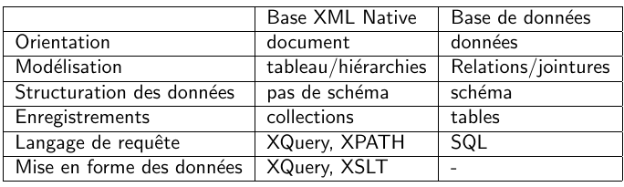
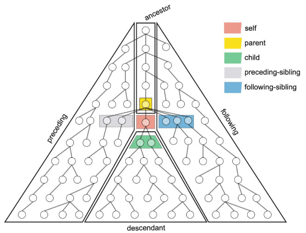

**ouvrir BaseX** : `cd ~/Programmes/basex && bin/basexgui`


---
# INTRODUCTION : LES BDD XML NATIVES

**les BDXN dans l'écosystème des BDD**
- **types de bases possibles** en XML :
	- des bases orientées **graphes** ;
		- permettent structure en **triplets RDF**
		- ont un **langage de requête propre** (SPARQL et al)
	- des bases **clés-valeurs** (qui reprennent les avantages d’une base SQL), qui permettent 
    	- stockage de **données hétérogènes**
        - un stockage performant et **scalable**
        - **pas de de contrainte d’intégrité** des données
        - **uniquement le stockage** (pas d’API pour diffuser les données)
	- des bases de données orientées **documents**, comme les bases JSON ; BDD XML orientées documents permettent confirmité aux standards et nb fonctionnalités, alors que JSON est orienté performance
- **pourquoi** une solution de stockage spécifique pour XML ?
	- par défaut les SGBD ne permettent **pas de stockage efficace du XML** : xml uniquement stocké sous forme d’objet binaire => impossible d’accéder aux données sans utiliser un middleware rigide
	- évolution dans SBGD non-xml : **support partiel de xpath** pour travailler avec des documents
- **bdxn et sgbd – comparaison** : (bdxn = bdd xml native)
	- au niveau de la **modélisation** : bdxn permet
		- **dénormalisation** (inclusion de valeurs sur un schéma différent)
		- modélisation **one to many** (que veut-ce dire?)
		- **accès direct aux données** (sans recomposer les documents, comme avec XML dans SGBD)

- **bdxn – avantages** :
	- **orientation document** facilite gestion + dvp d’applications
	- accès à la structure et aux données des documents facilité par **xpath + xquery**
	- respect de **normes** et intégration de **standards**


---
**bdxn - définitions et caractéristiques**
- **ce que permettent BDXN :
	- **préservent structure physique** des documents (éléments, attributs, entités…)
	- permettent de **stocker des documents sans déclaration de schéma** de doc (DTD…)
	- permettent **d’accéder aux documents** grâce à des API propres à XML (xpath, xquery)
- **caractéristiques** :
	- **stockage hiérarchique** de collections de documents (toutes les données dérivent de la même racine)
	- stockage de **=/= types de données** : documents, de fragments de documents et d’objets binainres
	- utilisation de **langages** d’adressage (xpath) et de requête (xquery)
	- intégration de **standards xml** : xsl, xproc…
- **usages** :
	- **bdd applicative**, pour faciliter communication depuis une application (api rest…)
	- **moteurs de recherche** pour explorer des corpus XML
- **un espace de travail** bdxn, c’est quoi ?
 	- environnement d’exécution, pour xquery, xslt, xpath…
	- éditeur et navigateur de fichier
    - gestion des accès utilisateurs
    - outils d’exploration des corpus (visualisation, langage de requête…)


---
**les langages de programmation pour XML**
- **xslt** :
	- langage de **transformation**
	- défini comme un ensemble de règles de transformation avec un mécanisme de template et pattern
	- est un document xml
- **xpath** : 
	- langage d’**adressage** : permet de cibler des éléments dans un document
	- permet de désigner des chemins et des portions d’un document
	- définit un ensemble de fonctions pour récupérer des infos et manipuler des données
	- n’est pas un document xml
- **xquery** : aka xml query language
	- langage de **requête**
    - définit un langage pour **interroger des dépôts de documents xml**
    - orienté **données et documents**
    - s’appuie sur **xpath2 et sur les schémas xml**
    - n’est **pas un document xml**
    - comme langage de requête, permet :
    	- **interrogation** de corpus
        - **lecture, écriture, recherche plein texte** dans des documents
		- **itération, filtrer et trier** des données, faire des variables
        - **génération** de données, documents, séquences
        - faire des **jointures** et des groupes
	- comme **langage de transformation**, permet :
    	- spectre fonctionnel **//xslt**
        - **création de documents** xml et autres
        - **intégration du xml** dans la syntaxe des requêtes
        - **génération d’élts et attributs**
        - **parcours explicite de l’arbre xml** source ≠ xslt où le parcours est implicite
	- comme **langage de programmation**, permet :
    	- utilisation de **data types** simples et variées
        - définition de **structures de contrôle**
        - déclaration de **fonctions**
        - utilisation d’une **bibliothèque de modules**


---
**fonctionnement de xquery**
- fonctionnement **interactif**
	- envois de **requête** à la base de données, retour de données, séquences de données ou types complexes.
	- utilisation **éditeurs intégrés** dans les environnements de travail
	- **requêtes et résultats** font partie de l’interface
	- nombreux **modules et fonctions** sont accessibles depuis ces environnements
- **indexation** : pour des raisons de performance, les bases de données XML reposent essentiellement sur une indexation des documents XML :
	- index **structurels**
	- index **plein textes**
	- indexation **automatique**, paramétrée et manuelle


---
# XPATH
(cette partie est hybridée avec le cours sur XML TEI)

XPath est un **langage du W3C qui sert à cibler des nœuds** dans un document XML (pas à requêter, juste à retourner des nœuds)


---
**structure globale**
`axe1::filtre1[predicat1]/axe2::filtre2[predicat2]`


---
**nœuds**
xpath cible des nœuds dans le document XML ; on peut cibler un élément, un attribut, le contenu d'un élément/attribut, le contenu d'un commentaire
- **`element_name`** : désigne un élément par son nom de balise : `div`, `p`...
- **`attribute_name`** : désigne un élément par le nom d'un de ses attributs : `type`, `n`...
- **`text()`** : désigne le contenu d'un élément/attribut
- **`comment()`** : désigne le contenu d'un commentaire
- **`*`** : n'importe quel nœud
- *exemples* 
	- *`//teiHeader//title/type/text()` : le contenu de l'attribut 'type' de l'élément 'title' descendant directement ou non du 'teiHeader'*
	- *`TEI/teiHeader/*` : tout ce qui est contenu dans le 'teiHeader'*


---
**axes**
indiquent la **position de l'élément à cibler par rapport à l'élément courant** dans un document XML (aka, la direction dans laquelle se déplacer à partir de l'élément courant)
- **syntaxe** : 
	- sans abbréviation : `axe::nœud`
	- avec abbréviation : `axenœud`
.
- **`child` / `[vide]`** : descendant direct du nœud courant - axe sélectionné par défaut dans xpath
- **`attribute` / `@`** : attribut du nœud courant
- **`parent` / `..`** : nœud parent de l'élément courant
- **`self` / `.`** : nœud courant
- **`descendant-or-self` / `//`** : l'élément courant et ses descendants
- **`ancestor`** : tous les ancêtres
- **`ancestor-or-self`** : le nœud et tous ses ancêtres
- **`descendant`** : descendant direct ou indirect du nœud courant
- **`following`** : tous les éléments qui viennent après la balise fermante du nœud courant
- **`following-sibling`** : nœuds qui sont au même niveau que l'élément courant et qui viennent après cet élément
- **`preceding-sibling`** : nœuds qui sont au même niveau que l'élément courant et qui viennent avant cet element



---
**prédicats**
- prédicats sont des expressions évaluées à `True` ou `False` et qui **permettent de filtrer** les résultats ; équivalent de `WHERE` en SQL
- **syntaxe** : `nœud[predicat1][predicat2]`...
	- si on a plusieurs prédicats, il faut que tous soient validés
- **prédicats numériques** : `[n]`, avec `n` un nombre
	- permettent de cibler le nième élément sélectionné
	- attention, avec xpath **l'indexation commence à 1**
- *exemples* : 
	- *`lg[@type='quatrain'][2]` : le 2e élément 'lg' qui a un attribut 'type' ayant pour valeur 'quatrain'*
	- *`div/following-sibling::p[.//persName]` : les éléments 'p' de même niveau qu'un 'div' suivant la balise fermante de ce 'div' et qui contiennent un élément 'persName'*


___
**fonctions**
- **`count(node-set)`** : compte l'ensemble des occurences dans un ensemble de nœuds node-set (soit un chemin absolu ou relatif par rapport au nœud courant)
- **`sum(node-set)`** : somme des valeurs de type nombre d'un ensemble de nœuds
- **`last()`** : renvoie le dernier des nœuds ciblés
- **`position()`** : renvoie la position du nœud ciblé par rapport aux éléments de même niveau (pas par ordre d'héritage) (`div/*[position()=1]` = le premier élement descendant directement de 'div')
- **`string(val)`, `number(val)`** : retypage
- **`string-lenght(str)`** : renvoie la longueur de la chaîne 'str'
- **tester le contenu d'une chaîne** :
	- **`start-with(str1, str2)`** : renvoie 'True' si 'str1' commence par 'str2'
	- **`contains(str1, str2)`** : renvoie 'True' si 'str1' contient 'str2'
- **modifier une chaîne**
	- **`concat(str1, str2)`** : concatène 'str1' et 'str2'
	- **`normalize-space(str)`** : retire les espaces de début, de fin et les doubles espaces contenus dans 'str'
- **`true()`, `false()`, `not(bool)`** : vrai, faux, valeur inverse du boléen
- **sélection de documents** :
	- **`doc('path')`** : sélectionne un document en fonction d'un chemin relatif ou absolu
	- **`collection('path')`** : sélectionne plusieurs documents en fonction d'un chemin relatif ou absolu

- *exemples*
	- *`//div[@class='foo']/bar[position() = 1]` : le premier élément 'bar' descendant directement d'un élément 'div' ayant un attribut 'class' dont la valeur est 'foo'
	- *`/TEI//lg[@n = count(/TEI//l)]` : l'élément 'lg' contenu dans 'TEI' dont l'attribut 'n' est le nombre d'éléments 'l' dans l'élément 'TEI' (soit tous les 'l' d'un document TEI)
	- *`TEI//body//div[last()]/attribute::*]` : tous les attributs du dernier élément div du body*

 
---
**opérateurs** - s'utilisent dans des prédicats
- **opérateurs arithmétiques** : `+` `-` `*` `div` (division) `mod` (modulo)
- **opérateurs de comparaison** : `=` `!=` `<` `>` `<=` `>=`
	- **en XSLT**, `<` s'écrit `&lt;` et `>` s'écrit `&gt;` (parfois en fait je crois)
- **opérateurs logiques** : `and` `or` (permettent d'accoler plusieurs expressions booléennes, aka expressions dont la valeur est évaluée à `true` ou `false`)
- **opérateur de concaténation** : `|` (permet de concaténer le résultat retourné par 2 expressions xpath)

---
# XQUERY

---
**bases**
- xquery est **un langage du W3C qui sert à requêter des bases de documents XML** ; c'est une **extension d'XPath**
- **tout ce qui fonctionne dans xpath** devrait fonctionner dans xquery (ça peut être cool à supposer qu'on comprenne xpath) : **utiliser la syntaxe xpath pour sélectionner des chemins avec xquery**
- xquery renvoie **soit une valeur, soit une séquence de valeurs**
- **typage** : xquery est un langage typé => on peut devoir faire des retypages et préciser les types de données
	- `element()`
	- `attribute()`
	- `text()`
	- `comment()`
	- `number()`
	- `string()`
	- *exemple: `string( doc(”db/mondial/mondial.xml”)//city[name=’Nantes’]/@id )`*
- **commentaires** : `(: ceci est un commentaire :)`


---
**FLOWR**
une requête xquuery retourne une séquence de résultats => il faut itérer sur cette séquence pour accéder à chaque valeur
- **`For`** - itérer sur une séquence
	- **syntaxe for...in** : `for $item in _expr_`, avec
		- `item` : la variable qui prend successivement la valeur de chaque élément de la séquence
		- `_expr_` : l'expression qui permet de rechercher des données
	- **syntaxe for...at** : `for $item at $numero in _expr_
`
		- permet de retourner le numéro de `item` dans la boucle, et donc de connaître la position d'un élément dans la séquence (*3 élément retourné par la requête*)
- **`Let`** - définir une constante (variable qu'on ne peut pas redéfinir)
	- **syntaxe** : `let $const := _expr_`
	- on peut **définir plusieurs variables**
- **`Order by`** - ordonner une séquence selon un/des critère(s)
	- **syntaxe** : `order by _expr_ ascending|descending`
- **`Where`** - filtrer une séquence selon 1/des critères
- **`Return`** - clore une requête


---
**trier une requête** 
- **dédoublonner** : `distinct-values()`
	- **syntaxe**: `for $item in distinct-values(_expr_)` 
	- *exemple* : 
	```xquery
		for $theme in distinct-values("db/tp/notices")//THEME/text())
		return $theme
	```
- **regrouper** : `group by`
	- **syntaxe** : 
	```xquery
		for $item in _expr_ 
		group by _clause_
		return ...
	```
	- *exemple* :
	```xquery
		for $theme in collection (”db/tp/notices”)//THEME/text()
		group by $ themeGroup := $theme
		return $themeGroup
	```

---
**imbriquer et enchaîner des requêtes**
- on peut **enchaîner plusieurs requêtes en les séparant par des `,`**
	- **syntaxe** : `requête1, requête2`
- on peut **filtrer les résultats d'une requête en lançant une seconde requête** :
	- **syntaxe** :
	```xquery
		for $item in _expr_
		return
			(for $item in _expr_
			return ...)
	```
- on peut **combiner l'imbrication et l'enchaînement** (joie) : exemple pour retourner des noms de ville et des noms de pays: 
```xquery
	let $doc := doc(”db/tp/mondial.xml”)
	return
		(for $country in $doc//country/name
		return $country,
		for $city in $doc//city/name
		return $city)
```


---
**générer du XML à partir d'une requête : les constructeurs**
- pour créer un fichier XML à partir d'une requête,
	- **créer une structure XML** qui corresponde à ce qu'on veut
	- **faire des requêtes entre `{}` dans le document XML**, là où l'on veut que le résultat du XML s'affiche
	- **syntaxe**
		- avec le **contenu d'un élément** : `<balise>{requête}</balise>`  (faire la requête entre la balise d'ouverture et de fermeture)
		- avec les **arguments d'un élément** : `<balise arg="{requête}"/>` (faire la requête entre guillemets après le nom de l'argument)
	- on peut faire **tous des requêtes en xpath et xquery/flowr**
	- *exemple : on crée une balise `montagne` avec un argument `compte` qui contient tous les noms de montagne*
	```xquery
		let $doc := doc('db/tp/mondial')
		return
		<geographie>
			<montagne compte="{count($doc//mountain)}">{}
				for $mountain in $doc//mountain/text()
				return $mountain || ', '
			}</montagne>
		</geographie>
	```


---
**constructeurs XML directs et indirects**
(ratrapper / combiner avec ce qu'il y a au dessus)


---
**définir des namespaces**
- **namespace / espace de noms** : spécification particulière de XML (tei, xpath...), lié à un URL qui définit la spécification; on peut empiler les définitions
- **syntaxe** :
	- `declare namespace nom = ”url” ;` - permet de **déclarer un espace de noms**
		- l'espace de nom n'est pas par défaut => il faut **spécifier l'espace de noms** à chaque fois : `namespace:elementname`
	- `declare default element|attribute namespace ”url” ;` - permet de **déclarer un espace de noms par défaut** dans un nœud XML donné
		- permet de **ne pas avoir à spécifier** l'espace de noms défini par défaut
		- à l'inverse, si on travaille avec des éléments qui ne font pas partie de cet espace de nom, il faut le spécifier, donc c risqué
- **par défaut**, XQuery prédéfinit syntaxe xml par défaut, schéma xml, instance de schéma, fonctions xpath et fonctions xquery définies localement
- *exemple - définir tei comme namespace par défaut pour les éléments et les attributs*
```xquery
	declare default element tei "http://www.tei-c.org/ns/1.0";
	declare default attribute tei "http://www.tei-c.org/ns/1.0";
```
- *exemple: utiliser un namespace (quand il n'est pas défini par défaut*
```xquery
	tei:titleStmt/tei:title
```


---
**expressions conditionnelles - `if-then-else`**
- **syntaxe** : `if _expr_ then _expr_ else _expr_`
- *exemple*
```xquery
	for $city in doc("db/tp/mondial.xml")//city
	return
		if ($city/population/text()>30000)
		then <grande_ville>{$city/name/text()}</grande_ville>
		else <ville>{$city/name/text()}</ville>
```


---
**opérateurs**
- **opérateur arrow `=>`**  : permet d'appliquer une fonction à une valeur ; en gros, permet d'appliquer des fonctions avec une syntaxe différente, sans imbrication
	- **syntaxe** : `$var => funct1() => funct2()`
	- *syntaxe normale: `funct1(funct2($var))`*
	- **exemple** : l'équivalent de `lower-case(normalise-space($str))` est
	```XQuery
		$str => lower-case() => normalise-space()
	```
- **opérateur map `!`** permet de parcourir tous les éléments d'une séquence itérable, sans avoir recours à tous les éléments de la séquence
	- **syntaxe** : `sequence ! fonction()`
	- le `!` veut dire : "parcourir tous les élts de la séquence"
	- **exemple** :
	```XQuery
		(A, B, C) ! lower-case()
	```