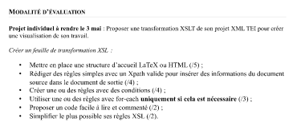
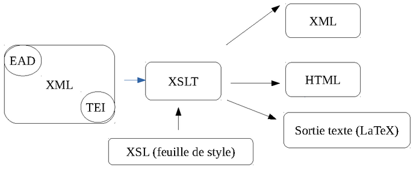

# XSLT
---
**cours** : https://github.com/ArianePinche/coursTNAH_XML-TEI
**contact** : ariane[dot]pinche[at]chartes.psl.eu
**évaluation** : 
- 11 avril : rendu du devoir (feuille de transformation pour le devoir de TEI)
 

---
# COURS 1 - DÉFINITIONS ET PREMIÈRES TRANSFORMATIONS
**introduction**
- **l'environnement XML** : 
	
- **petit point vocabulaire** : 
	- `XSL` : la feuille de style
	- `XSLT` : le processus de transformation
	- `XML` : langage de structure sémantique qui sert à décrire l'information
	- `HTML` : langage permettant la présentation et la structuration de l'information, pas de sa sémantique

**`XSLT` : une définition**
- « XSLT (extensible Stylesheet Language Transformations) est un langage de programmation fonctionnel utilisé pour **spécifier comment un document XML est transformé** en un autre document qui peut, mais qui n’est pas nécessairement, un autre document XML. Un processeur XSLT lit un arbre XML en entrée et une feuille de style XSL et produit un arbre résultat en sortie. »
- **principe général de fonctionnement** : 
	- un processeur XSLT lit le processeur de haut en bas, en commençant par la racine
	- les règles modèles sont activées dans l'ordre de rencontre des éléments : une règle modèle d'un élément est activée avant les règles modèles de ses sous-éléments
	- il faut déclarer des espaces de noms: `tei:lg` (pour déclarer l'espace de noms d'un élément `lg`)

---
**une feuille de style simple** :
- on déclare les espaces de noms
- on fait un match pour cibler les éléments que l'on veut transformer
- on applique une template

```xsl
<xsl:stylesheet xmlns:xsl="http://www.w3.org/XSL/Transform"
	xmlns:xs="http://www.w3.org/2001/..."
	xmlns:tei="http://www.tei-c.org/ns/1.0">
		
	<xsl:template match="/"> <!-- on match une xpath je crois -->
		<xsl:apply-templates/> <!-- on applique le scénario de transformation ; ici rien -->
	</xsl:template> 
	<!-- par défaut, xslt, sans templates spéciales, retourne le contenu des balises -->
```

```xsl
<xsl:template match="tei:l[position()=3]"> <!-- on cible tous les 3e vers -->
	<xsl:copy-of select="."/> <!-- ici, xslt copie et retourne l'élément courant : ".", cad  tous les 3e vers -->
</xsl:template>
```

on peut aussi **injecter du texte** : 
```xsl
<xsl:template match="tei:l[position()=3]"> 
	Texte qui sera injecté
	<xsl:apply-templates/>
</xsl:template>
```

**spécifier un espace de noms particulier pour les Xpath** : dans l'élément racine, `xpath-default-namespace="URL"`


---
# Cours 2 : Les règles de base de XSL
---
## Mettre en place une règle

---
**Base des templates**

- pour donner des instructions XSL, on utilise des **templates/règles** grâce à l’élément : 
```XML
<xsl:template>
  ```

- on utilise **l’attribut match** pour sélectionner un élément de l’arbre XML
	- on peut utiliser des **`xpath`** avec `match`
```XML
<xsl:template match="mon_element_xml">
```
- **attention : ne pas mettre plusieurs règles** à la suite **dans un seul template** : : c'est seulement la dernière règle qui est prise en compte
  
  
---
**Ajouter des éléments dans une règle**
- on peut **ajouter du texte** dans la règle :
```XML
<xsl:template match="mon_element_xml">
    Ici, il y avait mon élément
</xsl:template>
  ```
- on peut aussi **ajouter des balises**
- on peut aussi **récupérer certains éléments** de l’arbre XML
	- soit tels quels
	- soit transformés ou triés par des fonctions XSL ou Xpath.
```XML
<xsl:template match="mon_element_xml">
    <xsl:text>Ici, il y avait mon élément</xsl:text>
</xsl:template>
```

----
## Éléments et attributs XSL

---
**Cibler des éléments***
- **méthode n°1** : (pas compris but hey)
```XML
<xsl:template match="mon_element_xml">
   <p>Ici, il y avait mon élément</p>
</xsl:template>
```
- **méthode n°2** (pas compris but hey)
```XML
<xsl:template match="mon_element_xml">
<xsl:element name="p">Ici, il y avait mon élément</xsl:element>
</xsl:template>
```
- **`<xsl:text>`** permet de rajouter du texte dans un élément 

---
**Cibler des attributs**

**méthode n°1** : viser la valeur d'un attribut
- **récupérer la valeur attribut en dur** : (aka récupérer tout le nom de l'attribut)
```XML
		<xsl:template match="mon_element_xml">
			<p type="valeur_attribut">Ici, il y avait mon élément</p>
		</xsl:template>
```
- **récupérer l'attribut via xPath** : 
	- on écrit le xpath **entre `"{}"`** (pour indiquer que c'est du xpath)
	- on écrit une xpath qui **permet de récupérer la valeur de l'attribut**
	- (dans l'exemple au dessous: `.` vaut pour "élément courant", **utile pour boucles**)

```XML
<xsl:template match="mon_element_xml">
        <p type="{./chemin_Xpath}">Ici, 
          il y avait mon élément</p>
</xsl:template>
```

**méthode n°2** : combiner `<xsl:attribute>` et `<xsl:text>`
```XML
<xsl:template match="mon_element_xml">
   <xsl:element name="p">
        <xsl:attribute name="type">
             <xsl:text>valeur_attribut</xsl:text>
        </xsl:attribute>
        <xsl:text>Ici, il y avait mon élément</xsl:text>
    </xsl:element>
</xsl:template>
```
---
## Préambule d'une feuille XSL

**L'élément ouvrant**
```xml
<xsl:stylesheet xmlns:xsl="http://www.w3.org/1999/XSL/Transform" 
    xpath-default-namespace="http://www.tei-c.org/ns/1.0"
    xmlns:xs="http://www.w3.org/2001/XMLSchema"
    xmlns:tei="http://www.tei-c.org/ns/1.0"
    exclude-result-prefixes="xs tei"
    version="2.0">
```
**Paramétrer la sortie**
- **`output`** : la sortie (ici, `xml` vu qu'on travaille avec dy XML)
- **`indent`** : autoindenter la sortie
- **`encoding`** : assez transparent
```xml
<xsl:output method="xml" indent="yes" encoding="UTF-8"/>
```


---
## Règles XSL

---
**`<xsl:apply-templates>`**

Cette règle indique que les règles définies dans l’XSL doivent être **appliquées aux éléments enfants de l’élément sélectionné** par la règle. 
```XML
<xsl:template match="mon_element_xml">
     <xsl:element name="p">
          <xsl:apply-templates/>
     </xsl:element>
</xsl:template>
```
- **attribut `select`** permet de n'apppliquer les templates qu'à un sous-élément/des sous éléments ciblés avec une xpath
	```XML
	<!-- n'appliquer les templates que aux <persName> -->
	<xsl:template match="div">
	     <xsl:element name="p">
	          <xsl:apply-templates select="persName"/>
 	    </xsl:element>
	</xsl:template>
	```
	- *on peut modifier l'ordre des éléments* du document originel en multipliant les `<apply-templates>` :
		```xml
		<xsl:apply-templates select="//lg[@type='tercet'][2]"/>
		<xsl:apply-templates select="//lg[@type='tercet'][1]"/>
		<xsl:apply-templates select="//lg[@type='quatrain'][2]"/>
		<xsl:apply-templates select="//lg[@type='quatrain'][1]"/>
		```
- **attribut `mode`** : permet d'associer différentes règles à différents usages (aka, traiter un même élément de plusieurs manières différentes)
	```xml
 	<xsl:template match="element">
		<xsl:apply-templates mode="mode1"/>
	</xsl:template>

	<xsl:template match="sous_element" mode="mode1">
		<!-- règles -->
	</xsl:template>
	```
	- s'applique à`<xsl:apply-templates>` et `<xsl:templates>` 
	- le nom du mode est arbitraire

---
**`<xsl:copy>`**

« L’élément XSL copy **copie le nœud courant du document source vers le document** de sortie. 
- il **ne copie que la balise lui-même**. 
- Cependant il **ne copie pas** le contenu de l'élément, ses enfants et ses attributs. » 
- *XML en concentré*, 2005, p. 525.
- **utile** si on ne veut que copier une balise
- ajouter un **`<xsl:apply-templates`** à l'intérieur de `<xsl:copy>` pour copier aussi le contenu de l'élément (ou plutôt utiliser `<xsl:copy-of>`)

```XML
<xsl:template match="mon_element_xml">
    <xsl:copy>
        <xsl:apply-templates/>
    </xsl:copy>
</xsl:template>
```
---
**`<xsl:copy-of>`**

« L’instruction xsl:copy-of insère le fragment d’arbre résultat identifié par l’attribut select dans le document de sortie. Cette instruction **copie** **les nœuds** spécifiques sélectionnés par l’expression tous leurs **enfants**, **attributs**,  **espaces de noms**, **descendants**. C’est en cela qu’il diffère de xsl:copy.»
	- *XML en concentré*, 2005, p. 525.
	- **l'attribut `select`** obligatoire détermine sur quelle sous-section de ce qui est matché avec `<xsl:template>` s'applique `<xsl:copy-of>`

```XML
<xsl:template match="mon_element_xml">
	<xsl:copy-of select="."/>
</xsl:template>
```

---
**`<xsl:value-of>`**

L’élément xsl:value-of **calcule la valeur textuelle** d’une expression Xpath et l’insère dans l’arbre résultat. » (*XML en concentré*, 2005, p. 543).
- **aka** : copie le texte d'un élément d'un élément (et ses descendants je crois)
- prend un **attribut `select`**

```XML
<xsl:template match="mon_element_xml">
	<xsl:value-of select="chemin_Xpath"/>
</xsl:template>
```

---
**`<xsl:number>` : numéroter automatiquement des vers**

L’élément `xsl:number` est utilisé pour **produire un nombre formaté** dans l’arbre résultat.

L’élément possède plusieurs attributs :
- L’attribut **`count`** est un motif qui spécifie les nœuds à comptabiliser dans les nœuds spécifiés.
- L’attribut **`level`** défini le nombre de niveaux
	- `multiple` : numérotation à plusieurs niveaux : I.1, I.2...
	- `single` : numérotation à un niveau : 1, 2, 3 / a, b, c ; **numérotation discontinue** (on numérote 1,2,3,4 tous les vers d'un quatrain et ensuite on repasse à 1 au quatrain suivant)
	- `any` : (je crois) : numérotation continue sur tous les éléments (on numérote 1,2,3,4,5 tous les vers du début à la fin du poème, sans prendre en compte les formats)
- L’attribut `format` permet de paramétrer le format de numérotation (chiffres romains, arabes...)

```XML
<xsl:template match="mon_element_xml">
    <xsl:number count="element_a_compter" level="" format=""/> <!-- élément à compter: une cible -->
</xsl:template>
```
```XML
<xsl:template match="//lg">
    <xsl:number count="./l" level="multiple" format="I.1.a"/>
</xsl:template>
```

---
### Exercice

À l’aide des éléments vus pendant la séance, reproduire l'intégralité du fichier TEI de Verlaine en numérotant automatiquement les vers et les strophes. Essayer de proposer plusieurs formats et plusieurs types de numérotation des vers: 
```xsl
<?xml version="1.0" encoding="UTF-8"?>
<xsl:stylesheet xmlns:xsl="http://www.w3.org/1999/XSL/Transform" 
    xpath-default-namespace="http://www.tei-c.org/ns/1.0"
    xmlns:xs="http://www.w3.org/2001/XMLSchema"
    xmlns:tei="http://www.tei-c.org/ns/1.0"
    exclude-result-prefixes="xs"
    version="2.0">
    <xsl:template match="TEI"> <!-- on fait des modis => <xsl:copy> -->
        <xsl:copy>
            <xsl:apply-templates/> <!-- applique les règles définies dans les <xsl:template> -->
        </xsl:copy> <!-- copie la balise TEI avec ses attr -->
    </xsl:template>
    
    <xsl:template match="teiHeader"> <!-- on copie tout et modif rien => copy-of -->
        <xsl:copy-of select="."/>
    </xsl:template> 
    
    <xsl:template match="text"> <!-- on fait des modis => <xsl:copy> -->
        <xsl:copy select=".">
            <xsl:apply-templates/>
        </xsl:copy>
    </xsl:template>
    
    <xsl:template match="body"> <!-- on fait des modis => <xsl:copy> -->
        <xsl:copy select=".">
            <xsl:apply-templates/>
        </xsl:copy>
    </xsl:template>
    
    <xsl:template match="lg">
        <xsl:element name="lg"> <!-- pour chaque <lg> dans l'og, créer un <lg> dans sortie -->
            <xsl:attribute name="type"> <!-- créer un attribut @type qui prenne la valeur du type og -->
                <xsl:value-of select="@type"/>
            </xsl:attribute>
            <xsl:attribute name="n">
                <xsl:number count="lg" level="multiple" format="I.1.a"/>
            </xsl:attribute>
            <xsl:apply-templates/> <!-- on applique les modifs -->
        </xsl:element>
    </xsl:template>
    
    <xsl:template match="l"> <!-- pareil qu'au dessus -->
        <xsl:element name="l">
            <xsl:attribute name="n">
                <xsl:number count="l" level="any" format="1"/>
            </xsl:attribute>
            <xsl:apply-templates/>
        </xsl:element>
    </xsl:template>
</xsl:stylesheet>
```